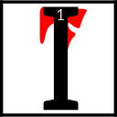

---

<!--- Local CSS Font Loading -->

<!--- Jekyll Page Links -->

<a href="../../../../../index.html">Home</a>
&emsp;&nabla;&emsp;
<a href="../../../../about/index.html">About</a>
&emsp;&nabla;&emsp;
<a href="../../../../archive/index.html">Archive</a>
&emsp;&nabla;&emsp;
<a href="../../../index.html">Quintessence</a>

<!--- Markdown Body Below: -->

---

## dimihn am as itam

#### End of the Journey

t was during the time of Great Despair when Veloth and his people reached the land of Resdayn.
<b>&sup2;</b>For untold weeks they had climbed a mighty range of mountains under Veloth's leadership.
<b>&sup3;</b>Many among the Chimer considered this path to be folly, but they were driven by Veloth's unyielding certainty and commitment.

<b>&#8308;</b>They came upon a great pass, a deep scar in the mountain covered in ice and snow.
<b>&#8309;</b>Veloth drove them onward, chasing a vision that had come to him in a dream.
<b>&#8310;</b>He claimed to see a great hawk in the sky. He vowed that the hawk would lead the Chimer to a new home.
<b>&#8311;</b>They drudged through the pass, but after a time the Chimer could go no farther. A great wall of ice blocked their way.

<b>&#8312;</b>Then a powerful voice boomed from the mountains. "Who are you and why have you come to this place?"

<b>&#8313;</b>"We are a people without a home," replied Veloth to the mountain.

<b>&sup1;&#8304;</b>A young woman stepped out of the wall of ice.\
\
"And who are you?" asked Veloth.

<b>&sup1;&sup1;</b>"I am Chimer-Friend. I have come to lead you home, if you are willing to accept my challenge.
<b>&sup1;&sup2;</b>I demand a sacrifice of you, Veloth. Swear an oath that will make you a better mer."

<b>&sup1;&sup3;</b>Veloth hoisted his mighty hammer and proclaimed, "Never again shall I wield this tool or any other to slay a foe.
<b>&sup1;&#8308;</b>I have given my heart to my people, but now I shall give them more. I shall dedicate my life and my soul to them."

<b>&sup1;&#8309;</b>The woman turned and waved at the wall of ice. It melted away in moments. Beyond lay an alien land of fungus and ash.
<b>&sup1;&#8310;</b>She began to walk forward and the Chimer followed.

Veloth spoke to his people. "We are home," he declared.
<b>&sup1;&#8311;</b>"This is the anvil upon which we shall forge a new people. One journey ends here, but another journey begins."

---

#### References

1. [UESP: End of the Journey][1]

[1]: https://en.uesp.net/wiki/Online:End_of_the_Journey

---
