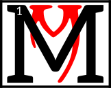

---

<!--- Local CSS Font Loading -->

<!--- Jekyll Page Links -->

<a href="../../../../../index.html">Home</a>
&emsp;&nabla;&emsp;
<a href="../../../../about/index.html">About</a>
&emsp;&nabla;&emsp;
<a href="../../../../archive/index.html">Archive</a>
&emsp;&nabla;&emsp;
<a href="../../../index.html">Quintessence</a>

<!--- Markdown Body Below: -->

---

## gah'toshok aurbex

#### Mythic Aurbis

ythic Aurbis exists, and has existed from time without measure, as a fanciful Unnatural Realm.

<b>&sup2;</b>The magical beings of Mythic Aurbis lived for a long time and had complex narrative lives, creating the patterns of myth.

<b>&sup3;</b>Finally, the magical beings of Mythic Aurbis told the ultimate story&mdash;that of their own death.

<b>&#8308;</b>For some this was an artistic transfiguration into the concrete, non-magical substance of the world.

<b>&#8309;</b>For others, this was a war in which all were slain, their bodies becoming the substance of the world.

<b>&#8310;</b>For yet others, this was a romantic marriage and parenthood, with the parent spirits naturally having to die and give way to the succeeding mortal races.

<b>&#8311;</b>The magical beings created the races of the mortal Aurbis in their own image, either consciously as artists and craftsmen, or as the fecund rotting matter out of which the mortals sprung forth, or in a variety of other analogical senses.

<b>&#8312;</b>The magical beings, then, having died, became the et'Ada.

<b>&#8313;</b>The et'Ada are the things perceived and revered by the mortals as gods, spirits, or geniuses of Aurbis.

<b>&sup1;&#8304;</b>Through their deaths, these magical beings separated themselves in nature from the other magical beings of the Unnatural Realms.

---

#### References

1. [UESP: The Myth of Aurbis][1]
2. [Myth of Aurbis Archive Post][2]

[1]: https://en.uesp.net/wiki/Morrowind:The_Monomyth#The_Myth_of_Aurbis
[2]: https://web.archive.org/web/20010305115943/http://www.m0use.net/~xanathar/es_book_monomyth.html

---
