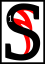

---

<!--- Local CSS Font Loading -->

<!--- Jekyll Page Links -->

<a href="../../../../../index.html">Home</a>
&emsp;&nabla;&emsp;
<a href="../../../../about/index.html">About</a>
&emsp;&nabla;&emsp;
<a href="../../../../archive/index.html">Archive</a>
&emsp;&nabla;&emsp;
<a href="../../../index.html">Quintessence</a>

<!--- Markdown Body Below: -->

---

## sithisit

#### Sithis

ithis is the start of the house. Before him was nothing,
<b>&sup2;</b>but the foolish Aldmer have names for and revere this nothing. That is because they are lazy slaves.
<b>&sup3;</b>Indeed, from the Sermons,

'stasis asks merely for itself, which is nothing.'

<b>&#8308;</b>Sithis sundered the nothing and mutated the parts, fashioning from them a myriad of possibilities.
<b>&#8309;</b>These ideas ebbed and flowed and faded away and this is how it should have been.

<b>&#8310;</b>One idea, however, became jealous and did not want to die; like the stasis, he wanted to last.
<b>&#8311;</b>This was the demon Anui-El, who made friends, and they called themselves the Aedra.
<b>&#8312;</b>They enslaved everything that Sithis had made and created realms of everlasting imperfection.
<b>&#8313;</b>Thus are the Aedra the false gods, that is, illusion.

<b>&sup1;&#8304;</b>So Sithis begat Lorkhan and sent him to destroy the universe.

Lorkhan! Unstable mutant!

<b>&sup1;&sup1;</b>Lorkhan had found the Aedric weakness. While each rebel was, by their nature, immeasurable, they were, through jealously and vanity, also separate from each other.
<b>&sup1;&sup2;</b>They were also unwilling to go back to the nothing of before.
<b>&sup1;&sup3;</b>So while they ruled their false dominions, Lorkhan filled the void with a myriad of new ideas. These ideas were legion.
<b>&sup1;&#8308;</b>Soon it seemed that Lorkhan had a dominion of his own, with slaves and everlasting imperfections, and he seemed, for all the world, like an Aedra.
<b>&sup1;&#8309;</b>Thus did he present himself as such to the demon Anui-El and the Eight Givers: as a friend.

\[
<b>&sup1;&#8310;</b>Such was the plan of Lorkhan:

To destroy the false gods, free their slaves and reveal their illusion.

<b>&sup1;&#8311;</b>And this is how he achieved it:

He told them that he was tired of his dominion and wanted to create a new one. This was foolish enough to arouse the curiosity of the always satisfied Aedra.

<b>&sup1;&#8312;</b>They watched Lorkhan perform his work. Magnus was the first to express an opinion on this new domain.
<b>&sup1;&#8313;</b>For Lorkhan had duped them all and so Nirn was created.
&emsp;]

<b>&sup2;&#8304;</b>Thus, go unto the Sharmat as a friend.

AE HERMA MORA ALTADOON PADHOME LKHAN AE AI

---

#### References

1. [UESP: Sithis][1]
2. [Monomyth: French Version][2]
3. [Original Monomyth Research][3]

[1]: https://en.uesp.net/wiki/Morrowind:Sithis
[2]: https://lagbt.wiwiland.net/index.php?title=Le_Monomythe
[3]: https://old.reddit.com/r/teslore/comments/iozxpc/first_editions_in_translation_anuad_sithis_more/

---
