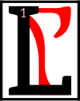

---

<!--- Local CSS Font Loading -->

<!--- Jekyll Page Links -->

<a href="../../../../../index.html">Home</a>
&emsp;&nabla;&emsp;
<a href="../../../../archive/about.html">About</a>
&emsp;&nabla;&emsp;
<a href="../../../../archive/index.html">Archive</a>
&emsp;&nabla;&emsp;
<a href="../../../index.html">Quintessence</a>

<!--- Markdown Body Below: -->

---

## shaln am nirn

#### Spirit of Nirn

orkhan is the Spirit
of Nirn, the god of all mortals.
<b>&sup2;</b>This does not mean all mortals necessarily like him or even know him.
<b>&sup3;</b>Most mer hate him, thinking creation as that act which sundered them from the spirit realm.
<b>&#8308;</b>Most humans revere him, or aspects of him, as the herald of existence.

<b>&#8309;</b>The creation of the Mortal Plane, the Mundus, Nirn, is a source of mental anguish to all living things;
<b>&#8310;</b>all souls know deep down they came originally from somewhere else, and that Nirn is a cruel and crucial step to what comes next.
<b>&#8311;</b>What is this next?

Some wish to return to the original state, the spirit realm, and that Lorkhan is the Demon that hinders their way;
<b>&#8312;</b>to them Nirn is a prison, an illusion to escape.

<b>&#8313;</b>Others think that Lorkhan created the world as the testing ground for transcendence;
<b>&sup1;&#8304;</b>to them the spirit realm was already a prison, that true escape is now finally possible.

---

#### References

1. [UESP: Spirit of Nirn, God of Mortals][1]

[1]: https://en.uesp.net/wiki/Morrowind:Spirit_of_Nirn,_God_of_Mortals

---
