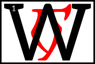

---

<!--- Local CSS Font Loading -->

<!--- Jekyll Page Links -->

<a href="../../../../../index.html">Home</a>
&emsp;&nabla;&emsp;
<a href="../../../../about/index.html">About</a>
&emsp;&nabla;&emsp;
<a href="../../../../archive/index.html">Archive</a>
&emsp;&nabla;&emsp;
<a href="../../../index.html">Quintessence</a>

<!--- Markdown Body Below: -->

---

## nerevar neen

#### The Real Nerevar

hen the Dunmer followed Veloth to Morrowind, they were many warring clans, with no law or leader in common.
<b>&sup2;</b>One Dunmer warlord, Nerevar, had the ambition to rule all the Dunmer.

<b>&sup3;</b>In that time, House Dwemer were great enchanters, so Nerevar went in secret to a Dwemer smith and asked for an enchanted ring that would help him.
<b>&#8308;</b>The ring gave its wearer great powers of persuasion; for safety, it was enchanted to instantly kill anyone who wore it except Nerevar.
<b>&#8309;</b>The ring was called Moon-and-Star, and it helped Nerevar unite the various clans into the First Council.

<b>&#8310;</b>Later, however, disputes over religion divided the Council, with House Dwemer and House Dagoth on one side and all the other Houses on the other.
<b>&#8311;</b>Dwemer and Dagoth invited Orc and Nord clans as allies, and held northwest Morrowind,
<b>&#8312;</b>while Nerevar mustered the other Houses and nomad tribes and marched to meet the Dwemer-Dagoth-Westerner forces.

<b>&#8313;</b>The armies met at Red Mountain, a Dwemer stronghold.
<b>&sup1;&#8304;</b>The Dwemer were defeated, with great slaughter, and terrible sorceries were used, resulting in the utter extermination of House Dwemer, House Dagoth, and their allies.
<b>&sup1;&sup1;</b>Nerevar was killed in the battle, and his ring lost, but Nerevar's alliance survives in Morrowind's ruling political institution, the Grand Council.

---

#### References

1. [UESP: The Real Nerevar][1]

[1]: https://en.uesp.net/wiki/Morrowind:The_Real_Nerevar

---
