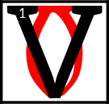

---

<!--- Local CSS Font Loading -->

<!--- Jekyll Page Links -->

<a href="../../../../../index.html">Home</a>
&emsp;&nabla;&emsp;
<a href="../../../../archive/about.html">About</a>
&emsp;&nabla;&emsp;
<a href="../../../../archive/index.html">Archive</a>
&emsp;&nabla;&emsp;
<a href="../../../index.html">Quintessence</a>

<!--- Markdown Body Below: -->

---

## amaranth

#### The Amaranth

ivec was borne by ribbons of water, which wrote their starward couplings in red. This was a new place of speed.
<b>&sup2;</b>His eyes broke on the spikes above the tower, where the Void Ghost squatted over a drake-scaled drum, imbecile in its rhythm.
<b>&sup3;</b>And he asked of it:

"Who are you, that need no signature at all?"

<b>&#8308;</b>Three in sum, the robes of Ayem stretched towards the bright black rim of memory, roping an arc of purchase. This was a new sprinting task.
<b>&#8309;</b>And Seht held his swollen belly to its name, clockmaker's daughter, swimming the dead confession along a century of thread,
<b>&#8310;</b>Naming her, uneaten, a golden cache of Veloth and Velothi, for where else would they know to go?

<b>&#8311;</b>"Go here: world without wheel, charting zero deaths, and echoes singing,"

Seht said, until all of it was done, and in the center was anything whatever.

<b>&#8312;</b>And the red moment became a great howling unchecked, for the Provisional House was in ruin.
<b>&#8313;</b>And Vivec became as glass, a lamp, for the dragon's mane had broke, and the red moon bade him come.

<b>&sup1;&#8304;</b>"The sign of royalty is not this," a signal blueshift told him, "There is no right lesson learned alone."

<b>&sup1;&sup1;</b>He refused the twine on her catching net, spiteful that an uncontinued people would not become fuller by their searching, and yet were wracked in their spirits for flight.
<b>&sup1;&sup2;</b>But the male signals were offended, and Vivec took a fighting form.
<b>&sup1;&sup3;</b>He undid his eastern light, saying to the
ASV
that through war, they had become brides in glass, which no power could observe.

<b>&sup1;&#8308;</b>The light bent, and Vivec donned a cuirass made of red plates of jewel, and a mask that marked him born in the lands of Man.
<b>&sup1;&#8309;</b>Wheeling, he spread into an insect salve, worn on the neck of hist-bulbs when at challenge.
<b>&sup1;&#8310;</b>He roared up and fed his fingers to mammoth ghosts. The signal fires wondered if they mistook this for surrender, for Vivec had told the void that he could learn to undo it all.

<b>&sup1;&#8311;</b>The light bent, and somewhere a history was finally undone.
<b>&sup1;&#8312;</b>Of it, Vivec remembered the laughing of the netchimen of his village when the hunts were good.
<b>&sup1;&#8313;</b>He marched with his father in the ash, growing strong in the hooks and sail, able to run a junk through silt.
<b>&sup2;&#8304;</b>At eleven, he sung to an ashkhan. He became sick after Red Mountain, with the nix-blood and fever, and was infirm a hundred years.
<b>&sup2;&sup1;</b>His mother survived him and laid his body at the altar of Padomay. She gave him her skin to wear into the underworld.

<b>&sup2;&sup2;</b>The light bent, and Vivec awoke and grew fangs, unwilling to make of herself a folding thing. This was a new and lunar promise.
<b>&sup2;&sup3;</b>And in her Biting she tunneled up and then downward, while her brother and sister smeared across heaven, thin ruptures of dissent, food for scarabs and the Worm.
<b>&sup2;&#8308;</b>She took her people and made them safe, and sat with Azura drawing her own husband's likeness in the dirt.

<b>&sup2;&#8309;</b>"For I have removed my left hand and my right, he will say," she said, "for that is how I shall win against them.
<b>&sup2;&#8310;</b>Love alone and you shall know only mistakes of salt."

<b>&sup2;&#8311;</b>The worlding of the words is
AMARANTH

---

#### References

1. [UESP: Sermon 37][1]

[1]: https://en.uesp.net/wiki/Online:The_36_Lessons:_Sermon_37

---
