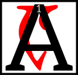

---

<!--- Local CSS Font Loading -->

<!--- Jekyll Page Links -->

<a href="../../../../../index.html">Home</a>
&emsp;&nabla;&emsp;
<a href="../../../../about/index.html">About</a>
&emsp;&nabla;&emsp;
<a href="../../../../archive/index.html">Archive</a>
&emsp;&nabla;&emsp;
<a href="../../../index.html">Quintessence</a>

<!--- Markdown Body Below: -->

---

## sild kol as bal'huloakam

#### The Post at the Turning Point

maranth anon Anew
AE
I,

which is said to have occupied the passageways of heaven and earth, because everyone above and below asks Amaranth anon Anew
AE
I if they cannot find the passage,
<b>&sup2;</b>Amaranth anon Anew
AE
I is the Godhead who caused to be visible.
<b>&sup3;</b>Amaranth anon Anew
AE
I stands as a post at the turning point.

<b>&#8308;</b>The others say of Amaranth anon Anew
AE
I the post:

"The one and one (an inelegant number) who crosses the middle of the Z Centerex without calm, may his name be I and no other, for he takes up the center of it in sleep."

<b>&#8309;</b>"The path of the stars of the sky should be kept unchanged but will not, for he dreams in the sun and now has dreamed of orphans, anon Magne-Ge, the colors he still wishes to dream."

---

#### References

1. [Amaranth IRC Reveal][1]

[1]: https://gist.github.com/numinit/34ba3bacc21e19e21c46

---
