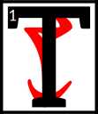

---

<!--- Local CSS Font Loading -->

<!--- Jekyll Page Links -->

<a href="../../../../../index.html">Home</a>
&emsp;&nabla;&emsp;
<a href="../../../../archive/about.html">About</a>
&emsp;&nabla;&emsp;
<a href="../../../../archive/index.html">Archive</a>
&emsp;&nabla;&emsp;
<a href="../../../index.html">Quintessence</a>

<!--- Markdown Body Below: -->

---

## arca'resdul

#### Fable Five

__The Guar and the Mudcrabs__

he Guar were so tormented by the other creatures they did not know where to go.
<b>&sup2;</b>As soon as they saw a single beast approach them, off they dashed in terror.

<b>&sup3;</b>One day they saw a pack of Nix-hounds ranging about, and in a desperate panic all the Guar scuttled off towards the sea, determined to drown themselves rather than live in such a continual state of fear.
<b>&#8308;</b>But just as they got near the shoreline, a colony of Mudcrabs, frightened in their turn by the approach of the Guar, scuttled off, and threw themselves into the water.

<b>&#8309;</b>"Truly," said one of the Guar, "things are not so bad as they seem. For there is always someone worse off than you."

---

#### References

1. [UESP: Homilies of Blessed Almalexia][1]

[1]: https://en.uesp.net/wiki/Morrowind:Homilies_of_Blessed_Almalexia#The_and_the_s

---
