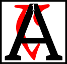

---

<!--- Local CSS Font Loading -->

<!--- Jekyll Page Links -->

<a href="../../../../../index.html">Home</a>
&emsp;&nabla;&emsp;
<a href="../../../../about/index.html">About</a>
&emsp;&nabla;&emsp;
<a href="../../../../archive/index.html">Archive</a>
&emsp;&nabla;&emsp;
<a href="../../../index.html">Quintessence</a>

<!--- Markdown Body Below: -->

---

## alnahna'resdul

#### Fable Ten

__The Friendly Alit__

 jovial alit pranced across the Ashlands, ever watchful for a beast it could call "friend."
<b>&sup2;</b>Presently it came upon a nix-hound who was preening itself in an ashpit. The alit smiled a great smile and cried out, "Greetings, friend!"
<b>&sup3;</b>The nix-hound, seeing the alit's huge teeth, panicked and dashed under a rock. The alit sighed and pranced on.

<b>&#8308;</b>In due course it came upon a vvardvark rooting through a beetle-nest. "Hello!" the alit shouted, smiling widely and revealing its huge, sharp teeth.
<b>&#8309;</b>The vvardvark squealed in terror and scampered off into the bushes. The alit released another mournful sigh, and trundled on toward the shore.

<b>&#8310;</b>Finally, it spotted an ash-hopper rolling in the sand. The alit summoned up its widest, most cheerful smile and said, "Hail, ash-hopper!"
<b>&#8311;</b>The ash-hopper leapt back in horror and sprung away as fast as it could.

The alit was heartbroken.
<b>&#8312;</b>"I will never have a friend as long as I have these terrible teeth!" it hissed.
<b>&#8313;</b>The beast resolved to be done with them altogether. It took a huge rock in its mouth and bit down hard&mdash;knocking out all its teeth like a box of loose nails.
<b>&sup1;&#8304;</b>"Finally," it sighed "other beasts will no longer be afraid!"

<b>&sup1;&sup1;</b>Just then a great Kagouti arrived, stomping its feet and preparing to pounce. The alit growled and opened its wide jaws to frighten the predator away, but the kagouti just laughed.
<b>&sup1;&sup2;</b>"You fool! You've no teeth left in your head!"
<b>&sup1;&sup3;</b>The alit realized its folly too late. The kagouti lunged and swallowed the cheerful beast in one huge gulp.

<b>&sup1;&#8308;</b>So you see, child&mdash;that which we hate in ourselves is often our greatest gift.

---

#### References

1. [UESP: Blessed Almalexia's Fables for Morning][1]

[1]: https://en.uesp.net/wiki/Online:Blessed_Almalexia%27s_Fables_for_Morning

---
