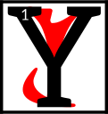

---

<!--- Local CSS Font Loading -->

<!--- Jekyll Page Links -->

<a href="../../../../../index.html">Home</a>
&emsp;&nabla;&emsp;
<a href="../../../../about/index.html">About</a>
&emsp;&nabla;&emsp;
<a href="../../../../archive/index.html">Archive</a>
&emsp;&nabla;&emsp;
<a href="../../../index.html">Quintessence</a>

<!--- Markdown Body Below: -->

---

## alnahn'arca'resdul

#### Fable Fifteen

__Sotha Sil and the Stars__

oung Sotha Sil lay upon a patch of moss and gazed up at the stars. Driven by his great love of maths, his mind turned to counting.

<b>&sup2;</b>"I shall count every star and give each a name!" he resolved.

<b>&sup3;</b>For hours he counted and named until, at length, his eyes tired and he drifted off to sleep.

<b>&#8308;</b>When morning came, Sotha Sil woke with a start and looked up at the sky. Alas, all the stars had vanished.
<b>&#8309;</b>He buried his face in his hands and began to weep, for he had learned a harsh lesson.
<b>&#8310;</b>You see, child, time cages all tasks.

---

#### References

1. [UESP: Blessed Almalexia's Fables for Evening][1]

[1]: https://en.uesp.net/wiki/Online:Blessed_Almalexia%27s_Fables_for_Evening

---
