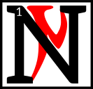

---

<!--- Local CSS Font Loading -->

<!--- Jekyll Page Links -->

<a href="../../../../index.html">Home</a>
&emsp;&nabla;&emsp;
<a href="../../../archive/about.html">About</a>
&emsp;&nabla;&emsp;
<a href="../../../archive/index.html">Archive</a>
&emsp;&nabla;&emsp;
<a href="../../index.html">Quintessence</a>

<!--- Markdown Body Below: -->

---

&#8203;

<h1>Iam Caard</h1>
<h1>THE ANCESTORS</h1>

<h4>PSJJJJ</h4>

<h6>The Post at the Turning Point</h6>
<h6>and the Start of the House</h6>

&#8203;\
&#8203;

---

## Chapters

| &#8203; | Index                         |
|--------:|:------------------------------|
|  __1:__ | [Sithis][1]                   |
|  __2:__ | [Mythic Aurbis][2]            |
|  __3:__ | [Changed Ones][3]             |
|  __4:__ | [Exodus from Summerset][4]    |
|  __5:__ | [End of the Journey][5]       |
|  __6:__ | [The Real Nerevar][6]         |
|  __7:__ | [The Daedra][7]               |
|  __8:__ | [The Anticipations][8]        |
|  __9:__ | [The House of Troubles][9]    |
| __10:__ | [The Doors of the Spirit][10] |
| __11:__ | [Blasphemous Revenants][11]   |
| __12:__ | [Spirit of Nirn][12]          |

[1]: #sithisit
[2]: #gahtoshok-aurbex
[3]: #chimer
[4]: #ajalde-devehr-summerset
[5]: #dimihn-am-as-itam
[6]: #nerevar-neen
[7]: #as-daedra
[8]: #as-alvioos
[9]: #thil-am-rokashiin
[10]: #khiis-am-as-shaln
[11]: #demigi-devahroshaaln
[12]: #shaln-am-nirn
[13]: #
[14]: #chapters

---

## sithisit
&emsp;[Open][15] | [Chapters][14] | [Top][13]

[15]: ancestors/sithis.html

#### Sithis

ithis is the start of the house. Before him was nothing,
<b>&sup2;</b>but the foolish Aldmer have names for and revere this nothing. That is because they are lazy slaves.
<b>&sup3;</b>Indeed, from the Sermons,

'stasis asks merely for itself, which is nothing.'

<b>&#8308;</b>Sithis sundered the nothing and mutated the parts, fashioning from them a myriad of possibilities.
<b>&#8309;</b>These ideas ebbed and flowed and faded away and this is how it should have been.

<b>&#8310;</b>One idea, however, became jealous and did not want to die; like the stasis, he wanted to last.
<b>&#8311;</b>This was the demon Anui-El, who made friends, and they called themselves the Aedra.
<b>&#8312;</b>They enslaved everything that Sithis had made and created realms of everlasting imperfection.
<b>&#8313;</b>Thus are the Aedra the false gods, that is, illusion.

<b>&sup1;&#8304;</b>So Sithis begat Lorkhan and sent him to destroy the universe.

Lorkhan! Unstable mutant!

<b>&sup1;&sup1;</b>Lorkhan had found the Aedric weakness. While each rebel was, by their nature, immeasurable, they were, through jealously and vanity, also separate from each other.
<b>&sup1;&sup2;</b>They were also unwilling to go back to the nothing of before.
<b>&sup1;&sup3;</b>So while they ruled their false dominions, Lorkhan filled the void with a myriad of new ideas. These ideas were legion.
<b>&sup1;&#8308;</b>Soon it seemed that Lorkhan had a dominion of his own, with slaves and everlasting imperfections, and he seemed, for all the world, like an Aedra.
<b>&sup1;&#8309;</b>Thus did he present himself as such to the demon Anui-El and the Eight Givers: as a friend.

\[
<b>&sup1;&#8310;</b>Such was the plan of Lorkhan:

To destroy the false gods, free their slaves and reveal their illusion.

<b>&sup1;&#8311;</b>And this is how he achieved it:

He told them that he was tired of his dominion and wanted to create a new one. This was foolish enough to arouse the curiosity of the always satisfied Aedra.

<b>&sup1;&#8312;</b>They watched Lorkhan perform his work. Magnus was the first to express an opinion on this new domain.
<b>&sup1;&#8313;</b>For Lorkhan had duped them all and so Nirn was created.
&emsp;]

<b>&sup2;&#8304;</b>Thus, go unto the Sharmat as a friend.

AE HERMA MORA ALTADOON PADHOME LKHAN AE AI

---

## gah'toshok aurbex
&emsp;[Open][16] | [Chapters][14] | [Top][13]

[16]: ancestors/mythic_aurbis.html

#### Mythic Aurbis

ythic Aurbis exists, and has existed from time without measure, as a fanciful Unnatural Realm.

<b>&sup2;</b>The magical beings of Mythic Aurbis lived for a long time and had complex narrative lives, creating the patterns of myth.

<b>&sup3;</b>Finally, the magical beings of Mythic Aurbis told the ultimate story&mdash;that of their own death.

<b>&#8308;</b>For some this was an artistic transfiguration into the concrete, non-magical substance of the world.

<b>&#8309;</b>For others, this was a war in which all were slain, their bodies becoming the substance of the world.

<b>&#8310;</b>For yet others, this was a romantic marriage and parenthood, with the parent spirits naturally having to die and give way to the succeeding mortal races.

<b>&#8311;</b>The magical beings created the races of the mortal Aurbis in their own image, either consciously as artists and craftsmen, or as the fecund rotting matter out of which the mortals sprung forth, or in a variety of other analogical senses.

<b>&#8312;</b>The magical beings, then, having died, became the et'Ada.

<b>&#8313;</b>The et'Ada are the things perceived and revered by the mortals as gods, spirits, or geniuses of Aurbis.

<b>&sup1;&#8304;</b>Through their deaths, these magical beings separated themselves in nature from the other magical beings of the Unnatural Realms.

---

## chimer
&emsp;[Open][17] | [Chapters][14] | [Top][13]

[17]: ancestors/changed_ones.html

#### Changed Ones

f all the et'Ada who wandered Nirn, Trinimac was the strongest.
<b>&sup2;</b>He, for a very long time, fooled the Aldmeri into thinking that tears were the best response to the Sundering.
<b>&sup3;</b>They cried and shamed our ancestors, especially the feeble Altmer. They even took the Missing God's name in vain, calling His narratives into question.

<b>&#8308;</b>So one day Boethiah, Prince of Plots, precocious youth, tricked Trinimac to go into his mouth.
<b>&#8309;</b>Boethiah talked like Trinimac for awhile then, and gathered enough people to listen to him.
<b>&#8310;</b>Boethiah showed them the lies of the et'Ada, the Aedra, and told them Trinimac was the biggest liar of all, saying all this with Trinimac's voice!
<b>&#8311;</b>Boethiah told the mass before him the Tri-Angled Truth. He showed them, with Mephala, the rules of Psijic Endeavor.
<b>&#8312;</b>He taught them how to build Houses, and what items they needed to bury in the Corners.
<b>&#8313;</b>He demonstrated the right way to wear their skin.
<b>&sup1;&#8304;</b>He performed the way to walk to achieve an Exodus.

<b>&sup1;&sup1;</b>Then Boethiah relieved himself of Trinimac right there on the ground before them to prove all the things he said were the truth.

<b>&sup1;&sup2;</b>It was easy then for his new people to become the Changed Ones.

---

## ajalde devehr summerset
&emsp;[Open][18] | [Chapters][14] | [Top][13]

[18]: ancestors/exodus_from_summerset.html

#### Exodus from Summerset

hose who dare can achieve greatness.

<b>&sup2;</b>Veloth the Prophet was scorned by those who were blind to the corruption and spiritual bankruptcy at the heart of their society.
<b>&sup3;</b>Veloth was cast out, cast off, by those with no interest in truth and even less interest in the betterment of all, who sought only to preserve their pride and place by keeping others in poverty, ignorance, and slavery.
<b>&#8308;</b>Veloth was highborn, but he dared to cast off the decadent chains of Aldmeri society.

<b>&#8309;</b>Veloth the Mystic called out to those whose souls were weary, whose lives were ground out with no hope of improvement in a society founded on ambition, greed, and decadence.
<b>&#8310;</b>To those who hoped for a society that preserved traditions, praised honesty, and rewarded the just, Veloth's voice was as a golden note among a cacophony.

<b>&#8311;</b>Veloth the Pilgrim led his followers across the seas and away from the lands they had known with the promise of a new land and a better future.

---

## dimihn am as itam
&emsp;[Open][19] | [Chapters][14] | [Top][13]

[19]: ancestors/end_of_the_journey.html

#### End of the Journey

t was during the time of Great Despair when Veloth and his people reached the land of Resdayn.
<b>&sup2;</b>For untold weeks they had climbed a mighty range of mountains under Veloth's leadership.
<b>&sup3;</b>Many among the Chimer considered this path to be folly, but they were driven by Veloth's unyielding certainty and commitment.

<b>&#8308;</b>They came upon a great pass, a deep scar in the mountain covered in ice and snow.
<b>&#8309;</b>Veloth drove them onward, chasing a vision that had come to him in a dream.
<b>&#8310;</b>He claimed to see a great hawk in the sky. He vowed that the hawk would lead the Chimer to a new home.
<b>&#8311;</b>They drudged through the pass, but after a time the Chimer could go no farther. A great wall of ice blocked their way.

<b>&#8312;</b>Then a powerful voice boomed from the mountains. "Who are you and why have you come to this place?"

<b>&#8313;</b>"We are a people without a home," replied Veloth to the mountain.

<b>&sup1;&#8304;</b>A young woman stepped out of the wall of ice.\
\
"And who are you?" asked Veloth.

<b>&sup1;&sup1;</b>"I am Chimer-Friend. I have come to lead you home, if you are willing to accept my challenge.
<b>&sup1;&sup2;</b>I demand a sacrifice of you, Veloth. Swear an oath that will make you a better mer."

<b>&sup1;&sup3;</b>Veloth hoisted his mighty hammer and proclaimed, "Never again shall I wield this tool or any other to slay a foe.
<b>&sup1;&#8308;</b>I have given my heart to my people, but now I shall give them more. I shall dedicate my life and my soul to them."

<b>&sup1;&#8309;</b>The woman turned and waved at the wall of ice. It melted away in moments. Beyond lay an alien land of fungus and ash.
<b>&sup1;&#8310;</b>She began to walk forward and the Chimer followed.

Veloth spoke to his people. "We are home," he declared.
<b>&sup1;&#8311;</b>"This is the anvil upon which we shall forge a new people. One journey ends here, but another journey begins."

---

## nerevar neen
&emsp;[Open][20] | [Chapters][14] | [Top][13]

[20]: ancestors/the_real_nerevar.html

#### The Real Nerevar

hen the Dunmer followed Veloth to Morrowind, they were many warring clans, with no law or leader in common.
<b>&sup2;</b>One Dunmer warlord, Nerevar, had the ambition to rule all the Dunmer.

<b>&sup3;</b>In that time, House Dwemer were great enchanters, so Nerevar went in secret to a Dwemer smith and asked for an enchanted ring that would help him.
<b>&#8308;</b>The ring gave its wearer great powers of persuasion; for safety, it was enchanted to instantly kill anyone who wore it except Nerevar.
<b>&#8309;</b>The ring was called Moon-and-Star, and it helped Nerevar unite the various clans into the First Council.

<b>&#8310;</b>Later, however, disputes over religion divided the Council, with House Dwemer and House Dagoth on one side and all the other Houses on the other.
<b>&#8311;</b>Dwemer and Dagoth invited Orc and Nord clans as allies, and held northwest Morrowind,
<b>&#8312;</b>while Nerevar mustered the other Houses and nomad tribes and marched to meet the Dwemer-Dagoth-Westerner forces.

<b>&#8313;</b>The armies met at Red Mountain, a Dwemer stronghold.
<b>&sup1;&#8304;</b>The Dwemer were defeated, with great slaughter, and terrible sorceries were used, resulting in the utter extermination of House Dwemer, House Dagoth, and their allies.
<b>&sup1;&sup1;</b>Nerevar was killed in the battle, and his ring lost, but Nerevar's alliance survives in Morrowind's ruling political institution, the Grand Council.

---

## as daedra
&emsp;[Open][21] | [Chapters][14] | [Top][13]

[21]: ancestors/the_daedra.html

#### The Daedra

he Daedra are not of this world, and are jealous of our walks here, even as they laugh at our inanities.
<b>&sup2;</b>The Daedra are teachers and testers, but never masters. Only a fool does what a Daedra desires without consideration.

<b>&sup3;</b>The bones of the earth are dead and can only whisper their secrets. The Daedra scream theirs, and can change the course of the world with their hands, while the Aedra must plead for mortal interference.
<b>&#8308;</b>That is their power, but beware your own arrogance if you choose to claim it as your own for a time.

<b>&#8309;</b>Mephala is the artist, the weaver of dance and death.
<b>&#8310;</b>Her sex is the act of creation but the destruction of will; her murder the bringer of fear, but the possibility of night.
<b>&#8311;</b>There is birth in every death, death in every birth, and breathtaking beauty in both.
<b>&#8312;</b>Would you see only ashes and death here, in our home? Or the splendor of the morning's kiss on the mushroom's cap, the twisting colors of an active foyada?
<b>&#8313;</b>Lava ravages the land; lava washes the land clean. The new growth is a brighter green, but will attract more locusts to prey on the land.
<b>&sup1;&#8304;</b>Which would you see? Mephala reminds us that there is duality in all, and to hold contentment where we can.
<b>&sup1;&sup1;</b>Dance lightly on the ground else it will shift, but breathe in deep and fast, else you will never know the joy that comes with our petty existence.

<b>&sup1;&sup2;</b>Boethiah is the warrior, fierce, proud, and cunning.
<b>&sup1;&sup3;</b>He reminds us to keep discipline and never stop fighting, even in seeming defeat.
<b>&sup1;&#8308;</b>If you cannot cross the foyada, go around it, go along it, wait a day and build one's own bridge, but never to let it remain your obstacle.
<b>&sup1;&#8309;</b>To surrender fully is the coward's way out, but only the false warrior mistakes laying down one's arms as surrender.
<b>&sup1;&#8310;</b>In the face of a wicked enemy, there are no codes of honor beyond what a mer can do, and what a mer can't.
<b>&sup1;&#8311;</b>But always honor the enemy for the strength they gift you, like the seared heart of a bull guar. We are greater than we know when pushed to the brink by violence.
<b>&sup1;&#8312;</b>The deaths of many raise up the one to lead. Boethiah knows this, and chases the soles of our feet with his cinders.

<b>&sup1;&#8313;</b>Azura is the mystery, the space between waking and sleeping.
<b>&sup2;&#8304;</b>She governs transitions, from day to night, from the wet season to the dry, from babe to full-grown.
<b>&sup2;&sup1;</b>All change needs guidance, and her smile is the proud tusks of the kagouti, as she jostles and guides her enemy to their own undoing, or her mates to their painful awakening.
<b>&sup2;&sup2;</b>A flute never stays on one quaver, but sways back and forth like a woman in dance. When you are blind, you can hear this best, and that is why she would take your eyes.
<b>&sup2;&sup3;</b>Azura's realm is grace and the balance that goes with it.

<b>&sup2;&#8308;</b>Malacath is the warning, the fallen.
<b>&sup2;&#8309;</b>What is a mer with no tribe, no ancestors? Exile is not in the deed but in the heart.
<b>&sup2;&#8310;</b>Cleave to your ancestors, but don't forget our heritage, the path of the wayward and the doubter. Ideals are only pillars waiting to be cast down.
<b>&sup2;&#8311;</b>The rigid who do not look beneath the surface of their thoughts are eaten by the darkness that lies below, and he is our proof of this lesson.
<b>&sup2;&#8312;</b>To see this malcontent hunter, you must keep your eyes open, but your heart stern.

<b>&sup2;&#8313;</b>Mehrunes Dagon is the sculptor of the earth.
<b>&sup3;&#8304;</b>When the winds blow and waves crash, when the Mountain erupts, he is behind these things. We are of the earth and weak, and flee before him.
<b>&sup3;&sup1;</b>But remember this: as bones are re-broken to be set anew, as leeches clean a wound of blood and infectant by their greed, so are we able to make an art of it and swallow our past mistakes.
<b>&sup3;&sup2;</b>The lava burns away the chaff to make way for new grazing. He is a sister to Mephala in this way, the brushstroke to her genius.

<b>&sup3;&sup3;</b>Molag Bal is the wanton fertility, the twister of authority, love, and childbearing.
<b>&sup3;&#8308;</b>As a maggot devours the offal of our kills, in his proper place he will eat of our discards. But as a maggot loose in the meat, he will foul our careful labors.
<b>&sup3;&#8309;</b>His is the true power behind the Missing God's decrees, and though the wise will feel sorrow for the sufferers of his deceit, they will also recognize the untruths this pain has given seed to.
<b>&sup3;&#8310;</b>Molag Bal's lesson is instead in the whisper of the ashkhan's wife before he would charge into his exploits;
<b>&sup3;&#8311;</b>though she may be of weaker arm than her warrior husband, her discretion and sympathies guide her tribe as much as the control and vigors of her partner, and those who corrupt either are ceded to Molag's mercy.

<b>&sup3;&#8312;</b>Sheogorath is the slower blight, eater of order, punching holes of chaos into the prideful veneers of mer.
<b>&sup3;&#8313;</b>Like a rabid nix-hound, he will blunder and bite at mer on the way. Eat of his flesh and you share of this madness, so set him loose well away from the tribes.
<b>&#8308;&#8304;</b>Should he come sniffing around, coolly show him your manners as befitting an honored guest, but do not let him in.

---

## as alvioos
&emsp;[Open][22] | [Chapters][14] | [Top][13]

[22]: ancestors/the_anticipations.html

#### The Anticipations

he Daedra are powerful ancestor spirits, similar in form and substance to the Tribunal, but weaker in power, and more arbitrary and removed from the affairs of mortals.
<b>&sup2;</b>In old times, the Chimer worshiped the Daedra as gods. But they did not deserve this veneration, for the Daedra harm their worshipers as often as help them.

<b>&sup3;</b>The Advent of the Tribunal changed this unhappy state.

<b>&#8308;</b>By the Apotheosis, the Tribunal became the Protectors and High Ancestor Spirits of the Dunmer, and bade the Daedra to give proper veneration and obedience.
<b>&#8309;</b>The Three Good Daedra, Boethiah, Azura, and Mephala, recognized the Divinity of the Triune Ancestors.
<b>&#8310;</b>The Rebel Daedra, Molag Bal, Malacath, Sheogorath, and Mehrunes Dagon, refused to swear fealty to the Tribunal, and their worshipers were cast out.

<b>&#8311;</b>These Rebel Daedra thus became the Four Corners of the House of Troubles, and they continue to plague our tranquility and tempt the unwary into Heresy and Dark Worship.
<b>&#8312;</b>The Priests of the Temple remain ever vigilant for signs of the Adversaries' return, sometimes aided by the loyal Three Good Daedra, who are familiar with the wiles of their rebellious kin.

<b>&#8313;</b>The Good Daedra are known to the Temple as the Anticipations, since they are the early ancestral anticipations of the loving patronage of the Tribunal.
<b>&sup1;&#8304;</b>The Anticipations are the Daedra Lords Boethiah, Mephala, and Azura.

<b>&sup1;&sup1;</b>Boethiah is the Anticipation of Almalexia but male to her female.
<b>&sup1;&sup2;</b>Boethiah was the ancestor who illuminated the Aldmer ages ago before the Mythic Era.
<b>&sup1;&sup3;</b>He told them the truth of Lorkhan's test, and defeated Auri-El's champion, Trinimac.
<b>&sup1;&#8308;</b>Boethiah ate Trinimac and voided him.
<b>&sup1;&#8309;</b>The followers of Boethiah and Trinimac rubbed the soil of Trinimac upon themselves and changed their skins.

<b>&sup1;&#8310;</b>Mephala is the Anticipation of Vivec, but manifold and androgynous.
<b>&sup1;&#8311;</b>Mephala taught the Chimer to evade their enemies or kill them with secret murder.
<b>&sup1;&#8312;</b>The Chimer were few in those days and threatened on all sides.
<b>&sup1;&#8313;</b>Mephala taught the Chimer to build Houses.
<b>&sup2;&#8304;</b>Later, Mephala created the Morag Tong.

<b>&sup2;&sup1;</b>Azura is the Anticipation of Sotha Sil, but female to his male.
<b>&sup2;&sup2;</b>Azura was the ancestor who taught the Chimer how to be different from the Altmer. Her teachings are sometimes attributed to Boethiah.
<b>&sup2;&sup3;</b>In the stories, Azura is often encountered more as a communal progenitor of the race as a whole rather than as an individual ancestor.
<b>&sup2;&#8308;</b>She is associated with Dusk and Dawn, and is sometimes called the Mother Soul.
<b>&sup2;&#8309;</b>Azura's Star, also called the Twilight Star, appears briefly at dawn and dusk low on the horizon below the constellation of the Steed.
<b>&sup2;&#8310;</b>Azura is associated with mystery and magic, fate and prophecy.

---

## thil am rokashiin
&emsp;[Open][23] | [Chapters][14] | [Top][13]

[23]: ancestors/the_house_of_troubles.html

#### The House of Troubles

mong the ancient ancestral spirits who accompanied Veloth and the Chimer into the promised land of Morrowind, the four Daedra Lords, Malacath, Mehrunes Dagon, Molag Bal, and Sheogorath, are known as the Four Corners of the House of Troubles.
<b>&sup2;</b>These Daedra Lords rebelled against the counsel and admonition of the Tribunal, causing great kinstrife and confusion among the clans and Great Houses.

<b>&sup3;</b>Malacath, Mehrunes Dagon, Molag Bal, and Sheogorath are holy in that they serve the role of obstacles during the Testing.
<b>&#8308;</b>Through time they have sometimes become associated with local enemies, like the Nords, Akaviri, or Mountain Orcs.

<b>&#8309;</b>Malacath is the reanimated dung that was Trinimac. Malacath is a weak but vengeful god.
<b>&#8310;</b>The Dunmer say he is Malak, the god-king of the Orcs. He tests the Dunmer for physical weakness.

<b>&#8311;</b>Molag Bal is, in Morrowind, the King of Rape. He tries to upset the bloodlines of Houses and otherwise ruin the Dunmer gene pool.
<b>&#8312;</b>A race of monsters, said to live in Molag Amur, are the result of his seduction of Vivec during the previous era.

<b>&#8313;</b>Sheogorath is the King of Madness. He always tests the Dunmer for mental weakness.
<b>&sup1;&#8304;</b>In many legends he is called upon by one Dunmer faction against another;
<b>&sup1;&sup1;</b>in half of these stories he does not betray those who called him, further confusing the issue of his place in the scheme of things.
<b>&sup1;&sup2;</b>He is often associated with the fear other races have of the Dunmer, especially those who, like the Empire, might prove as useful allies.

<b>&sup1;&sup3;</b>Mehrunes Dagon is the god of destruction. He is associated with natural dangers like fire, earthquakes, and floods.
<b>&sup1;&#8308;</b>To some he represents the inhospitable land of Morrowind. He tests the Dunmer will to survive and persevere.

<b>&sup1;&#8309;</b>The worship of these four malevolent spirits is against the law and practice of the Temple.
<b>&sup1;&#8310;</b>However, the Four Corners seldom fail to discover those greedy, reckless, or mad enough to serve them.

<b>&sup1;&#8311;</b>By ancient Temple law and custom, the lives of witches and warlocks are forfeit,
<b>&sup1;&#8312;</b>and garrisons join Ordinators and Buoyant Armigers of the Temple in tracking down and destroying these foul covens in the wilderness refuges and ancient ruins where they conceal their profane worships.

---

## khiis am as shaln
&emsp;[Open][24] | [Chapters][14] | [Top][13]

[24]: ancestors/the_doors_of_the_spirit.html

#### The Doors of the Spirit

he Ancestors are among us. They are never farther away than the Waiting Door.

<b>&sup2;</b>The Ancestors are not departed. The dead are not under the earth.
<b>&sup3;</b>Their spirits are in the restless wind, in the fire's voice, in the foot-smoothed step.
<b>&#8308;</b>Pay heed to these things, and you will know your absent kin.

<b>&#8309;</b>Pay reverence through gift and prayer.
<b>&#8310;</b>Acquaint the Ancestors with your affairs, with your comings and goings, with your blessings and trials.

<b>&#8311;</b>From the Waiting Door comes your protection.
<b>&#8312;</b>Heed the spirits, who are the guardians of your hearth, teachers of wisdom, counselors of fortune, seers of fate.

<b>&#8313;</b>Each bone is a door through the wall of the world.
<b>&sup1;&#8304;</b>Each bone is the road, with Wisdom and Power the travelers.
<b>&sup1;&sup1;</b>Each bone is the ghost fence that guards us from evil.

<b>&sup1;&sup2;</b>Honor the Ancestors upon your hearths, within your halls, in the community of your temples, in the solitude of your tombs.

<b>&sup1;&sup3;</b>Guard your Ancestors from beasts, from thieves, from profane priests and sorcerers.
<b>&sup1;&#8308;</b>Let no creature steal your spirits, for the plundered hearth is diminished, and the plundered tomb is shamed.

<b>&sup1;&#8309;</b>Live in One World with your spirits. Honor the spirits within and without you.
<b>&sup1;&#8310;</b>Do not grieve for the dead. Take shelter in their arms, and pay heed to their words.

---

## demigi devahroshaaln
&emsp;[Open][25] | [Chapters][14] | [Top][13]

[25]: ancestors/blasphemous_revenants.html

#### Blasphemous Revenants

ot into the world, nor out of it, but between worlds they linger, held to the hearth and tomb by blood and loyalty.
<b>&sup2;</b>And if they come unbidden, from love of kin or faith to duty, it is not unholy.
<b>&sup3;</b>It is but the answering of the ancestors, the awakening of those who never sleep, the summoning to service of those bound through Hearth and House to the protection of the clan.

<b>&#8308;</b>But if sorcerers bring them forth, then such a summons is blasphemy, an abomination before the tribes and Temple, and a sin so great that ages of burning cannot cleanse the fault.
<b>&#8309;</b>Abide not the sorcerer among you, for he comes to steal the bones of your fathers and dust of your tombs.
<b>&#8310;</b>He seeks to bind by power what is yours by right, to drag forth the warm spirits from their world between and bind them to their service like slaves and beasts.

<b>&#8311;</b>Who can know the shame of the dead, the ceaseless weeping of the necromancer's thrall?
<b>&#8312;</b>Cruel enough is the ancestor's service given in love to Hearth and Kin.
<b>&#8313;</b>But ghost or guardian, bone-walker or bonelord, summoned by profane ritual and bound by force to the corpse miner's will, how may such a spirit ever find rest?
<b>&sup1;&#8304;</b>How may it ever find its way back to its blood and clan?

<b>&sup1;&sup1;</b>Only a righteous Dunmer, bound by blood to hearth and kin, bound by oath and service to the Temple, can call upon the spirits of the Dunmer dead.
<b>&sup1;&sup2;</b>Those foreign sorcerers of other races that invade our shores, shall they be permitted to rob our tombs, to bind our kin-spirits into sorcerous slavery, to steal the lives of our dead as well as our land of the living?
<b>&sup1;&sup3;</b>No, I say, no, and no, three times more. Such necromancers must die, and their profane magics must die with them.

<b>&sup1;&#8308;</b>And shall we tolerate the hidden hosts of the undead, the arrogant princes of necromancers, the ancient vampire demons who creep from their lairs in the West, seeking refuge in profane Daedric shrines, abandoned Dunmer strongholds, and corrupted subterranean labyrinths of the detested Dwemer race?
<b>&sup1;&#8309;</b>For ages the Great Houses and the Temple have kept our land clean of the vampire's taint, but now these undead lords and their vile cattle have returned.
<b>&sup1;&#8310;</b>These vampires must die, and their corrupt cattle with them, and their blood taint must be forever erased by fire and stake.

---

## shaln am nirn
&emsp;[Open][26] | [Chapters][14] | [Top][13]

[26]: ancestors/spirit_of_nirn.html

#### Spirit of Nirn

orkhan is the Spirit
of Nirn, the god of all mortals.
<b>&sup2;</b>This does not mean all mortals necessarily like him or even know him.
<b>&sup3;</b>Most mer hate him, thinking creation as that act which sundered them from the spirit realm.
<b>&#8308;</b>Most humans revere him, or aspects of him, as the herald of existence.

<b>&#8309;</b>The creation of the Mortal Plane, the Mundus, Nirn, is a source of mental anguish to all living things;
<b>&#8310;</b>all souls know deep down they came originally from somewhere else, and that Nirn is a cruel and crucial step to what comes next.
<b>&#8311;</b>What is this next?

Some wish to return to the original state, the spirit realm, and that Lorkhan is the Demon that hinders their way;
<b>&#8312;</b>to them Nirn is a prison, an illusion to escape.

<b>&#8313;</b>Others think that Lorkhan created the world as the testing ground for transcendence;
<b>&sup1;&#8304;</b>to them the spirit realm was already a prison, that true escape is now finally possible.

---

---
