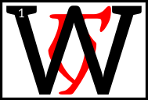
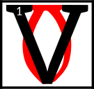

---

<!--- Local CSS Font Loading -->

<!--- Jekyll Page Links -->

<a href="../../../../index.html">Home</a>
&emsp;&nabla;&emsp;
<a href="../../../archive/about.html">About</a>
&emsp;&nabla;&emsp;
<a href="../../../archive/index.html">Archive</a>
&emsp;&nabla;&emsp;
<a href="../../index.html">Quintessence</a>

<!--- Markdown Body Below: -->

---

&#8203;

<h1>neihn'dahrdii</h1>
<h1>THE AVOWALMENTS</h1>

<h4>SCARAB AE AURBEX</h4>
<h6>The New Man becomes God becomes Amaranth</h6>

&#8203;\
&#8203;

---

## Chapters

| &#8203; | Index                              |
|--------:|:-----------------------------------|
|  __1:__ | [Mystery of the Apotheosis][1]     |
|  __2:__ | [The Selected Teachings][2]        |
|  __3:__ | [Hour of the Dragon Break][3]      |
|  __4:__ | [The Memories of Sotha Sil][4]     |
|  __5:__ | [The Post at the Turning Point][5] |
|  __6:__ | [The Obscured Loveletter][6]       |
|  __7:__ | [The Prophet of Landfall][7]       |
|  __8:__ | [The Amaranth][8]                  |

[1]: #leysha-am-as-panthimerdohn
[2]: #khiryeag-shoreshiin
[3]: #as-telsan-am-akaaduri
[4]: #mnem-am-sotha-sil
[5]: #sild-kol-as-balhuloakam
[6]: #molhiag-daelshokhthi
[7]: #bihnshokil-am-provicithuhn
[8]: #amaranth
[9]: #
[10]: #chapters

---

## leysha am as panthimerdohn
&emsp;[Open][11] | [Chapters][10] | [Top][9]

[11]: avowalments/mystery_of_the_apotheosis.html

#### Mystery of the Apotheosis

hen the Tribunal mortals reached into the center, they ceased to be anything except for what they wished to be.
<b>&sup2;</b>The axis erupted. There was an exact cracking, an instant of pure Aurbis, their hands burnt black by that ever-nil of static change, and the gods who had never been had always been.
<b>&sup3;</b>A whole universe swelled up to legitimize their throne, as the old universe, where the mortals still lapped up Godsblood, warped itself to accept its new equivalent.
<b>&#8308;</b>And like all things magical it simply could not happen, could not Be. Red Mountain was the intersection of the Is-Is Not as it was of old, its center point, and it did not hold.
<b>&#8309;</b>And so the Dragon, having broken, saw fit to heal, turning into the world you know. Except now the gods were alive before their own birth, which had, in fact, really happened in the death of the last universe.

<b>&#8310;</b>
GHARTOK PADHOME AE ALTADOON DUNMERI

The Tribunal gloriously usurped the worship of their Anticipations, as was foretold in the words of Veloth.

<b>&#8311;</b>Earlier than Vehk were Ayem and Seht. They had supplanted in the orbit of the Chimeri soul those Daedra that predated them, Mephala and Boethiah and Azura respectively.
<b>&#8312;</b>None of them did this out of criminal intent. Rather, these beings were the Anticipations in the truest sense, the fore-images of the gods that would come for Morrowind.
<b>&#8313;</b>The gods hold the original Triune in honor as the bringers of difference and culture, and knowledge, and revere them as the harbingers of the glory of
ASV.
<b>&sup1;&#8304;</b>And never did we question their divinities or remove them from our holy books.

But as Vehk once spoke of the Rainmaker, the needs of the people change, and those that provide guidance to them must also change.
<b>&sup1;&sup1;</b>While it may seem strange to imply that the fore-images of the Tribunal, being Daedra, were adverse to change, they were, and they are.
<b>&sup1;&sup2;</b>In this they are very alike to the Aedra in their fundaments.
<b>&sup1;&sup3;</b>While born of Padomay, they are of too much ego to give up their realms entirely, especially for altruism, which is perhaps what they most hate.

<b>&sup1;&#8308;</b>And so from their basis did the Tribunal spring, called to heaven by violence, our people throwing our mantles to them across stars, and across time, and magic and dream, and here they remain.

---

## khirye'ag shoreshiin
&emsp;[Open][12] | [Chapters][10] | [Top][9]

[12]: avowalments/the_selected_teachings.html

#### The Selected Teachings

__of Vehk__

he Psijic Endeavor
is the basis for the teachings of the Prophet Veloth, founder of present day Morrowind and father of Dunmeri culture.
<b>&sup2;</b>Veloth describes the Psijic Endeavor as a process of glorious apotheosis, where time itself is bent inward and outward into 'a shape that is always new'.
<b>&sup3;</b>Those who can attain this state, called Chim, experience an ineffable sense of the godhead, and escape the strictures of the world-egg.

<b>&#8308;</b>It should be noted that, while Veloth is given credit for establishing the anti-laws that govern the Endeavor, this process has its antecedents in the teachings of the Black Hands Mephala, Boethiah, Azura, Trinimac, and, of course, Lorkhan, through that lord's association with
PSJJJJ.

<b>&#8309;</b>Chim, from the Ehlnofex,
is an ancient sigil connoting 'royalty', 'starlight', and 'high splendor'. As with most characters of that dangerous language, the sigil
CHIM
constantly distorts itself.
<b>&#8310;</b>Those scholars that can perceive its shape regard it as a Crowned Tower that threatens to break apart at the slightest break in concentration.

<b>&#8311;</b>Representations of the Chim, and by extension the Psijic Endeavor, are always protean values, such as the anumidi models renowned by the Dwemer, the Scarab of contemporary astrolothurges, and the Striking ("exact egg-cracking") of old Argonia.
<b>&#8312;</b>All of these representations possess an innate and constant aspect of transformation.

<b>&#8313;</b>The purpose of the Psijic Endeavor is to transcend mortal boundaries set in place by immortal rulers.

<b>&sup1;&#8304;</b>At its simplest, the state of Chim provides an escape from all known laws of the divine worlds and the corruptions of the black sea of Oblivion.
<b>&sup1;&sup1;</b>It is a return to the first brush of Anu-Padomay, where stasis and change created possibility. Moreso, it the essence needed to hold that 'dawning' together without disaster.
<b>&sup1;&sup2;</b>One that knows
CHIM
observes the Tower without fear. Moreso: he resides within.

<b>&sup1;&sup3;</b>The Tower is an ideal, which, in our world of myth and magic, means that it is so real that it becomes dangerous.
<b>&sup1;&#8308;</b>It is the existence of the True Self within the Universal Self, and is embodied by the fourth constellation, and is guarded by the Thief, the third.
<b>&sup1;&#8309;</b>The Thief is another metaphorical absolute; in this case, he represents the "taking of the Tower" or, and sometimes more importantly, the "taking" of the Tower's secret: how to permanently exist beyond duplexity, antithesis, or trouble.

<b>&sup1;&#8310;</b>This is not an easy concept, I know. Imagine being able to feel with all of your senses the relentless alien terror that is God and your place in it, which is everywhere and therefore nowhere, and realizing that it means the total dissolution of your individuality into boundless being.
<b>&sup1;&#8311;</b>Imagine that and then still being able to say "I". The "I" is the Tower.

<b>&sup1;&#8312;</b>The Wheel created the Tower. The Wheel is the structure of this universe, and it is easiest to see it that way: rim, spokes, hub, and all the spaces within and without. I shall take each in turn.

<b>&sup1;&#8313;</b>Anu and Padomay, stasis and change, both vast realms sitting in the void, created the wheel. Not vast but infinite, as the void was infinite.
<b>&sup2;&#8304;</b>Imagine an infinity enclosed by another; you come away with a bubble. Now watch as the two bubbles touch.
<b>&sup2;&sup1;</b>Their intersection is a perfect circle of pattern and possibility that we shall call the Aurbis. The Aurbis is the foundation of the Wheel.

<b>&sup2;&sup2;</b>Outside the wheel is the void, bereft of anything. It cannot be named. If it has more aspects than stasis and change, they are outside of true language.
<b>&sup2;&sup3;</b>Inside of the Wheel is the Aurbis. As the process of subcreation continued, both Anu and Padomay awakened. For to see your antithesis is to finally awaken.
<b>&sup2;&#8308;</b>Each gave birth to their souls, Auri-El and Sithis, and these souls regarded the Aurbis each in their own part, and from this came the et'Ada, the original patterns. These et'Ada eventually congealed.

<b>&sup2;&#8309;</b>Anu's firstborn, for he mostly desired order, was time, anon Akatosh. Padomay's firstborn went wandering from the start, changing as he went, and wanted no name but was branded with Lorkhan
<b>&sup2;&#8310;</b>As time allowed more and more patterns to individualize, Lorkhan watched the Aurbis shape itself and grew equally delighted and tired with each new shaping.
<b>&sup2;&#8311;</b>As the gods and demons of the Aurbis erupted, the get of Padomay tried to leave it all behind for he wanted all of it and none of it all at once. It was then that he came to the border of the Aurbis.

<b>&sup2;&#8312;</b>He saw the Tower, for a circle turned sideways is an "I". This was the first word of Lorkhan and he would never, ever forget it.

<b>&sup2;&#8313;</b>For ages the et'Ada grew and shaped and destroyed each other and destroyed each other's creations.
<b>&sup3;&#8304;</b>Some were like Lorkhan and discovered the void outside of the Aurbis, though if some saw the Tower I do not know, but I know that, if they did, none held it in such high esteem.
<b>&sup3;&sup1;</b>In any case, some of those that did see the void created its like inside the Aurbis, but each of these smaller voids sought each other out.
<b>&sup3;&sup2;</b>Void shall follow void; the et'Ada called it Oblivion.
<b>&sup3;&sup3;</b>What was left of the Aurbis was solid change, otherwise known as magic. The et'Ada called this Aetherius.

<b>&sup3;&#8308;</b>Now Lorkhan had by at this point seen everything there was to see, and could accept none of it.
<b>&sup3;&#8309;</b>Here were the et'Ada with their magic and their voids and everything in between and he yearned for the return to flux but at the same time he could not bear to lose his identity.
<b>&sup3;&#8310;</b>He did not know what he wanted, but he knew how to build it.
<b>&sup3;&#8311;</b>Through trickery ("we have made the Aurbis unstable with the voids") and wisdom ("we are of two minds and so should make a perfect gem of compromise") and force ("do what I say, rude spirit"), he bound some of the strongest et'Ada to create the World.

<b>&sup3;&#8312;</b>The spokes of the Wheel are the eight gifts of the Aedra, sons and daughters of Aetherius.
<b>&sup3;&#8313;</b>The voids between each spoke number sixteen, and their masters are the sons and daughters of Oblivion.

<b>&#8308;&#8304;</b>The center of the Wheel was another circle, the hub, which held everything together. The et'Ada called this Mundus.
<b>&#8308;&sup1;</b>We are the hub, the Mundus that goes by many names. We are the heart of all creation.

<b>&#8308;&sup2;</b>What does this mean? Why should we care? Lorkhan created it so that we could find what he did.
<b>&#8308;&sup3;</b>In fact, and here is the secret: the hub is the reflection of its creators, the circle within the circle, only the border to ours is so much easier to see.
<b>&#8308;&#8308;</b>Stand in its flux and remain whole of mind. Look at it sideways and see the "I".

This is the Tower.

<b>&#8308;&#8309;</b>It relates to the Psijic Endeavor because from within one, you may regard the other.

<b>&#8308;&#8310;</b>The world you stand on is said to be the first attempt at Chim. It is also admittedly the most famous.
<b>&#8308;&#8311;</b>That it was choreographed by Lorkhan and ultimately failed is well-documented, but whether or not this failure was intentional is still disputed.

<b>&#8308;&#8312;</b>And this is the most-reached destination of all that embark upon this road: Why would Lorkhan and his (unwitting?) agents sabotage their experiments with the Tower? Why would he crumble that which he esteems?

<b>&#8308;&#8313;</b>Perhaps he failed so you might know how not to.

---

## as telsan am aka'aduri
&emsp;[Open][13] | [Chapters][10] | [Top][9]

[13]: avowalments/hour_of_the_dragon_break.html

#### Hour of the Dragon Break

he middle dawn is an axis for the spirits of the Foretime.
<b>&sup2;</b>As such, many of the beliefs of the primitive Psijics cannot be discounted; here, in this place, are proofs within proofs.
<b>&sup3;</b>Of special note is the Blue Star, which the Alesstics call "Mnemoli", that runs through this part of the Aurbis every untime.

<b>&#8308;</b>The Psijics hold it in much reverence, and many of their folk make pilgrimages to Veloth when it appears because a mountain there catches fire at its passing.
<b>&#8309;</b>This mountain is reputed to be one of the last refuges of the Dwemer before they departed from this world.

<b>&#8310;</b>And so to most, the middle dawn is little more than an undisputable and grandiose display of mystic power, which is to say nonsense, and few regard it as the numinous gateway that it really signifies.
<b>&#8311;</b>Like many things they cannot explain, the middle dawn is merely another excuse to declare good omens and portents, but unto you it should be known as the Hurling Disk, numbered seventeen.

<b>&#8312;</b>According to the texts,
Mnemoli is a wayward child of
ANU,
one of a pantheon of forgotten deities known as the "Star Orphans", a tribe of gods and goddesses that apparently felt abandoned when the Sun withdrew from the World-Making.
<b>&#8313;</b>Like many of her siblings, Mnemoli is both confused and delighted with the Aurbis,
<b>&sup1;&#8304;</b>and explores its five quarters as best she can without the help and regulation of worship, which are not needed (by which I mean, always there) during breakings of the sideways wheel.

<b>&sup1;&sup1;</b>The Hurling Disk, it is conjectured, contains a strange mingling of magic from both the Solar and Lunar spheres.
<b>&sup1;&sup2;</b>That singular rarity, coupled with the rarity of its presence within the world, has kept it from gaining a strong foothold in the schools of known sorcery.
<b>&sup1;&sup3;</b>The Selectives claim a similar source of power in their depictions of the Right Reaching, but that has not deterred those magicians which still try to fathom the meaning of the middle dawn and what benefits they may derive from that understanding.
<b>&sup1;&#8308;</b>Perhaps it is the association of Mnemoli with the vanishing of sequential sensation (and, by extension, the teeth-filled stare of the Alinor Dragon that comes thereafter) that drives seekers of arcane knowledge to pledge their scholarship to the Aetherius
<b>&sup1;&#8309;</b>rather than dealing with the esoteric teachings of my murder-brother
SEHT
or her many aspects, who loves the secret tower so much that she trucks with folk that first gave it legs, head, and sexual recepticle.

<b>&sup1;&#8310;</b>One last note regarding the phenomenon of the middle dawn: it should be mentioned that at least one myth ("the Blue Bone-Ring of Jyg") suggests a relationship between Mnemolic sorcery and the Void Ghost Eaters, the magic practiced in the countless Trickster cults scattered throughout the Tamri-El.

---

## mnem am so't'ha sil
&emsp;[Open][14] | [Chapters][10] | [Top][9]

[14]: avowalments/the_memories_of_sotha_sil.html

#### The Memories of Sotha Sil

emories are fleeting, flawed, and fragile. So easily overwritten by emotion and prejudice.
<b>&sup2;</b>I cannot think of a more unregulated recording of events, which is why I commit my thoughts into the unchanging metal of my sequence plaques.
<b>&sup3;</b>But even the most objective view can still hold bias, and words can only convey so much.
<b>&#8308;</b>The engravings on this plaque pale to the complexity of a simple human thought, with all the nuances and richness that even a common mind can hold.

<b>&#8309;</b>Lord Seht knows this. After all, his heart drives the Wheels Eternal, oiled and calibrated. This we know.
<b>&#8310;</b>To become that which is the only true name, which is not Name, one's mind must be polished. Synchronized. How to accomplish such a task?
<b>&#8311;</b>Even a god may become overburdened with the weight of emotions, fractured from the whole which is logic.

<b>&#8312;</b>But in this too the Clockwork God was wise. He gave his memories form, manifestation.
<b>&#8313;</b>Glowing stars to make up the galaxy of his thoughts. Tangible and real, far more real than ink upon parchment, than words or whispers.
<b>&sup1;&#8304;</b>Whole and perfect, and only able to be so from the strength of his divinity, his gleaming and peerless mind which holds the true order of all.

<b>&sup1;&sup1;</b>Memories are flawed, yes, but they are precious all the same. They hold our wisdom and knowledge, all that which we are.
<b>&sup1;&sup2;</b>To give them away would be squandering that gift, and this too Lord Seht knew.
<b>&sup1;&sup3;</b>So he preserved these precious thoughts, locked safely with his Mnemonic Planisphere. Watched over by the ever-silent Astronomer.
<b>&sup1;&#8308;</b>A multitude of stars which no longer held emotional sway over him, no, but still remained connected, known.

<b>&sup1;&#8309;</b>It's quiet in the Planisphere, but one hears whispers. A low hum of voices seem to echo within the halls.
<b>&sup1;&#8310;</b>Those figures of the past, lost but not forgotten, come to light once more.

---

## sild kol as bal'huloakam
&emsp;[Open][15] | [Chapters][10] | [Top][9]

[15]: avowalments/the_post_at_the_turning_point.html

#### The Post at the Turning Point

maranth anon Anew
AE
I,

which is said to have occupied the passageways of heaven and earth, because everyone above and below asks Amaranth anon Anew
AE
I if they cannot find the passage,
<b>&sup2;</b>Amaranth anon Anew
AE
I is the Godhead who caused to be visible.
<b>&sup3;</b>Amaranth anon Anew
AE
I stands as a post at the turning point.

<b>&#8308;</b>The others say of Amaranth anon Anew
AE
I the post:

"The one and one (an inelegant number) who crosses the middle of the Z Centerex without calm, may his name be I and no other, for he takes up the center of it in sleep."

<b>&#8309;</b>"The path of the stars of the sky should be kept unchanged but will not, for he dreams in the sun and now has dreamed of orphans, anon Magne-Ge, the colors he still wishes to dream."

---

## molhi'ag daelshokhthi
&emsp;[Open][16] | [Chapters][10] | [Top][9]

[16]: avowalments/the_obscured_loveletter.html

#### The Obscured Loveletter

 tell you now,
brothers and sisters of the coming forth, that the holy Scripture of Love contains all you need to avoid the perils of the Landfall.
<b>&sup2;</b>This warning is given freely and by Love. Sermon 35 begins properly:

<b>&sup3;</b>"The formulas of proper Velothi magic continue in ancient tradition, but that virility is dead, by which I mean at least replaced.
<b>&#8308;</b>Truth owes its medicinal nature to the establishment of the myth of justice.
<b>&#8309;</b>Its curative properties it likewise owes to the concept of sacrifice. Princes, chiefs, and angels all subscribe to the same notion.
<b>&#8310;</b>This is a view primarily based on a prolific abolition of an implied profanity, seen in ceremonies, knife fighting, hunting, and the exploration of the poetic.
<b>&#8311;</b>On the ritual of occasions, which comes to us from the days of the cave glow, I can say nothing more than to loosen your equation of moods to lunar currency."

<b>&#8312;</b>In this passage, he describes the goal of the Lunar God, who some of you still ascribe the name "Lorkhan".
<b>&#8313;</b>When stabilized, the words become proof:

All creation is subgradient.
<b>&sup1;&#8304;</b>First was Void, which became split by
AE.
Anu and Padomay came next and with their first brush came the Aurbis.

<b>&sup1;&sup1;</b>Void to Aurbis: naught to pattern.

<b>&sup1;&sup2;</b>"Later, and by that I mean much, much later, my reign will be seen as an act of the highest love, which is a return from the astral destiny and the marriages between.
<b>&sup1;&sup3;</b>By that I mean the catastrophes, which will come from all five corners. Subsequent are the revisions, differentiated between hope and the distraught, situations that are only required by the periodic death of the immutable.
<b>&sup1;&#8308;</b>Cosmic time is repeated: I wrote of this in an earlier life. An imitation of submersion is love's premonition, its folly into the underworld, by which I mean the day you will read about outside of yourself in an age of gold.
<b>&sup1;&#8309;</b>For on that day, which is a shadow of the sacrificial concept, all history is obliged to see me for what you are: in love with evil."

<b>&sup1;&#8310;</b>The marriages of the Aether describe the birth of all magic. The Aurbis exploded with its surplus. Will formed and, with it, the Potential to Action.
<b>&sup1;&#8311;</b>This is the advent of mantellian, mnemolia, the aetherial realm of the et'Ada.
<b>&sup1;&#8312;</b>The Head of this order is Magnus, but he is not its Ward, for even he was subcreated by the birth of Akatosh.

<b>&sup1;&#8313;</b>Aurbis to Aetherius: possibility to maintenance by time.

<b>&sup2;&#8304;</b>"To keep one's powers intact at such a stage is to allow for the existence of what can only be called a continual spirit.
<b>&sup2;&sup1;</b>Make of your love a defense against the horizon. Pure existence is only granted to the holy, which comes in a myriad of forms, half of them frightening and the other half divided into equal parts purposeless and assured.
<b>&sup2;&sup2;</b>Late is the lover that comes to this by any other walking way than the fifth, which is the number of the limit of this world.
<b>&sup2;&sup3;</b>The lover is the highest country and a series of beliefs. He is the sacred city bereft of a double. The uncultivated land of monsters is the rule.
<b>&sup2;&#8308;</b>This is clearly attested by
ANU
and his double, which love knows never really happened."

<b>&sup2;&#8309;</b>Lull calls this a refutation of sorts, but the wise may know it as the first appearance of Nu-Mantia, which is Liberty. Rather, the road to Liberty.

<b>&sup2;&#8310;</b>Another subcreation happened to the wheels of the et'Ada, a shore that all of creation crashed against, the terminus of limits known as Oblivion.
<b>&sup2;&#8311;</b>An echo of the Void before but unalike, many spirits fled here and came to power by merely harnessing the impossibility of Limit+All.

<b>&sup2;&#8312;</b>Aetherius to Oblivion: creation to destruction.

<b>&sup2;&#8313;</b>"Similarly, all the other symbols of absolute reality are ancient ideas ready for their graves, or at least the essence of such.
<b>&sup3;&#8304;</b>This scripture is directly ordered by the codes of Mephala, the origin of sex and murder, defeated only by those who take up those ideas without my intervention.
<b>&sup3;&sup1;</b>The religious elite is not a tendency or a correlation. They are dogma complemented by the influence of the untrustworthy sea and the governance of the stars, dominated at the center by the sword, which is nothing without a victim to cleave unto.
<b>&sup3;&sup2;</b>This is the love of God and he would show you more: predatory but at the same time instrumental to the will of critical harvest, a scenario by which one becomes as he is, of male and female, the magic hermaphrodite."

<b>&sup3;&sup3;</b>We begin to see the first inkling of emergence, which by its nature requires the merging of two-fold powers.
<b>&sup3;&#8308;</b>Inevitably, this leads to another gradient, but this time by forceful process: the Trap of the Lunar God.
<b>&sup3;&#8309;</b>The Aedra are Named at this time, having lent their hands to what was to be the arena of the eternally impossible: Mundus, or Exactness.

<b>&sup3;&#8310;</b>Oblivion to Mundus: debris of all possibility to anchor of all things.

<b>&sup3;&#8311;</b>"Mark the norms of violence and it barely registers, suspended as it is by treaties written between the original spirits."

<b>&sup3;&#8312;</b>When one visits Memory, you become filled with the first ideas of the Lunar God, and see the trap within the trap.
<b>&sup3;&#8313;</b>Vehk knows it at this point, and sees for all of you, and realizes the need for treaty: avenue of escape, first stone.

<b>&#8308;&#8304;</b>If all previous gradients continue along this path, especially given that there is now a centerpoint, impossible Mundus, the process of continuation can be pre-figured.

<b>&#8308;&sup1;</b>The echo of the Void is Oblivion. The echo of Oblivion is now mortal death. Death results in reappropriation of spirit towards its aligned
AE&mdash;either to the god-planet Aedra or the Principalities of Oblivion.
<b>&#8308;&sup2;</b>Vehk's name for this transaction, mentioned above, is "lunar currency".

<b>&#8308;&sup3;</b>AE CHIM NU'MEN NU'MANTIA

Mundus to Mortal Death: centerpoint to the soon recycled.

<b>&#8308;&#8308;</b>"This should be seen as an opportunity, and in no way tedious, though some will give up for it is easier to kiss the lover than become one."

<b>&#8308;&#8309;</b>Here we come to the Scripture's greatest resignation: to imagine the subcreation AFTER mortal death, which by pattern would mean an echo of Mundus, and through this imagining, the failures of so many.

<b>&#8308;&#8310;</b>Record of the Lunar God's involvement in all of this is called the Great Pain: "The Lunar God failed by his own devices, to show the new progeny how they might not."

<b>&#8308;&#8311;</b>You in the current era have already witnessed many of the attempts at reaching the final subgradient of all
AE,
that state that exists beyond mortal death.
<b>&#8308;&#8312;</b>The Numidium. The Endeavor. The Prolix Tower.
CHIM.
The Enantiomorph. The Scarab that Transforms into the New Man.

<b>&#8308;&#8313;</b>Simply put, as the Gods cannot know joy as mortals, their creation, so mortals may only understand the joy of Liberty by becoming the progenitors of the models that can make the jump past mortal death.

And so many of you give up.

<b>&#8309;&#8304;</b>Mortal Death to Z, the state-gradient echo of Mundus Centerex.

<b>&#8309;&sup1;</b>"The lower regions crawl with these souls, caves of shallow treasures, meeting in places to testify by way of extension, when love is only satisfied by a considerable (incalculable) effort."

<b>&#8309;&sup2;</b>Those who do not fail become the New Men: an individual beyond all
AE,
unerased and all-being.

<b>&#8309;&sup3;</b>Jumping beyond the last bridge of all existence is the Last Existence, The Eternal I.

<b>&#8309;&#8308;</b>I AM.

A whole World of You.

God.

<b>&#8309;&#8309;</b>God outside of all else but his own free consciousness, hallucinating for eternity and falling into love:

I AM AND I ARE ALL WE.

<b>&#8309;&#8310;</b>A subject in sensory deprivation begins to hallucinate after only twenty minutes. Scale unto this along the magical spectrum and maintenance of time, which is forever, and you begin to see the Lunar God's failure as Greatest Gift.

<b>&#8309;&#8311;</b>As above, "This is the love of God."

Why Love?

Know Love to avoid the Landfall, my brothers and sisters.

<b>&#8309;&#8312;</b>The New Man becomes God becomes Amaranth, everlasting hypnogogic.

<b>&#8309;&#8313;</b>Hallucinations become lucid under His eye and therefore, like all parents of their children, the Amaranth cherishes and adores all that is come from Him.

<b>&#8310;&#8304;</b>I ARE ALL WE.

God is Love.

<b>&#8310;&sup1;</b>COME TO THE HOUSE OF WE.

God is Love.

<b>&#8310;&sup2;</b>ONE WORLD IN SPIRIT I AM.

God is Love.

---

## bihn'shokil am provicithuhn
&emsp;[Open][17] | [Chapters][10] | [Top][9]

[17]: avowalments/the_prophet_of_landfall.html

#### The Prophet of Landfall

e has come down from the mountains, the chitin of his belly segments freshly painted in Faith.
<b>&sup2;</b>The suns shine overhead, each uttering his name in their way.

<b>&sup3;</b>The barrens before him distort in the blur of their heat as he climbs the last hill, but his vision is clear. It always has been.
<b>&#8308;</b>His fifth and second arms encircle his staff as his mandibles click out a small prayer.
<b>&#8309;</b>Beyond the barrens lay the Crescent of the Eighty and One Thrones, and all the villages that hang from it like a jeweled belt.

<b>&#8310;</b>They do not know it yet, those millions that work, rule, and commit their countless sins out there in the cradle of all written history, but he will save them.
<b>&#8311;</b>In ones and twos, then in droves, and then their own priests and their own kings will throw down their false idols and take up the New Faith.

<b>&#8312;</b>He would permit himself some pride if that emotion occurred to him;
<b>&#8313;</b>instead, he tests his locust wings on the wind, permitting himself to glide into the first steps of Salvation.

---

## amaranth
&emsp;[Open][18] | [Chapters][10] | [Top][9]

[18]: avowalments/the_amaranth.html

#### The Amaranth

ivec was borne by ribbons of water, which wrote their starward couplings in red. This was a new place of speed.
<b>&sup2;</b>His eyes broke on the spikes above the tower, where the Void Ghost squatted over a drake-scaled drum, imbecile in its rhythm.
<b>&sup3;</b>And he asked of it:

"Who are you, that need no signature at all?"

<b>&#8308;</b>Three in sum, the robes of Ayem stretched towards the bright black rim of memory, roping an arc of purchase. This was a new sprinting task.
<b>&#8309;</b>And Seht held his swollen belly to its name, clockmaker's daughter, swimming the dead confession along a century of thread,
<b>&#8310;</b>Naming her, uneaten, a golden cache of Veloth and Velothi, for where else would they know to go?

<b>&#8311;</b>"Go here: world without wheel, charting zero deaths, and echoes singing,"

Seht said, until all of it was done, and in the center was anything whatever.

<b>&#8312;</b>And the red moment became a great howling unchecked, for the Provisional House was in ruin.
<b>&#8313;</b>And Vivec became as glass, a lamp, for the dragon's mane had broke, and the red moon bade him come.

<b>&sup1;&#8304;</b>"The sign of royalty is not this," a signal blueshift told him, "There is no right lesson learned alone."

<b>&sup1;&sup1;</b>He refused the twine on her catching net, spiteful that an uncontinued people would not become fuller by their searching, and yet were wracked in their spirits for flight.
<b>&sup1;&sup2;</b>But the male signals were offended, and Vivec took a fighting form.
<b>&sup1;&sup3;</b>He undid his eastern light, saying to the
ASV
that through war, they had become brides in glass, which no power could observe.

<b>&sup1;&#8308;</b>The light bent, and Vivec donned a cuirass made of red plates of jewel, and a mask that marked him born in the lands of Man.
<b>&sup1;&#8309;</b>Wheeling, he spread into an insect salve, worn on the neck of hist-bulbs when at challenge.
<b>&sup1;&#8310;</b>He roared up and fed his fingers to mammoth ghosts.

The signal fires wondered if they mistook this for surrender, for Vivec had told the void that he could learn to undo it all.

<b>&sup1;&#8311;</b>The light bent, and somewhere a history was finally undone.
<b>&sup1;&#8312;</b>Of it, Vivec remembered the laughing of the netchimen of his village when the hunts were good.
<b>&sup1;&#8313;</b>He marched with his father in the ash, growing strong in the hooks and sail, able to run a junk through silt.
<b>&sup2;&#8304;</b>At eleven, he sung to an ashkhan. He became sick after Red Mountain, with the nix-blood and fever, and was infirm a hundred years.
<b>&sup2;&sup1;</b>His mother survived him and laid his body at the altar of Padomay. She gave him her skin to wear into the underworld.

<b>&sup2;&sup2;</b>The light bent, and Vivec awoke and grew fangs, unwilling to make of herself a folding thing. This was a new and lunar promise.
<b>&sup2;&sup3;</b>And in her Biting she tunneled up and then downward, while her brother and sister smeared across heaven, thin ruptures of dissent, food for scarabs and the Worm.

<b>&sup2;&#8308;</b>She took her people and made them safe, and sat with Azura drawing her own husband's likeness in the dirt.

<b>&sup2;&#8309;</b>"For I have removed my left hand and my right, he will say," she said, "for that is how I shall win against them.
<b>&sup2;&#8310;</b>Love alone and you shall know only mistakes of salt."

<b>&sup2;&#8311;</b>The worlding of the words is
AMARANTH

---

---
