---

<!--- Local CSS Font Loading -->

<!--- Jekyll Page Links -->

<a href="../../../../index.html">Home</a>
&emsp;&nabla;&emsp;
<a href="../../../about/index.html">About</a>
&emsp;&nabla;&emsp;
<a href="../../../archive/index.html">Archive</a>
&emsp;&nabla;&emsp;
<a href="../../index.html">Quintessence</a>

<!--- Markdown Body Below: -->

---

&#8203;

<h1>3'6 shoreshiik</h1>
<h1>THE 36 LESSONS</h1>

<h4>V'VEHK</h4>
<h6>Twice the Worn Sigil of Veloth</h6>

&#8203;\
&#8203;

---

## Chapters

| &#8203; | Index               | &#8203; | Index                     | &#8203; | Index                     |
|--------:|:--------------------|--------:|:--------------------------|--------:|:--------------------------|
|  __1:__ | [Sermon One][1]     | __13:__ | [Sermon Thirteen][13]     | __25:__ | [Sermon Twenty-Five][25]  |
|  __2:__ | [Sermon Two][2]     | __14:__ | [Sermon Fourteen][14]     | __26:__ | [Sermon Twenty-Six][26]   |
|  __3:__ | [Sermon Three][3]   | __15:__ | [Sermon Fifteen][15]      | __27:__ | [Sermon Twenty-Seven][27] |
|  __4:__ | [Sermon Four][4]    | __16:__ | [Sermon Sixteen][16]      | __28:__ | [Sermon Twenty-Eight][28] |
|  __5:__ | [Sermon Five][5]    | __17:__ | [Sermon Seventeen][17]    | __29:__ | [Sermon Twenty-Nine][29]  |
|  __6:__ | [Sermon Six][6]     | __18:__ | [Sermon Eighteen][18]     | __30:__ | [Sermon Thirty][30]       |
|  __7:__ | [Sermon Seven][7]   | __19:__ | [Sermon Nineteen][19]     | __31:__ | [Sermon Thirty-One][31]   |
|  __8:__ | [Sermon Eight][8]   | __20:__ | [Sermon Twenty][20]       | __32:__ | [Sermon Thirty-Two][32]   |
|  __9:__ | [Sermon Nine][9]    | __21:__ | [Sermon Twenty-One][21]   | __33:__ | [Sermon Thirty-Three][33] |
| __10:__ | [Sermon Ten][10]    | __22:__ | [Sermon Twenty-Two][22]   | __34:__ | [Sermon Thirty-Four][34]  |
| __11:__ | [Sermon Eleven][11] | __23:__ | [Sermon Twenty-Three][23] | __35:__ | [Sermon Thirty-Five][35]  |
| __12:__ | [Sermon Twelve][12] | __24:__ | [Sermon Twenty-Four][24]  | __36:__ | [Sermon Thirty-Six][36]   |

[1]: #alnashoreshik
[2]: #ascashoreshik
[3]: #cahnashoreshik
[4]: #cinashoreshik
[5]: #arcashoreshik
[6]: #tahnashoreshik
[7]: #sahnashoreshik
[8]: #daskhorashoreshik
[9]: #entashoreshik
[10]: #alnahnashoreshik
[11]: #alnahnalnashoreshik
[12]: #alnahnascashoreshik
[13]: #alnahncahnashoreshik
[14]: #alnahncinashoreshik
[15]: #alnahnarcashoreshik
[16]: #alnahntahnashoreshik
[17]: #alnahnsahnashoreshik
[18]: #alnahndaskhorashoreshik
[19]: #alnahnentashoreshik
[20]: #ascahnashoreshik
[21]: #ascahnalnashoreshik
[22]: #ascahnascashoreshik
[23]: #ascahncahnashoreshik
[24]: #ascahncinashoreshik
[25]: #ascahnarcashoreshik
[26]: #ascahntahnashoreshik
[27]: #ascahnsahnashoreshik
[28]: #ascahndaskhorashoreshik
[29]: #ascahnentashoreshik
[30]: #cahnahnashoreshik
[31]: #cahnahnalnashoreshik
[32]: #cahnahnascashoreshik
[33]: #cahnahncahnashoreshik
[34]: #cahnahncinashoreshik
[35]: #cahnahnarcashoreshik
[36]: #cahnahntahnashoreshik
[37]: #
[38]: #chapters

---

## alna'shoreshik
&emsp;[Open][39] | [Chapters][38] | [Top][37]

[39]: lessons/sermon_01.html

#### Sermon One

e was born in the ash among the Velothi, anon Chimer, before the war with the northern men.
<b>&sup2;</b>Ayem came first to the village of the netchimen, and her shadow was that of Boethiah, who was the Prince of Plots,
<b>&sup3;</b>and things unknown and known would fold themselves around her until they were like stars or the messages of stars.
<b>&#8308;</b>Ayem took a netchiman's wife and said:

'I am the Face-Snaked Queen of the Three in One.
<b>&#8309;</b>In you is an image and a seven-syllable spell,
AYEM AE SEHTI AE VEHK,
which you will repeat to it until mystery comes.'

<b>&#8310;</b>Then Ayem threw the netchiman's wife into the ocean water where dreughs took her into castles of glass and coral.
<b>&#8311;</b>They gifted the netchiman's wife with gills and milk fingers, changing her sex so that she might give birth to the image as an egg.
<b>&#8312;</b>There she stayed for seven or eight months.

<b>&#8313;</b>Then Seht came to the netchiman's wife and said:

'I am the Clockwork King of the Three in One.
<b>&sup1;&#8304;</b>In you is an egg of my brother-sister, who possesses invisible knowledge of words and swords, which you shall nurture until the Hortator comes.'

<b>&sup1;&sup1;</b>And Seht then extended his hands and multitudes of homunculi came forth, each like a glimmering rope through the water,
<b>&sup1;&sup2;</b>and they raised the netchiman's wife back to the surface world and set her down on the shoals of Azura's coast.
<b>&sup1;&sup3;</b>There she lay for seven or eight more months, caring for the egg-knowledge by whispering to it the Codes of Mephala and the prophecies of Veloth and even the forbidden teachings of Trinimac.

<b>&sup1;&#8308;</b>Seven Daedra came to her one night and each one gave to the egg new motions that could be achieved by certain movements of the bones.
<b>&sup1;&#8309;</b>These are called the Barons of Move Like This.
<b>&sup1;&#8310;</b>Then an eighth Daedroth came, and he was a Demiprince, called Fa-Nuit-Hen, or the Multiplier of Motions Known.
<b>&sup1;&#8311;</b>And Fa-Nuit-Hen said:

'Whom do you wait for?'

To which the netchiman's wife said the Hortator.

<b>&sup1;&#8312;</b>'Go to the land of the Indoril in three months' time, for that is when war comes.
<b>&sup1;&#8313;</b>I return now to haunt the warriors who fell and still wonder why. But first I show you this.'

<b>&sup2;&#8304;</b>Then the Barons and the Demiprince joined together into a pillar of fighting styles terrible to behold and they danced before the egg and its learning image.

<b>&sup2;&sup1;</b>'Look, little Vehk, and find the face behind the splendor of my bladed carriage, for in it is delivered the unmixed conflict path, perfect in every way. What is its number?'

<b>&sup2;&sup2;</b>It is said the number is the number of birds that can nest in an ancient tibrol tree, less three grams of honest work,
<b>&sup2;&sup3;</b>but Vivec in his later years found a better one and so gave this secret to his people.

<b>&sup2;&#8308;</b>'For I have crushed a world with my left hand,' he will say, 'but in my right hand is how it could have won against me. Love is under my will only.'

<b>&sup2;&#8309;</b>The ending of the words is
ASV.

---

## asca'shoreshik
&emsp;[Open][40] | [Chapters][38] | [Top][37]

[40]: lessons/sermon_02.html

#### Sermon Two

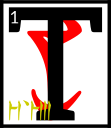he netchiman's wife who carried the egg of Vivec within her went looking for the lands of the Indoril.
<b>&sup2;</b>Along the journey many spirits came to see her and offer instructions to her son-daughter, the future glorious invisible warrior-poet of Vvardenfell, Vivec.
<b>&sup3;</b>The first spirit threw his arms about her and hugged his knowledge in tight.
<b>&#8308;</b>The netchiman's wife became soaked in the Incalculable Effort.
<b>&#8309;</b>The egg was delighted and did somersaults inside her, bowing to the five corners of the world and saying:

'Thus whoever performs this holy act shall be proud and mighty among the rest!'

<b>&#8310;</b>The second spirit was too aloof and acted above his station so much that he was driven off by a headache spell.
<b>&#8311;</b>The third spirit, At-Hatoor, came down to the netchiman's wife while she relaxed for a while under an Emperor Parasol.
<b>&#8312;</b>His garments were made from implications of meaning, and the egg looked at them three times.
<b>&#8313;</b>The first time Vivec said:

'Ha, it means nothing!'

After looking a second time he said:

'Hmm, there might be something there after all.'

<b>&sup1;&#8304;</b>Finally, giving At-Hatoor's garments a sidelong glance, he said:

'Amazing, the ability to infer significance in something devoid of detail!'

'There is a proverb,' At-Hatoor said, and then he left.

<b>&sup1;&sup1;</b>The fourth spirit came with the fifth, for they were cousins.
<b>&sup1;&sup2;</b>They could ghost touch and probed inside the egg to find its core.
<b>&sup1;&sup3;</b>Some say Vivec at this point was shaped like a star with its penumbra broken off; others, that it looked like a revival of vanished forms.

<b>&sup1;&#8308;</b>'From my side of the family,' the first cousin said, 'I bring you a series of calamities that will bring about the end of the universe.'

<b>&sup1;&#8309;</b>'And from my side,' the second cousin said, 'I bring you all the primordial marriages that must happen within them, each one.'

<b>&sup1;&#8310;</b>At this the egg laughed. 'I am given too much to bear so young. I must have been born before.'

<b>&sup1;&#8311;</b>And then the sixth spirit appeared, the Black Hands Mephala, who taught the Velothi at the beginning of days all the arts of sex and murder.
<b>&sup1;&#8312;</b>Its burning heart melted the eyes of the netchiman's wife and took the egg from her belly with six cutting strokes.
<b>&sup1;&#8313;</b>The egg-image, however, could see into what it had been before in ancient times, when the earth still cooled, and was not blinded.

<b>&sup2;&#8304;</b>It joined with the Daedroth and took its former secrets, leaving a few behind to keep the web of the world from disentangling.
<b>&sup2;&sup1;</b>Then the Black Hands Mephala put the egg back into the netchiman's wife and blew on her with magic breath until the hole closed up.
<b>&sup2;&sup2;</b>But the Daedroth did not give her back her eyes, saying:

'God hath three keys; of birth, of machines, and of the words between.'

<b>&sup2;&sup3;</b>Within this Sermon the wise may find one half of these keys.

<b>&sup2;&#8308;</b>The ending of the words is
ASV.

---

## cahna'shoreshik
&emsp;[Open][41] | [Chapters][38] | [Top][37]

[41]: lessons/sermon_03.html

#### Sermon Three

eing blind the netchiman's wife wandered into a cave on her way to the domains of House Indoril.
<b>&sup2;</b>It so happened that this cave was a Dwemeri stronghold.
<b>&sup3;</b>The Dwemer spied the egg and captured the netchiman's wife.
<b>&#8308;</b>They bound her head to foot and brought her deep within the earth.

<b>&#8309;</b>She heard one say, 'Go and make a simulacrum of her and place it back on the surface,
<b>&#8310;</b>for she has something akin to what we have and so the Velothi will covet it and notice if she is too long away.'

<b>&#8311;</b>In the darkness, the netchiman's wife felt great knives try to cut her open.
<b>&#8312;</b>When the knives did not work, the Dwemer used solid sounds.
<b>&#8313;</b>When those did not work, great heat was brought to bear.
<b>&sup1;&#8304;</b>Nothing was of any use, and the egg of Vivec remained safe within her.

<b>&sup1;&sup1;</b>A Dwemer said, 'Nothing is of any use. We must go and misinterpret this.'

<b>&sup1;&sup2;</b>Vivec felt that his mother was afraid, and so consoled her.

<b>&sup1;&sup3;</b>'The fire is mine: let it consume thee,\
And make a secret door\
At the altar of Padhome,\
In the House of Boet-hi-Ah\
Where we become safe\
And looked after.'

<b>&sup1;&#8308;</b>This old prayer made the netchiman's wife smile and begin such a deep sleep that when Dwemeri atronachs returned with cornered spheres and cut her apart she did not awake and died peacefully.
<b>&sup1;&#8309;</b>Vivec was removed from her womb and placed within a magical glass for further study.
<b>&sup1;&#8310;</b>To confound his captors, he channeled his essence into love, an emotion the Dwemer knew nothing about.

<b>&sup1;&#8311;</b>The egg said:

'Love is used not only as a constituent in moods and affairs,
<b>&sup1;&#8312;</b>but also as the raw material from which relationships produce hour-later exasperations, regrettably fashioned restrictions, riddles laced with affections known only to the loving couple, and looks that linger too long.
<b>&sup1;&#8313;</b>Love is also an often-used ingredient in some transparent verbal and nonverbal transactions where, eventually, it can sometimes be converted to a variety of true devotions, some of which yield tough, insoluble, and infusible unions.
<b>&sup2;&#8304;</b>In its basic form, love supplies approximately thirteen draughts of all energy that is derived from relationships. Its role and value in society at large are controversial.'

<b>&sup2;&sup1;</b>The Dwemer were vexed at these words and tried to hide behind their power symbols.
<b>&sup2;&sup2;</b>They sent their atronachs to remove the egg-image from their cave and place it within the simulacrum they had made of Vivec's mother.

<b>&sup2;&sup3;</b>A Dwemer said, 'We Dwemer are only aspirants to this that the Velothi have.
<b>&sup2;&#8308;</b>They shall be our doom in this and the eight known worlds,
NIRN,
LHKAN,
RKHET,
THENDR,
KYNRT,
AKHAT,
MHARA,
and JHUNAL.'

<b>&sup2;&#8309;</b>The secret to doom is within this Sermon.

<b>&sup2;&#8310;</b>The ending of the words is
ASV.

---

## cina'shoreshik
&emsp;[Open][42] | [Chapters][38] | [Top][37]

[42]: lessons/sermon_04.html

#### Sermon Four

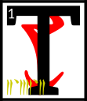he simulacrum of the netchiman's wife who carried the egg of Vivec within it went back to looking for the lands of the Indoril.
<b>&sup2;</b>Along the journey many more spirits came to see it and offer instructions to its son-daughter, the future glorious invisible warrior-poet of Vvardenfell, Vivec.

<b>&sup3;</b>A troupe of spirits called the Lobbyists for the Coincidence Guild appeared.
<b>&#8308;</b>Vivec understood the challenge immediately and said:

'The popular notion of God kills happenstance.'

<b>&#8309;</b>The head of the Lobbyists, whose name is forgotten, tried to defend the concept's existence.
<b>&#8310;</b>He said, 'Saying something at the same time can be magical.'

<b>&#8311;</b>Vivec knew that to retain his divinity that he must make a strong argument against luck.
<b>&#8312;</b>He said:

'Is not the sudden revelation of corresponding conditions and disparate elements that gel at the moment of the coincidence one of the prerequisites to being, in fact, coincidental?
<b>&#8313;</b>Synchronicity comes out of repeated coincidences at the lowest level.
<b>&sup1;&#8304;</b>Further examination shows it is the utter power of the sheer number of coincidences that leads one to the idea that synchronicity is guided by something more than chance.
<b>&sup1;&sup1;</b>Therefore, synchronicity ends up invalidating the concept of the coincidental, even though they are the symptomatic signs that bring it to the surface.'

<b>&sup1;&sup2;</b>Thus was coincidence destroyed in the land of the Velothi.

<b>&sup1;&sup3;</b>Then an Old Bone of the earth rose up before the simulacrum of the netchiman's wife and said,
<b>&sup1;&#8308;</b>'If you are to be born a ruling king of the world you must confuse it with new words. Set me into pondering.'

<b>&sup1;&#8309;</b>'Very well,' Vivec said, 'Let me talk to you of the world, which I share with mystery and love. Who is her capital? Have you taken the scenic route of her cameo?
<b>&sup1;&#8310;</b>I have\-\- lightly, in secret, missing candles because they're on the untrue side, and run my hand along the edge of a shadow made from one hundred and three divisions of warmth, and left no proof.'

<b>&sup1;&#8311;</b>At this the Old Bone folded unto itself twenty times until it became akin to milk, which Vivec drank, becoming a ruling king of the world.

<b>&sup1;&#8312;</b>Finally the Chancellor of Exactitude appeared, and he was perfect to look upon from every angle.
<b>&sup1;&#8313;</b>Vivec understood the challenge immediately and said:

'Certitude is for the puzzle-box logicians and girls of white glamour who harbor it on their own time. I am a letter written in uncertainty.'

<b>&sup2;&#8304;</b>The Chancellor bowed his head and smiled fifty different and perfect ways all at once.
<b>&sup2;&sup1;</b>He pulled the astrolabe of the universe from his robe and broke it in half, handing both halves to the egg-image of Vivec.

<b>&sup2;&sup2;</b>Vivec laughed and said, 'Yes, I know. The slave labor of the senses is as selfish as polar ice, and worsens when energies are spent on a life others regard as fortunate.
<b>&sup2;&sup3;</b>To be a ruling king I will have to suffer much that cannot be suffered, and to weigh matters that no astrolabe or compass can measure.'

<b>&sup2;&#8308;</b>The ending of the words is
ASV.

---

## arca'shoreshik
&emsp;[Open][43] | [Chapters][38] | [Top][37]

[43]: lessons/sermon_05.html

#### Sermon Five

inally the simulacrum of the netchiman's wife became unstable.
<b>&sup2;</b>The Dwemer in their haste had built it shoddily and the ashes of Red Mountain slowed its golden tendons.
<b>&sup3;</b>Before long it fell on its knees beside the road to the lands of the Indoril and pitched over, to be discovered eighty days later by a merchant caravan on its way to the capital of Veloth, anon Almalexia.

<b>&#8308;</b>Vivec had not been among his people all the days of his pre-life so he stayed silent and let the Chimer in the caravan think that the simulacrum was broken and empty.

<b>&#8309;</b>A Chimeri warrior, who was protecting the caravan, said, 'Look here how the Dwemer try to fool us as ever, crafting our likenesses out of their flesh-metals.
<b>&#8310;</b>We should take this to the capital and show our mother Ayem. She will want to see this new strategy of our enemies.'

<b>&#8311;</b>But the merchant captain said, 'I doubt that we shall be paid well for the effort.
<b>&#8312;</b>We can make more money if we stop at Noormoc and sell it to the Red Wives of Dagon, who pay well for the wonders made by the Deep Folk.'

<b>&#8313;</b>But another Chimer, who was wise in the ways of prophecy, looked on the simulacrum with disquietude.
<b>&sup1;&#8304;</b>'Was I not hired on to help you seek the best of fortunes? I say you should listen to your warrior, then, and take this thing to Ayem,
<b>&sup1;&sup1;</b>for though manufactured by our enemies there is something in it that will become sacred, or has been already.'

<b>&sup1;&sup2;</b>The merchant captain took pause then and looked on the simulacrum of the netchiman's wife
<b>&sup1;&sup3;</b>and, though he heeded always the advice of his seers, could do no more than think of the profits to be made at Noormoc.
<b>&sup1;&#8308;</b>He thought mainly of the Red Wives' form of recompense, which was four-cornered and good wounded, a belly-magic known nowhere else under the moons.
<b>&sup1;&#8309;</b>His lust made him deny Ayem his mother.
<b>&sup1;&#8310;</b>He gave order to change course for Noormoc.

<b>&sup1;&#8311;</b>Before the caravan could get underway again, the Chimeri warrior who had counseled a passage to the capital threw his money to the merchant captain
<b>&sup1;&#8312;</b>and said, 'I will pay you thus for the simulacrum and warn you: war is coming with the shaggy men of the north
<b>&sup1;&#8313;</b>and I will not have my mother Ayem at uneven odds with one enemy while tending to another.'

<b>&sup2;&#8304;</b>'Nerevar,' the merchant captain said, 'this is not enough. I am Triune in my own way, but I follow the road of my body and demand more.'

<b>&sup2;&sup1;</b>Then Vivec could not remain silent anymore and said into Nerevar's head these words:

'You can hear the words, so run away\
<b>&sup2;&sup2;</b>Come, Hortator, unfold into a clear unknown,\
Stay quiet until you've slept in the yesterday,\
And say no elegies for the melting stone'

<b>&sup2;&sup3;</b>So Nerevar slew the merchant captain and took the caravan for his own.

<b>&sup2;&#8308;</b>The ending of the words is
ASV.

---

## tahna'shoreshik
&emsp;[Open][44] | [Chapters][38] | [Top][37]

[44]: lessons/sermon_06.html

#### Sermon Six

ou have discovered the sixth Sermon of Vivec, which was hidden in the words that came next to the Hortator.

<b>&sup2;</b>There is an eon within itself that when unraveled becomes the first sentence of the world.\
&#8203;

<b>&sup3;</b>Mephala and Azura are the twin gates of tradition and Boethiah is the secret flame.

<b>&#8308;</b>The Sun shall be eaten by lions, which cannot be found yet in Veloth.

<b>&#8309;</b>Six are the vests and garments worn by the suppositions of men.

<b>&#8310;</b>Proceed only with the simplest terms, for all others are enemies and will confuse you.

<b>&#8311;</b>Six are the formulas to heaven by violence, one that you have learned by studying these words.

<b>&#8312;</b>The Father is a machine and the mouth of a machine. His only mystery is an invitation to elaborate further.

<b>&#8313;</b>The Mother is active and clawed like a nix-hound, yet she is the holiest of those that reclaim their days.

<b>&sup1;&#8304;</b>The Son is myself, Vehk, and I am unto three, six, nine, and the rest that come after, glorious and sympathetic, without borders, utmost in the perfections of this world and the others, sword and symbol, pale like gold.

<b>&sup1;&sup1;</b>There is a fourth kind of philosophy that uses nothing but disbelief.

<b>&sup1;&sup2;</b>For by the sword I mean the sensible.\
\
For by the word I mean the dead.

<b>&sup1;&sup3;</b>I am Vehk, your protector and the protector of Red Mountain until the end of days, which are numbered
3'3'3'3.

<b>&sup1;&#8308;</b>Below me is the savage, which we needed to remove ourselves from the Altmer.

<b>&sup1;&#8309;</b>Above me is a challenge, which bathes itself in fire and the essence of a god.

<b>&sup1;&#8310;</b>Through me you are desired, unlike the prophets that have borne your name before.

<b>&sup1;&#8311;</b>Six are the walking ways, from enigma to enemy to teacher.

<b>&sup1;&#8312;</b>Boethiah and Azura are the principles of the universal plot, which is begetting, which is creation, and Mephala makes of it an art form.

<b>&sup1;&#8313;</b>For by the sword I mean the first night.\
\
For by the word I mean the dead.

<b>&sup2;&#8304;</b>There will be a splendor in your name when it is said to be true.

<b>&sup2;&sup1;</b>Six are the guardians of Veloth, three before and they are born again, and they will test you until you have the proper tendencies of the hero.

<b>&sup2;&sup2;</b>There is a world that is sleeping and you must guard against it.

<b>&sup2;&sup3;</b>For by the sword I mean the dual nature.\
\
For by the word I mean animal life.

<b>&sup2;&#8308;</b>For by the sword I mean preceded by a sigh.\
\
For by the word I mean preceded by a wolf.

<b>&sup2;&#8309;</b>The ending of the words is
ASV.

---

## sahna'shoreshik
&emsp;[Open][45] | [Chapters][38] | [Top][37]

[45]: lessons/sermon_07.html

#### Sermon Seven

s the caravan of Nerevar now made for the capital of Veloth, anon Almalexia, there came great rumblings from the oblivion.
<b>&sup2;</b>A duke among scamps wandered into the House of Troubles, pausing before each scripture door to pay his respects, until finally he was met by the majordomo of Mehrunes Dagon.

<b>&sup3;</b>The Duke of Scamps said, 'I was summoned by Lord Dagon, master of the foul waters and fire, and I have brought the pennants of my seven legions.'

<b>&#8308;</b>The majordomo, whose head was a bubble of foul water and fire, bowed low, so that the head of the Duke of Scamps became enclosed in his own.

<b>&#8309;</b>He saw the first pennant, which commanded a legion of grim warriors who could die at least twice.

<b>&#8310;</b>He saw the second pennant, which commanded a legion of winged bulls and the emperor of color that rode upon each.

<b>&#8311;</b>He saw the third pennant, which commanded a legion of inverted gorgons, great snakes whose scales were the faces of men.

<b>&#8312;</b>He saw the fourth pennant, which commanded a legion of double-crossed lovers.

<b>&#8313;</b>He saw the fifth pennant, which commanded a legion of jumping wounds looking to hop onto a victim.

<b>&sup1;&#8304;</b>He saw the sixth pennant, which commanded a legion of abridged planets.

<b>&sup1;&sup1;</b>He saw the seventh pennant, which commanded a legion of armored winning moves.

<b>&sup1;&sup2;</b>To which the majordomo said, 'Duke Kh-Utta, your legions while mighty are not enough to destroy Nerevar or the Triune way.
<b>&sup1;&sup3;</b>Look upon the Hortator and see the wisdom he takes to wife.'

<b>&sup1;&#8308;</b>And they looked into the middle world and saw:

Evaporating in a throng of thunder\
Of red war and chitin men,\
Where destines\
Take him further from our ways\
<b>&sup1;&#8309;</b>The heat that we have wanted\
And pray they still remember,\
Where destines\
Clothe the distance,\
<b>&sup1;&#8310;</b>Glad in the golden east that we saw it now,\
Instead of the war and repair\
Of the oblivious fracture\
A curse on the Hortator\
And two more on his hands

<b>&sup1;&#8311;</b>And the Duke of Scamps saw the palms of the Hortator, upon which the egg had written these words of power:

GHARTOK PADHOME GHARTOK PADHOME.

<b>&sup1;&#8312;</b>The ending of the words is
ASV.

---

## daskhora'shoreshik
&emsp;[Open][46] | [Chapters][38] | [Top][37]

[46]: lessons/sermon_08.html

#### Sermon Eight

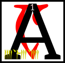nd presently Nerevar and Vivec were within sight of the capital and the Four Corners of the House of Troubles knew that it was not time to contest them.
<b>&sup2;</b>The caravan musicians made a great song of entrance and the eleven gates of the Mourning Hold were thrown wide.

<b>&sup3;</b>Ayem was accompanied by her husband-state, a flickering image that was channeled to her ever-changing female need.
<b>&#8308;</b>Around her were the Shouts, a guild now forgotten, who carried with them the whims of the people, for the Velothi then were still mostly good at heart.
<b>&#8309;</b>The Shouts were the counselors of Ayem and the country, though they sometimes quarreled and needed Seht to wring them into usefulness.
<b>&#8310;</b>Ayem approached Nerevar, who was by now adorned in the flags of House Indoril.
<b>&#8311;</b>He gifted her with the simulacrum of the netchiman's wife and the egg of Vivec inside.

<b>&#8312;</b>Ayem said to Nerevar, 'Seht who is Azura has revealed that war is come and that the Hortator that shall deliver us will approach with a solution walking at his side.'

<b>&#8313;</b>Nerevar said, 'I have traveled out of my way to warn you of the deceit of our enemies, the Dwemer, but I have learned much on the journey and have changed my mind.
<b>&sup1;&#8304;</b>This netchiman's wife you see at my side is a sword and a symbol and there is prophecy inside.
<b>&sup1;&sup1;</b>It tells me that, like it, we must for a while be like he is and, as a people, cloaked in our former enemies, and to use their machines without shame.'

<b>&sup1;&sup2;</b>At which Vivec spoke aloud, 'Boethiah-who-is-you wore the skin of Trinimac to cleanse the faults of Veloth, my Queen, and so it should be again. This is the walking way of the glorious.'
<b>&sup1;&sup3;</b>Seht appeared out of a cloud of iron vapor and his minions made of their blood a chair.
<b>&sup1;&#8308;</b>He sat beside Ayem and looked on the rebirth of mastery.
<b>&sup1;&#8309;</b>Vivec said to them, his Triune:

'My rituals and ordeals and all the rhymes within,\
Use no other motive than the revelation of my skin.'

<b>&sup1;&#8310;</b>Ayem said,
'AYEM AE SEHTI AE VEHK.
We are delivered and made whole, the diamond of the Black Hands is uncovered.'

<b>&sup1;&#8311;</b>Seht said, 'Wherever so he treads, there is invisible scripture.'

To which the Shouts were silent in sudden reading.

<b>&sup1;&#8312;</b>Vivec then reached out from the egg all his limbs and features, merging with the simulacrum of his mother, gilled and blended in all the arts of the star-wounded East, under water and in fire and in metal and in ash, six times the wise,
<b>&sup1;&#8313;</b>and he became the union of male and female, the magic hermaphrodite, the martial axiom, the sex-death of language and unique in all the middle world.

<b>&sup2;&#8304;</b>He said, 'Let us now guide the hands of the Hortator in war and its aftermath. For we go different, and in thunder. This is our destiny.'

<b>&sup2;&sup1;</b>The ending of the words is
ASV.

---

## enta'shoreshik
&emsp;[Open][47] | [Chapters][38] | [Top][37]

[47]: lessons/sermon_09.html

#### Sermon Nine

hen came the war with the northern men, where Vivec did guide the Hortator into swift and tricky union with the Dwemer.
<b>&sup2;</b>The greatest demon chieftains of the frigid west were those listed below, five in unholy number.

<b>&sup3;</b>HOAGA,
the Mouth of Mud, who appeared as a great bearded king, had the powers of Marshalling and breathing the earth.
<b>&#8308;</b>On the battlefields, this demon would often be seen on the sidelines, eating the soil voraciously.
<b>&#8309;</b>When his men fell, Hoaga would fill their bodies back with it, whereupon they would rise again and fight, albeit slower.
<b>&#8310;</b>He had a Secret Name, Fenja, and destroyed seventeen Chimeri villages and two Dwemeri strongholds before being turned away.

<b>&#8311;</b>CHEMUA,
the Running Hunger, who appeared as a mounted soldier with full helm, had the powers of Heart Roaring and of sky sickening.
<b>&#8312;</b>He ate the Chimeri hero, Dres Khizumet-e, sending the spirit back to the Hortator as an assassin.
<b>&#8313;</b>Sometimes called First Blighter, Chemua could give clouds stomach aches and turn the rain of Veloth into bile.
<b>&sup1;&#8304;</b>He destroyed six Chimeri villages before he was slain by Vivec and the Hortator.

<b>&sup1;&sup1;</b>BHAG,
the Two-Tongued, who appeared as a great bearded king, had the powers of Surety and Form Change.
<b>&sup1;&sup2;</b>His raiders were small in number, but ran amok in the west hinterlands, killing many Velothi trappers and scouts.
<b>&sup1;&sup3;</b>He fell in a great debate with Vivec, for the warrior-poet alone could understand the northern man's two-layered speech, though
ASV
had to remain invisible during the argument.

<b>&sup1;&#8308;</b>BARFOK,
Maid of Planes, who appeared as a winged human with lick-encrusted spear, had the powers of Event Denouement.
<b>&sup1;&#8309;</b>Battles fought against her would always end in victory for Barfok, because she could shape outcomes by singing.
<b>&sup1;&#8310;</b>Four Chimeri villages and two more Dwemeri strongholds were destroyed by her decision enforcement.
<b>&sup1;&#8311;</b>Vivec had to stuff her mouth with his milk finger to keep her from singing Veloth into ruin.

<b>&sup1;&#8312;</b>YSMIR,
the Dragon of the North, who always appears as a great bearded king, had powers innumerable and echoing.
<b>&sup1;&#8313;</b>He was grim and dark and the most silent of the invading chieftains, though when he spoke villages were uplifted and thrown into the sea.
<b>&sup2;&#8304;</b>The Hortator fought him unarmed, grabbing the Dragon's roars by hand until Ysmir's power throat bled.
<b>&sup2;&sup1;</b>These roars were given to Vivec to bind into an ebony listening frame, which the warrior-poet placed on Ysmir's face and ears to drive him mad and drive him away.

<b>&sup2;&sup2;</b>'The coming forth and the driving away brings all things around. What I shall say next is unpleasant to record:
HERMA-MORA-ALTADOON!
AE ALTADOON!'

<b>&sup2;&sup3;</b>The ending of the words is
ASV.

---

## alnahna'shoreshik
&emsp;[Open][48] | [Chapters][38] | [Top][37]

[48]: lessons/sermon_10.html

#### Sermon Ten

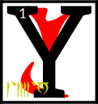ou have discovered the tenth Sermon of Vivec, which was hidden in the words that came in the aftermath to the Hortator.

<b>&sup2;</b>The evoker shall raise his left hand empty and open, to indicate he needs no weapons of his own.
<b>&sup3;</b>The coming forth is always hidden, so the evoker is always invisible or, better, in the skin of his enemies.

<b>&#8308;</b>'The eyelid of the kingdom shall fill thirty and six folios, but the eye shall read the world.'
<b>&#8309;</b>By this the Hortator needs me to understand.

The sword is an impatient signature. Write no contracts on the dead.

<b>&#8310;</b>Vivec says unto the Hortator remember the words of Boet-hi-ah:

We pledge ourselves to you, the Frame-maker, the Scarab: a world for us to love you in, a cloak of dirt to cherish.
<b>&#8311;</b>Betrayed by your ancestors when you were not even looking. Hoary Magnus and his ventured opinions cannot sway the understated, a trick worthy of the always satisfied.
<b>&#8312;</b>A short season of towers, a rundown absolution, and what is this, what is this but fire under your eyelid?

<b>&#8313;</b>Shift ye in your skin, I say to the Trinimac-eaters. Pitch your voices into the color of bruise.
<b>&sup1;&#8304;</b>Divide ye like your enemies, in Houses, and lay your laws in set sequence from the center, again like the enemy Corners of the House of Troubles, and see yourself thence as timber, or mud-slats, or sheets of resin.
<b>&sup1;&sup1;</b>Then do not divide, for yet is the stride of
SITHISIT
quicker than the rush of enemies, and He will sunder the whole for the sake of a shingle.

<b>&sup1;&sup2;</b>For we go different, and in thunder.
SITHISIT
is the start of all true Houses, built against stasis and lazy slaves.
<b>&sup1;&sup3;</b>Turn from your predilections, broken like false maps. Move and move like this.
<b>&sup1;&#8308;</b>Quicken against false fathers, mothers left in corners weeping for glass and rain.
<b>&sup1;&#8309;</b>Stasis asks merely for nothing, for itself, which is nothing, as you were in the eight everlasting imperfections.

<b>&sup1;&#8310;</b>Vivec says unto the Hortator remember the words of Vivec.\
UNDERSTAND THAT
SITHISIT
STILL TRAVELS

<b>&sup1;&#8311;</b>Vivec says unto the Hortator remember the words of Vivec.\
IN A PHOSPHORESCENT MIRROR OF THE SKY

<b>&sup1;&#8312;</b>Vivec says unto the Hortator remember the words of Vivec.\
DROWNED AND SMILING

<b>&sup1;&#8313;</b>Vivec says unto the Hortator remember the words of Vivec.\
INTERMITTENT HOPES ENOUGH

<b>&sup2;&#8304;</b>Vivec says unto the Hortator remember the words of Vivec.\
TO ANSWER ALL THE THINGS

<b>&sup2;&sup1;</b>Vivec says unto the Hortator remember the words of Vivec.\
NOT YET QUERIED

<b>&sup2;&sup2;</b>The ending of the words is
ASV.

---

## alnahn'alna'shoreshik
&emsp;[Open][49] | [Chapters][38] | [Top][37]

[49]: lessons/sermon_11.html

#### Sermon Eleven

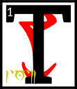hese were the days of Resdaynia, when Chimer and Dwemer lived under the wise and benevolent rule of the
ASV
and their champion the Hortator.
<b>&sup2;</b>When the gods of Veloth would retreat unto their own, to mold the cosmos and other matters, the Hortator would at times become confused.
<b>&sup3;</b>Vivec would always be there to advise him, and this is the first of the three lessons of ruling kings:

<b>&#8308;</b>'The waking world is the amnesia of dream. All motifs can be mortally wounded. Once slain, themes turn into the structure of future nostalgia.
<b>&#8309;</b>Do not abuse your powers or they will lead you astray. They will leave you like rebellious daughters.
<b>&#8310;</b>They will lose their virtue. They will become lost and resentful and finally become pregnant with the seed of folly.
<b>&#8311;</b>Soon you will be the grandparent of a broken state. You will be mocked. It will fall apart like a stone that recalls that it is really water.

<b>&#8312;</b>'Keep nothing in your house that is neither needed or beautiful.

'Ordeals you should face unimpeded by the world of restriction.
<b>&#8313;</b>The splendor of stars is Ayem's domain. The selfishness of the sea is Seht's. I rule the middle air. All else is earth and under your temporal command.
<b>&sup1;&#8304;</b>There is no bone that cannot be broken, except for the heart bone. You will see it twice in your lifetimes. Take what you can the first time and let us do the rest.

<b>&sup1;&sup1;</b>'There is no true symbolism of the center. The Sharmat will believe there is.
<b>&sup1;&sup2;</b>He will feel that he can cause years of exuberance from sitting in the sacred, when really no one can leave that state and cause anything more but strife.

<b>&sup1;&sup3;</b>'There is once more the case of the symbolic and barren. The true prince that is cursed and demonized will be adored at last with full hearts.
<b>&sup1;&#8308;</b>According to the Codes of Mephala there can be no official art, only fixation points of complexity that will erase from the awe of the people given enough time.
<b>&sup1;&#8309;</b>This is a secret that hides another.
<b>&sup1;&#8310;</b>An impersonal survival is not the way of the ruling king.
Embrace the art of the people and marry it and by that I mean secretly have it murdered.

<b>&sup1;&#8311;</b>'The ruling king that sees in another his equivalent rules nothing.

<b>&sup1;&#8312;</b>'The secret of weapons is this: they are the mercy seat.

<b>&sup1;&#8313;</b>'The secret of language is this: it is immobile.

<b>&sup2;&#8304;</b>'The ruling king is armored head to toe in brilliant flame. He is redeemed by each act he undertakes. His death is only a diagram back to the waking world.
<b>&sup2;&sup1;</b>He sleeps the second way. The Sharmat is his double, and therefore you wonder if you rule nothing.

<b>&sup2;&sup2;</b>'Hortator and Sharmat, one and one, eleven, an inelegant number.
<b>&sup2;&sup3;</b>Which of the ones is the more important? Could you ever tell if they switched places? I can and that is why you will need me.

<b>&sup2;&#8308;</b>'According to the Codes of Mephala, there is no difference between the theorist and the terrorist.
<b>&sup2;&#8309;</b>Even the most cherished desire disappears in their hands. This is why Mephala has black hands. Bring both of yours to every argument.
<b>&sup2;&#8310;</b>The one-handed king finds no remedy. When you approach God, however, cut both of them off.
<b>&sup2;&#8311;</b>God has no need of theory and he is armored head to toe in terror.'

<b>&sup2;&#8312;</b>The ending of the words is
ASV.

---

## alnahn'asca'shoreshik
&emsp;[Open][50] | [Chapters][38] | [Top][37]

[50]: lessons/sermon_12.html

#### Sermon Twelve

s the Hortator pondered the first lesson of ruling kings, Vivec wandered into the Mourning Hold and found that Ayem was with a pair of lovers.
<b>&sup2;</b>Seht had divided himself again. Vivec then leapt through into their likenesses to observe, but he gained no secrets that he did not already know.
<b>&sup3;</b>He left a few of his own behind to make the journey worthwhile.

<b>&#8308;</b>Then Vivec left the capital of Veloth and wandered far into the ash.
<b>&#8309;</b>He found a span of badlands to practice his giant-form.
<b>&#8310;</b>He made of his feet a less dense material than the divine to keep from falling waist-deep into the earth.
<b>&#8311;</b>At this point the First Corner of the House of Troubles, the Prince Molag Bal, made his presence known.

<b>&#8312;</b>Vivec looked on the King of Rape and said:

'How very beautiful you are, that you do not join us.'

<b>&#8313;</b>And Molag Bal crushed the warrior-poet's feet, which were not invulnerable, and had legions cleave them off.
<b>&sup1;&#8304;</b>Mighty fires from the Beginning Place were brought like nets to hold Vivec and he let them.

<b>&sup1;&sup1;</b>'I would prefer,' he said, 'some kind of ceremony if we are to be married.'

<b>&sup1;&sup2;</b>And the legions that took the feet were summoned again and ordered to begin a banquet.
<b>&sup1;&sup3;</b>Pomegranates sprang from the badlands and tents were raised.
<b>&sup1;&#8308;</b>A throng of Velothi mystics came, reading the passages of the severed feet on the ground and weeping until the scriptures were wet.

<b>&sup1;&#8309;</b>'We must love each other briefly,' Vivec said, 'if at all.
<b>&sup1;&#8310;</b>I am needed to counsel the Hortator in more important matters because the Dwemeri high priests stir up trouble. You may have my head for an hour.'

<b>&sup1;&#8311;</b>Molag Bal rose up and extended six arms to show his worth.
<b>&sup1;&#8312;</b>They were decorated in runes of seduction and its reverse. They were decorated in the annotated calendars of longer worlds.
<b>&sup1;&#8313;</b>When he spoke, mating monsters fell out. 'Where must it go?' he said.

<b>&sup2;&#8304;</b>'I told you,' Vivec said, 'I am meant to be the teacher of the king of the earth.
AE ALTADOON GHARTOK PADHOME.'

<b>&sup2;&sup1;</b>With these magic words, the King of Rape added another:
[CHIM],
which is the secret syllable of royalty.

<b>&sup2;&sup2;</b>Vivec had what he needed from the Daedroth and so married him that day.
<b>&sup2;&sup3;</b>In the hour that Bal had his head, the King of Rape asked for proof of love.

<b>&sup2;&#8308;</b>Vivec spoke two poems to show him such, but only the first is known.

I'm not sure just how much glass it took to make your hair\
Twice as much, I am sure, as the oceans have to share\
<b>&sup2;&#8309;</b>Hell, my sweet, is a fiction written by those who tell the truth\
My mouth is skilled at lying and its alibi a tooth

<b>&sup2;&#8310;</b>The sons and daughters of Vivec and Molag Bal number in the thousands. The name of the mightiest is a string of power:

GULGA MOR JIL HYAET AE HOOM.

<b>&sup2;&#8311;</b>The ending of the words is
ASV.

---

## alnahn'cahna'shoreshik
&emsp;[Open][51] | [Chapters][38] | [Top][37]

[51]: lessons/sermon_13.html

#### Sermon Thirteen

hese were the days of Resdaynia, when Chimer and Dwemer lived under the wise and benevolent rule of the
ASV
and their champion the Hortator.
<b>&sup2;</b>When the gods of Veloth would retreat unto their own, to mold the cosmos and other matters, the Hortator would at times become confused.
<b>&sup3;</b>Vivec would always be there to advise him, and this is the second of the three lessons of ruling kings:

<b>&#8308;</b>'The secret syllable of royalty is this:
[CHIM]

'The temporal myth is man.

<b>&#8309;</b>'The magical cross is an integration of the worth of mortals at the expense of their spirits.
<b>&#8310;</b>Surround it with the triangle and you begin to see the Triune house.
<b>&#8311;</b>It becomes divided into corners, which are ruled by our brethren, the Four Corners:
BAL DAGON MALAC SHEOG.
<b>&#8312;</b>Rotate the triangle and you pierce the heart of the Beginning Place, the foul lie, the testament of the irrefutable-for-a-span.
<b>&#8313;</b>Above them all is the horizon where only one stands, though no one stands there yet. It is proof of the new. It is the promise of the wise.
<b>&sup1;&#8304;</b>Unfold the whole and what you have is a star, which is not my domain, but not entirely outside my judgment. The grand design takes flight; it is transformed not only into a star but a hornet.
<b>&sup1;&sup1;</b>The center cannot hold. It becomes devoid of lines and points. It becomes devoid of anything and so becomes a receptacle. This is its usefulness at the end. This is its promise.

<b>&sup1;&sup2;</b>'The sword is the cross and
ASV
is the Triune house around it.
<b>&sup1;&sup3;</b>If there is to be an end I must be removed. The ruling king must know this, and I will test him. I will murder him time and again until he knows this.
<b>&sup1;&#8308;</b>I am the defender of the last and the last. To remove me is to refill the heart that lay dormant at the center that cannot hold.
<b>&sup1;&#8309;</b>I am the sword, Ayem the star, Seht the mechanism that allows the transformation of the world. Ours is the duty to keep the compromise from being filled with black sea.

<b>&sup1;&#8310;</b>'The Sharmat sleeps at the center. He cannot bear to see it removed, the world of reference.
<b>&sup1;&#8311;</b>This is the folly of the false dreamer. This is the amnesia of dream, or its power, or its circumvention. This is the weaker magic and it is barbed in venom.

<b>&sup1;&#8312;</b>'This is why I say the secret to swords is the mercy seat. It is my throne.
<b>&sup1;&#8313;</b>I am become the voice of
ASV.
The world will know me more than my sister and brother. I am the psychopomp. I am the killer of the weeds of Veloth. Veloth is the center that cannot hold.
<b>&sup2;&#8304;</b>Ayem is the plot. Seht is the ending. I am the enigma that must be removed. These are why my words are armed to the teeth.

<b>&sup2;&sup1;</b>'The ruling king is to stand against me and then before me. He is to learn from my punishment.
<b>&sup2;&sup2;</b>I will mark him to know. He is to come as male or female. I am the form he must acquire.

<b>&sup2;&sup3;</b>'Because a ruling king that sees in another his equivalent rules nothing.'

<b>&sup2;&#8308;</b>This is what was said to the Hortator when Vivec was not whole.

<b>&sup2;&#8309;</b>The ending of the words is
ASV.

---

## alnahn'cina'shoreshik
&emsp;[Open][52] | [Chapters][38] | [Top][37]

[52]: lessons/sermon_14.html

#### Sermon Fourteen

ivec lay with Molag Bal for eighty days and eight, though headless.
<b>&sup2;</b>In that time, the Prince placed the warrior-poet's feet back and filled them with the blood of Daedra.
<b>&sup3;</b>In this way Vivec's giant-form remained forever harmless to good earth.
<b>&#8308;</b>The Pomegranate Banquet brought many spirits back from the dead so that the sons and daughters of the union had much to eat besides fruit.

<b>&#8309;</b>The Duke of Scamps came while the banquet was still underway, and Molag Bal looked on the seven pennants with anger.
<b>&#8310;</b>The King of Rape had become necessary and therefore troubled for the rest of time.
<b>&#8311;</b>His legions and Kh-Utta's fell into open war, but the children of Molag Bal and Vivec were too elaborate in power and form.

<b>&#8312;</b>The Duke of Scamps therefore became a lesser thing, as did all his own children.
<b>&#8313;</b>Molag Bal said to them: 'You are the sons of liars, dogs, and wolf-headed women.' They have been useless to summon ever since.

<b>&sup1;&#8304;</b>The holy one returned at last, Vehk, golden with wisdom.
<b>&sup1;&sup1;</b>His head found its body had been tenderly used.
<b>&sup1;&sup2;</b>He mentioned this to Molag Bal, who told him that he should thank the Barons of Move Like This,
<b>&sup1;&sup3;</b>'For I have yet to learn how to refine my rapture. My love is accidentally shaped like a spear.'

<b>&sup1;&#8308;</b>So Vivec, who had a grain of Ayem's mercy, set about to teach Molag Bal in the ways of belly-magic.
<b>&sup1;&#8309;</b>They took their spears out and compared them. Vivec bit new words onto the King of Rape's so that it might give more than ruin to the uninitiated.
<b>&sup1;&#8310;</b>This has since become a forbidden ritual, though people still practice it in secret.

<b>&sup1;&#8311;</b>Here is why: The Velothi and demons and monsters that were watching all took out their own spears.
<b>&sup1;&#8312;</b>There was much biting and the earth became wet. And this was the last laugh of Molag Bal:

<b>&sup1;&#8313;</b>'Watch as the earth shall crack, heavy with so much power, that should have been forever unalike!'

<b>&sup2;&#8304;</b>Then that stretch of badlands that had been the site of the marriage fragmented and threw fire.
<b>&sup2;&sup1;</b>And a race that is no more but that was terrible at the time to behold came forth.
<b>&sup2;&sup2;</b>Born of the biters, that is all they did, and they ran amok across the lands of Veloth and even to the shores of Red Mountain.

<b>&sup2;&sup3;</b>But Vivec made of his spear a more terrible thing, from a secret he had bitten off from the King of Rape.
<b>&sup2;&#8308;</b>And so he sent Molag Bal tumbling into the crack of the biters and swore forever that he would not deem the King beautiful ever again.

<b>&sup2;&#8309;</b>Vivec wept as he slew all those around him with his terrible new spear.
<b>&sup2;&#8310;</b>He named it
MUATRA,
which is Milk Taker, and even the Chimeri mystics knew his fury.
<b>&sup2;&#8311;</b>Anyone struck by Vivec at this time turned barren and withered into bone shapes.
<b>&sup2;&#8312;</b>The path of bones became a sentence for the stars to read, and the heavens have never known children since.
<b>&sup2;&#8313;</b>Vivec hunted down the biters one by one, and all their progeny, and he killed them all by means of the Nine Apertures, and the wise still hide theirs from Muatra.

<b>&sup3;&#8304;</b>The ending of the words is
ASV.

---

## alnahn'arca'shoreshik
&emsp;[Open][53] | [Chapters][38] | [Top][37]

[53]: lessons/sermon_15.html

#### Sermon Fifteen

hese were the days of Resdaynia, when Chimer and Dwemer lived under the wise and benevolent rule of the
ASV
and their champion the Hortator.
<b>&sup2;</b>When the gods of Veloth would retreat unto their own, to mold the cosmos and other matters, the Hortator would at times become confused.
<b>&sup3;</b>Vivec would always be there to advise him, and this is the third of the three lessons of ruling kings:

<b>&#8308;</b>'The ruling king will remove me, his maker. This is the way of all children. His greatest enemy is the Sharmat, who is the false dreamer.
<b>&#8309;</b>You or he is the shingle, Hortator. Beware the wrong walking path. Beware the crime of benevolence. Behold him by his words.'

<b>&#8310;</b>I AM THE
SHARMAT\
I AM OLDER THAN MUSIC\
WHAT I BRING IS LIGHT\
WHAT I BRING IS A STAR\
WHAT I BRING IS\
AN ANCIENT SEA\
<b>&#8311;</b>WHEN YOU SLEEP YOU SEE ME\
DANCING AT THE CORE\
IT IS NOT A BLIGHT\
IT IS MY HOUSE\
<b>&#8312;</b>I PUT A STAR\
INTO THE WORLD'S MOUTH\
TO MURDER IT\
<b>&#8313;</b>TEAR DOWN THE PYLONS\
MY BLIND FISH\
SWIM IN THE NEW\
PHLOGISTON\
<b>&sup1;&#8304;</b>TEAR DOWN THE PYLONS\
MY DEAF MOONS\
SING AND BURN\
AND ORBIT ME\
<b>&sup1;&sup1;</b>I AM OLDER THAN MUSIC\
WHAT I BRING IS LIGHT\
WHAT I BRING IS A STAR\
WHAT I BRING IS\
AN ANCIENT SEA

<b>&sup1;&sup2;</b>'You alone, though you come again and again, can unmake him. Whether I allow it is within my wisdom.
<b>&sup1;&sup3;</b>Go unarmed into his den with these words of power:
AE GHARTOK PADHOME
[CHIM]
AE ALTADOON.
Or do not.
<b>&sup1;&#8308;</b>The temporal myth is man. Reach heaven by violence. This magic I give to you:
<b>&sup1;&#8309;</b>the world you will rule is only an intermittent hope and you must be the letter written in uncertainty.'

<b>&sup1;&#8310;</b>The ending of the words is
ASV.

---

## alnahn'tahna'shoreshik
&emsp;[Open][54] | [Chapters][38] | [Top][37]

[54]: lessons/sermon_16.html

#### Sermon Sixteen

he Hortator wandered through the Mourning Hold, wrestling with the lessons he had learned.
<b>&sup2;</b>They were slippery in his mind. He could not always keep the words straight and knew that this was a danger.
<b>&sup3;</b>He wandered to find Vivec, his lord and master, the glory of the image of Veloth, and found him of all places in the Temple of False Thinking.
<b>&#8308;</b>There, clockwork shears were taking off Vivec's hair. A beggar king had brought his loom and was making of the hair an incomplete map of adulthood and death.

<b>&#8309;</b>Nerevar said, 'Why are you doing this, milord?'

Vivec said, 'To make room for the fire.'

<b>&#8310;</b>And the Hortator could see that Vivec was out of sorts, though not because of the impending new power to come.
<b>&#8311;</b>The golden warrior-poet had been exercising his Water Face as well, learned from the dreughs before he was born.

<b>&#8312;</b>Nerevar said, 'Is this to keep you from the fire?'

Vivec said, 'It is so that I may see with truth.
<b>&#8313;</b>It, and my place here at the altar of Padhome in the house of False Thinking, serve so that I may see beyond my own secrets.
<b>&sup1;&#8304;</b>The Water Face cannot lie. It comes from the ocean, which is too busy to think, much less lie. Moving water resembles truth by its trembling.'

<b>&sup1;&sup1;</b>Nerevar said, 'I am afraid to become slipshod in my thinking.'

Vivec said, 'Reach heaven by violence then.'

<b>&sup1;&sup2;</b>So to quiet his mind the Hortator chose from the Fight Racks an axe.
<b>&sup1;&sup3;</b>He named it and moved on to the first moon.

<b>&sup1;&#8308;</b>There, Nerevar was greeted by the Parliament of Craters, who knew him by title and resented his presence, for he was to be a ruling king of earth and this was the lunar realm.
<b>&sup1;&#8309;</b>They shifted around him in a pattern of entrapment.

<b>&sup1;&#8310;</b>'The moon does not recognize crowns or scepters,' they said, 'nor the representatives of kingdoms below, lion or serpent or mathematician.
<b>&sup1;&#8311;</b>We are the graves of those that have migrated and become ancient countries. We seek no Queens or thrones.
<b>&sup1;&#8312;</b>Your appearance is decidedly solar, which is to say a library of stolen ideas. We are neither tear nor sorrow.
<b>&sup1;&#8313;</b>Our revolution succeeded in the manner that is was written. You are the Hortator and unwelcome here.'

<b>&sup2;&#8304;</b>And so Nerevar carved at the grave ghosts until he was out of breath and their Parliament could make no new laws.

<b>&sup2;&sup1;</b>He said, 'I am not of the slaves that perish.'

Of the members of Parliament only a few survived the Hortator's attack.

<b>&sup2;&sup2;</b>A surviving Crater said, 'Appropriation is nothing new. Everything happens of itself. This motif is by no means unassociated with hero myths.
<b>&sup2;&sup3;</b>You have not acted with the creative impulse; you fall below the weight of destiny. We are graves but not coffins. Know the difference.
<b>&sup2;&#8308;</b>You have only dug more and supplied no ghosts to reside within. Central to your claim is the predominance of frail events.
<b>&sup2;&#8309;</b>To be judged by the earth is to sit on a throne of wonder why. Damage us more and you will find naught but the absence of our dead.'

<b>&sup2;&#8310;</b>The ending of the words is
ASV.

---

## alnahn'sahna'shoreshik
&emsp;[Open][55] | [Chapters][38] | [Top][37]

[55]: lessons/sermon_17.html

#### Sermon Seventeen

&#8203; am an atlas of smoke.'

With this, Vivec became greater than he had been.
<b>&sup2;</b>These were the days of Resdaynia, when Chimer and Dwemer lived under the wise and benevolent rule of the
ASV
and their champion the Hortator.\
&#8203;

<b>&sup3;</b>'Seek me without effort for I take many shapes.'

<b>&#8308;</b>The Hortator was still trying to subdue the heavens with an axe.
<b>&#8309;</b>He was thrown out of the library of the sun by the power of Magnus.
<b>&#8310;</b>Vivec found him in a grub field outside of the swamps of the Deshaan Plain.
<b>&#8311;</b>They walked for a span in silence, for Nerevar had been humbled and Vivec still had mercy in his hand.

<b>&#8312;</b>Soon they were walking across the eastern sea to the land of snakes and snow demons.
<b>&#8313;</b>Vivec wanted to show the Hortator the fighting styles of foreign tongues.
<b>&sup1;&#8304;</b>They learned the idiom stroke from the pillow book of the Tsaesci king. It is shaped like the insight of this page.
<b>&sup1;&sup1;</b>The Tsaesci serpents vowed to have their vengeance on the west at least three times.

<b>&sup1;&sup2;</b>They walked farther and saw the spiked waters at the edge of the map.
<b>&sup1;&sup3;</b>Here the spirit of limitation gifted them with a spoke and bade them find the rest of the wheel.

<b>&sup1;&#8308;</b>The Hortator said, 'The edge of the world is made of swords.'

Vivec corrected him. 'They are the bottom row of the world's teeth.'

<b>&sup1;&#8309;</b>They walked to the north to the Elder Wood and found nothing but frozen bearded kings.

<b>&sup1;&#8310;</b>They came to the west where the black men dwelt.
<b>&sup1;&#8311;</b>For a year they studied under their sword saints and then for another Vivec taught them the virtue of the little reward.
<b>&sup1;&#8312;</b>Vivec chose a king for a wife and made another race of monsters which ended up destroying the west completely.
<b>&sup1;&#8313;</b>To a warrior chief Vivec said:

'We must not act and speak as if asleep.'

<b>&sup2;&#8304;</b>Nerevar wondered if there was anything to learn in the south but Vivec remained silent and only led them back to Red Mountain.

<b>&sup2;&sup1;</b>'Here,' Vivec said, 'is the last of the last. Within it the Sharmat waits.'

<b>&sup2;&sup2;</b>But they both knew that the time was not ready to contest the Sharmat and so they engaged in combat with each other.
<b>&sup2;&sup3;</b>Vivec marked the Hortator in this way for all of the Velothi to see.
<b>&sup2;&#8308;</b>He sealed the wound with the blessing of Ayem-Azura.
<b>&sup2;&#8309;</b>At the end of the battle, the Hortator found that he had gathered seven more spokes.
<b>&sup2;&#8310;</b>He attempted to attach them and form a staff but Vivec would not let him, saying, 'It is not the time for that.'

<b>&sup2;&#8311;</b>Nerevar said, 'Where did I find these?'

Vivec said that they had collected them from around the world, though some had come invisibly.
<b>&sup2;&#8312;</b>'I am the wheel,' he said, and took that shape. Before the emptiness at the center could live too long, Nerevar put in the spokes.

<b>&sup2;&#8313;</b>The ending of the words is
ASV.

---

## alnahn'daskhora'shoreshik
&emsp;[Open][56] | [Chapters][38] | [Top][37]

[56]: lessons/sermon_18.html

#### Sermon Eighteen

ow Vivec felt that he had taught the Hortator as much as he could before the war with the Dwemer came.
<b>&sup2;</b>The warrior-poet decided he had to begin his Book of Hours at that point, because the world was about to bend with its age.

<b>&sup3;</b>Vivec entered the Mourning Hold and announced to Ayem that he was going to fight nine monsters that had escaped the Muatra.

<b>&#8308;</b>'I will return,' he said, 'to deal the last blow to the grand architect of the Dwemer.'

<b>&#8309;</b>Ayem said, 'Out of nine you will find only eight, though they be mighty. The last is already destroyed by your decision to create the Book of Hours.'

<b>&#8310;</b>Vivec understood that Ayem meant himself.

'Why,' she asked, 'are you in doubt?'

<b>&#8311;</b>Vivec knew that his doubt made him the sword of the Triune and so he did not feel shame or fear.
<b>&#8312;</b>Instead, he explained and these are the words:

'Can a member of the Invisible Gate become so archaic that its successor is not so much an improvement of the exact model, but rather a related model that is just needed more because of the currency of the world's condition?
<b>&#8313;</b>As the Mother, you do not have to worry, unless things in the future are so strange that even Seht cannot understand. Neither does the Executioner or the Fool, but I am neither.

<b>&sup1;&#8304;</b>'These ideals are not going to change in nature, even though they may change in representation. But, even in the west, the Rainmaker vanishes. No one needs him anymore.

<b>&sup1;&sup1;</b>'Can one oust the model not because the model is set according to an ideal but because it is tied to an ever-changing unconscious mortal agenda?'

<b>&sup1;&sup2;</b>This is what was said to Ayem when Vivec was whole. The wise shall not mistake this.

<b>&sup1;&sup3;</b>Ayem said, 'This is why you were born of a netchiman's wife and destined to merge with the simulacrum of your mother, gilled and blended in all the arts of the star-wounded East,
<b>&sup1;&#8308;</b>under water and in fire and in metal and in ash, six times the wise, to became the union of male and female, the magic hermaphrodite, the martial axiom, the sex-death of language and unique in all the middle world.'

<b>&sup1;&#8309;</b>Vivec knew then why he would record his Book of Hours.

This sermon is forbidden.

<b>&sup1;&#8310;</b>In this world and others 1'8 less one (the victor) is the magical disk, hurled to reach heaven by violence.

This sermon is untrue.

<b>&sup1;&#8311;</b>The ending of the world is
ASV.

---

## alnahn'enta'shoreshik
&emsp;[Open][57] | [Chapters][38] | [Top][37]

[57]: lessons/sermon_19.html

#### Sermon Nineteen

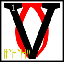ivec put on his armor and stepped into a non-spatial space filling to capacity with mortal interaction and information,
<b>&sup2;</b>a canvas-less cartography of every single mind it has ever known, an event that had developed some semblance of a divine spark.
<b>&sup3;</b>He said, 'From here I shall launch my attack on the eight monsters.'

<b>&#8308;</b>Vivec then saw the moths that would come from the starry heart, bringing with them dust more horrible than the ash of Red Mountain.
<b>&#8309;</b>He saw the twin head of a ruling king who had no equivalent.
<b>&#8310;</b>And eight imperfections rubbed into precious stones, set into a crown that looked like shackles, which he understood to be the twin crowns of the two-headed king.
<b>&#8311;</b>And a river that fed into the mouth of the two-headed king, because he contained multitudes.

<b>&#8312;</b>Vivec then built the Provisional House at the Center of the Secret Door. From here he could watch the age to come.
<b>&#8313;</b>Of the House is written:

Cornerstone one has a finger\
Buried under, pointing through\
Dirt, slow low in the ground\
North cannot be guessed,\
And yet it is spirit-free

<b>&sup1;&#8304;</b>Cornerstone two has a tongue,\
And even dust can be talkative,\
Listen and you will see the love\
The ancient libraries need

<b>&sup1;&sup1;</b>Cornerstone three has a bit of string,\
Shaped like your favorite color,\
A girl remembers who left it there\
But she is afraid to dig it out,\
And see what it is attached to

<b>&sup1;&sup2;</b>Cornerstone four has nine bones,\
Removed carefully from a black cat,\
Arranged in the fashion of this word,\
Protecting us from our enemies

<b>&sup1;&sup3;</b>Your house is safe now

So why is it\-\-

Your house is safe now

So why is it\-\-

<b>&sup1;&#8308;</b>The ending of the words is
ASV.

---

## ascahna'shoreshik
&emsp;[Open][58] | [Chapters][38] | [Top][37]

[58]: lessons/sermon_20.html

#### Sermon Twenty

he first monster was actually two, having been born twice like his mother-father, Vivec.
<b>&sup2;</b>He was not the mightiest of the eight to escape Muatra, but his actions were the most worrisome.
<b>&sup3;</b>He was known as Moon Axle, and he harvested the leftover foibles of nature.
<b>&#8308;</b>This he did twice, as was said, and the second harvest always brought ruin or unwritten law.
<b>&#8309;</b>His aspect was faceted like a polyhedron.

<b>&#8310;</b>No perils are mentioned in the finding of Moon Axle, but it was known that he was immune to spears, so Vivec had to use the sword not held against him.
<b>&#8311;</b>Before he took issue with the monster, the warrior-poet asked:

'How came you to be immune to spears?'

<b>&#8312;</b>To which Moon Axle replied, 'Mine is a dual nature, and protean. I am in fact made of many straight lines, though none last too long. In this way I have learned to ignore all true segments.'

<b>&#8313;</b>Luckily, the sword not held was curved and therefore could cut into Moon Axle, and before the sun was up he was bleeding from many wounds.
<b>&sup1;&#8304;</b>Vivec did not slay him outright for to do so would keep the foibles of nature within him and not back where they belonged.
<b>&sup1;&sup1;</b>Soon Vivec had traced geography right again, and Moon Axle was ready to be slain.

<b>&sup1;&sup2;</b>Vivec rose up in his giant-form, to be terrible to look upon.
<b>&sup1;&sup3;</b>He reached into the west and pulled out a canyon, holding it like a horn. He reached east and ate a handful of nix hounds.
<b>&sup1;&#8308;</b>Blowing their spirits through the canyon made a terrible wail, not unlike an unsolved woman.
<b>&sup1;&#8309;</b>He said:

'Let this overtake you,' and Moon Axle was overtaken by the curvatures of stolen souls.
<b>&sup1;&#8310;</b>They wrapped about the monster like resin, until finally he could not move, nor could his dual nature.

<b>&sup1;&#8311;</b>Vivec said, 'Now you are solved,' and pierced his child with Muatra.
<b>&sup1;&#8312;</b>Moon Axle had been reduced to something static, and therefore shattered.

<b>&sup1;&#8313;</b>The lines of Moon Axle were collected by Velothi philosophers and taken into caves.
<b>&sup2;&#8304;</b>There, and for a year, Vivec taught the philosophers how to turn the lines of his son into the spokes of mystery wheels.
<b>&sup2;&sup1;</b>This was the birth of the first Whirling School. Before, there had only been the surface thought of fire.

<b>&sup2;&sup2;</b>Vivec looked at his first wheeling students and observed:

'Alike the egg-layered universe is this morbid possession of three-distant coverage, soul-wrecked and alive, like my name is alive.
<b>&sup2;&sup3;</b>In this cloister you have discovered one walking path, hilled like a sword but more coarsened.
<b>&sup2;&#8308;</b>So edged it is that it has to be whispered to keep the tongue from bleeding, where its signs evacuate their former meanings, like empires that tarry too long.

<b>&sup2;&#8309;</b>'The sword is estrangement from statesmanship.

<b>&sup2;&#8310;</b>'Look on the estimable lines of my son, now crafted star-wise, his every limb equidistant from the center.
<b>&sup2;&#8311;</b>Is he solved because I will it so? There cannot be a second stage.
<b>&sup2;&#8312;</b>Think on the theory that my existence promulgates the five elements and alike the egg-layered universe I am cause for great density.
<b>&sup2;&#8313;</b>Here is a thought that can break the wagon's axle; here is another that can soar.'

<b>&sup3;&#8304;</b>The ending of the words is
ASV.

---

## ascahn'alna'shoreshik
&emsp;[Open][59] | [Chapters][38] | [Top][37]

[59]: lessons/sermon_21.html

#### Sermon Twenty-One

he Scripture of the Wheel,

First:

'The Spokes are the eight components of chaos, as yet solidified by the law of time:
<b>&sup2;</b>static change, if you will, something the lizard gods refer to as the Striking.
<b>&sup3;</b>That is the reptile wheel, coiled potential, ever-preamble to the never-action.'

<b>&#8308;</b>Second:

'They are the lent bones of the Aedra, the Eight gift-limbs to
SITHISIT,
the wet earth of the new star our home.
<b>&#8309;</b>Outside them is the Aurbis, and not within. Like most things inexplicable, it is a circle.
<b>&#8310;</b>Circles are confused serpents, striking and striking and never given leave to bite.
<b>&#8311;</b>The Aedra would have you believe different, but they were givers before liars. Lies have turned them into biters.
<b>&#8312;</b>Their teeth are the proselytizers; to convert is to place oneself in the mouth of falsehood; even to propitiate is to be swallowed.'

<b>&#8313;</b>Third:

'The enlightened are those uneaten by the world.'

<b>&sup1;&#8304;</b>Fourth:

'The spaces between the gift-limbs number sixteen, the signal shapes of the Demon Princedoms. It is the key and the lock, series and manticore.'

<b>&sup1;&sup1;</b>Fifth:

'Look at the majesty sideways and all you see is the Tower, which our ancestors made idols from.
<b>&sup1;&sup2;</b>Look at its center and all you see is the begotten hole, second serpent, womb-ready for the Right Reaching, exact and without enchantment.'

<b>&sup1;&sup3;</b>Sixth:

'The heart of the second serpent holds the secret triangular gate.'

<b>&sup1;&#8308;</b>Seventh:

'Look at the secret triangular gate sideways and you see the secret Tower.'

<b>&sup1;&#8309;</b>Eighth:

'The secret Tower within the Tower is the shape of the only name of God, I.'

<b>&sup1;&#8310;</b>The ending of the words is
ASV.

---

## ascahn'asca'shoreshik
&emsp;[Open][60] | [Chapters][38] | [Top][37]

[60]: lessons/sermon_22.html

#### Sermon Twenty-Two

hen Vivec left the first Whirling School and went back to the space that was not a space.
<b>&sup2;</b>From the Provisional House he looked into the middle world to find the second monster, which was called the Treasure Wood Sword.
<b>&sup3;</b>Within years of the Pomegranate Banquet, it had become a lessoning tune to the lower Velothi houses.
<b>&#8308;</b>They preached of its power:

'The Treasure Wood Sword, splinter scintilla of the high and glorious! He who wields it becomes self-known!'

<b>&#8309;</b>The warrior-poet appeared as a visitation in the ancestor alcove of House Mora, whose rose-worn prince of garlands was a hero against the northern demons.
<b>&#8310;</b>Vivec congregated with the bones. He said:

'A scavenger cannot acquire a silk sash and expect to discover the greater systems of its predecessor: perfect happiness is embraced only by the weeping.
<b>&#8311;</b>Give me back (and do so freely) what is barren of my marriage and I will not erase you from the thought realm of God.
<b>&#8312;</b>Your line has a notable enchantress that my sister Ayem is fond of and from her murky wisdom alone do I condescend to ask.'

<b>&#8313;</b>A bone-walker emerged from a wall. It had three precious stones set in its lower jaw, a magical practice of old. One was opal, the color of opal.
<b>&sup1;&#8304;</b>The bone-walker bowed to the prince of the middle air and said:

'The Treasure Wood Sword will not leave our house. Bargains were made with the Black Hands Mephala, the greater shade.'

<b>&sup1;&sup1;</b>Vivec kissed the first precious stone and said:

'Animal picture, rude-walker, go back to the lamp that stays lit in water and store no more messages of useless noise. Down.'

<b>&sup1;&sup2;</b>He kissed the second precious stone and said:

'Proud residue, soon dispersed, serve no guarantees made in my fore-image and demand nothing of its under-skin. I am master evermore. Down.'

<b>&sup1;&sup3;</b>He kissed the opal and said:

'Down I take thee.'

<b>&sup1;&#8308;</b>And then Vivec withdrew into the hidden places and found the darkest mothers of the Morag Tong, taking them all to wife and filling them with undusted loyalty that tasted of summer salt.
<b>&sup1;&#8309;</b>They became as black queens, screaming live with a hundred murderous sons, a thousand murderous arms, and a hundred thousand murderous hands,
<b>&sup1;&#8310;</b>one vast moving event of thrusting-kill-laughter in alleys, palaces, workshops, cities and secret halls.
<b>&sup1;&#8311;</b>Their movements among the holdings of the Ra'athim were as rippled endings, heaving between times, with all fates leading to swallowed knives, murder as moaning, God's holy rape-erasure of wet death.

<b>&sup1;&#8312;</b>The King of Assassins presented to Vivec the Treasure Wood Sword.

<b>&sup1;&#8313;</b>'Milord,' the King of Assassins said. 'The prince of House Mora is now fond of you, as well.
<b>&sup2;&#8304;</b>I placed him in the Corner of Dagon. His eyes I set into a fire prayer for the wicked. His mouth I stuffed with birds.'

<b>&sup2;&sup1;</b>The ending of the words is
ASV.

---

## ascahn'cahna'shoreshik
&emsp;[Open][61] | [Chapters][38] | [Top][37]

[61]: lessons/sermon_23.html

#### Sermon Twenty-Three

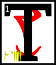he Scripture of the Sword,

First:

'The sword, treated as a delicate meal, is the Symbolic Collage. It serves you well in the first half of life. Name one dynasty that knows this not.'

<b>&sup2;</b>Second:

'The unity of my approach is understood by the immobile warrior. True eyes are acquired.
<b>&sup3;</b>Rejoice as my own subjects and realms. I build for you a city of swords, by which I mean laws that cut the people who live there into better shapes.'

<b>&#8308;</b>Third:

'Girls burn their dresses on my arrival if I am armored. They crawl to me as bled pilgrims.
<b>&#8309;</b>Minor spirits die without trace. Follow me of all the
ASV
if you are to mark your days with killing.
<b>&#8310;</b>AE ALTADOON,
the third law of weaponry.'

<b>&#8311;</b>Fourth:

'The immobile warrior is never fatigued. He cuts sleep holes in the middle of a battle to regain his strength.'

<b>&#8312;</b>Fifth:

'Instinct is not reflex action, but mini-miracles held in reserve.
<b>&#8313;</b>I am the welfare that decides which warrior will emerge. Beg not for luck. Serve me to win.'

<b>&sup1;&#8304;</b>Sixth:

'The span of the apparently inactivated is your love of the absolute. The birth of God from the netchiman's wife is the abortion of kindness from love.'

<b>&sup1;&sup1;</b>Seventh:

'The true sword is able to cut chains of generations, which is to say, the creation myths of your enemies. Look on me as the exiled garden. All else is uncut weed.'

<b>&sup1;&sup2;</b>Eighth:

'I give you an ancient road tempered by the second walking way.
<b>&sup1;&sup3;</b>Your hands must be huge to wield any sword the size of an ancient road, and yet he who is of right stature may irritate the sun with only a stick.'

<b>&sup1;&#8308;</b>The ending of the words is
ASV.

---

## ascahn'cina'shoreshik
&emsp;[Open][62] | [Chapters][38] | [Top][37]

[62]: lessons/sermon_24.html

#### Sermon Twenty-Four

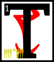hen Vivec left the house of assassins and went back to the space that was not a space.
<b>&sup2;</b>From the Provisional House he looked into the middle world to find the third monster, called Horde Mountain.
<b>&sup3;</b>It was made of modular warriors running free but spaced according to pattern,
<b>&#8308;</b>and from the highest warrior who could cut clouds they spread out beneath him like a tree, a skirt whose bottom circle was an army that ran through the ash.

<b>&#8309;</b>Vivec admired the cone-shape of his child and remembered with joy the whirlwind of fighting styles that instructed him during the days before life.

<b>&#8310;</b>Vivec moved into Veloth, saying, 'Onus.'

But before he could even get within sword-span of the monster, a trio of lower houses had trapped Horde Mountain in a net of doubtful doctrine.
<b>&#8311;</b>When they saw their lord, the Velothi cheered.

'We are happy to serve you and win!' they said.

<b>&#8312;</b>Vivec smiled at those brave souls around him and summoned celebration demons to cleave unto the victors.
<b>&#8313;</b>There was a great display of love and duty around the netted monster, and Vivec was at the center with a headdress made of mating bones.
<b>&sup1;&#8304;</b>He laughed and told mystical jokes and made the heads of the three houses marry and become a new order.

'You shall forever be now my Buoyant Armigers,' he said.

<b>&sup1;&sup1;</b>Then Vivec pierced Horde Mountain with Muatra and made of it all a big bag of bones.
<b>&sup1;&sup2;</b>At the touch of his right hand the net became right scripture and he threw it all northeasterly.
<b>&sup1;&sup3;</b>The contents spread out like sugar-glows and Vivec and the Buoyant Armigers ran under it laughing.

<b>&sup1;&#8308;</b>Finally the bones of Horde Mountain landed and became the foundation stones for the City of Swords, which Vivec named after his own sigil,
<b>&sup1;&#8309;</b>and the net fell across it all and between, or became as bridges between bones, and since its segments had been touched by his holy wisdom they became the most perfect of all city streets in the known worlds.

<b>&sup1;&#8310;</b>Throngs of Velothi came to the new city and Ayem and Seht gave it their blessing.
<b>&sup1;&#8311;</b>The streets were filled with laughter and love and the strength of tree-shaped enemy children.

<b>&sup1;&#8312;</b>Ayem said:

'To my sister-brother's city I give the holy protection of House Indoril, whose powers and thrones know no equal under heaven, wherefrom came the Hortator.'

<b>&sup1;&#8313;</b>Seht said:

'To my sister-brother's city I give safe passage through the dark corners still left of Molag Bal, and I give it this spell as well:
SO'T'HA SIL,
which is my name to the mighty.
<b>&sup2;&#8304;</b>It will protect the lost unless their flight is on purpose and fill all the roads and alleys with the mystery paths of civilization, and give the city a mind and make of it a conduit to the full concentrate of the
ASV.'

<b>&sup2;&sup1;</b>Thus was founded the city of Vivec in the days of Resdaynia.

<b>&sup2;&sup2;</b>The ending of the words is
ASV.

---

## ascahn'arca'shoreshik
&emsp;[Open][63] | [Chapters][38] | [Top][37]

[63]: lessons/sermon_25.html

#### Sermon Twenty-Five

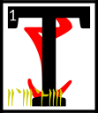he Scripture of the City:

'All cities are born of solid light. Such is my city, his city.

<b>&sup2;</b>'But then the light subsides, revealing the bright and terrible angel of Veloth.
<b>&sup3;</b>He is in his pre-chimerical form, demonic
VEHK,
gaunt and pale and beautiful, skin stretched painfully thin on bird's bones, feathered serpents encircling his arms.
<b>&#8308;</b>His wings are spread out behind him, their red and yellow ends like razors in the sun.
<b>&#8309;</b>The wispy mass of his fire hair floats as if underwater, milky in the nimbus of light that crowns his head.
<b>&#8310;</b>His presence is undeniable, the awe too much to bear.

<b>&#8311;</b>'This is God's city, different from others. Cities from foreign countries put their denizens to sleep and walk to the star-wounded East to pay homage to me.
<b>&#8312;</b>The capital of the northern men, crusty with eon's ice, bows before Vivec the city, me it together.

<b>&#8313;</b>'Self-thought streets rush through tunnel blood. I have rebuilt myself. Hyper eyed signposts along my traffic arm, soon to be an inner sea.
<b>&sup1;&#8304;</b>My body is crawling with all gathered to see me rising up like a monolithic instrument of pleasure. My spine is the main road to the city that I am.
<b>&sup1;&sup1;</b>Countless transactions are taking place in veins and catwalks and the roaming, roaming, roaming, as they roam over and through and add to me.
<b>&sup1;&sup2;</b>There are temples erected along the hollow of my skull and I will ever wear them as a crown. Walk across the lips of God.

<b>&sup1;&sup3;</b>'They add new doors to me and I become effortlessly trans-immortal with the comings and goings and the stride-heat of the market where I am traded for,
<b>&sup1;&#8308;</b>yell of the children hear them play, scoffed at, amused, desired, paid for in native coin, new minted with my face on one side and my city-body on the other.
<b>&sup1;&#8309;</b>I stare with each new window. Soon I am a million-eyed insect dreaming.

<b>&sup1;&#8310;</b>'Red-sparking war trumpets sound like cattle in the ribcage of shuffling transit. The heretics are destroyed on the plaza knees.
<b>&sup1;&#8311;</b>I flood over into the hills, houses rising like a rash, and I never scratch. Cities are the antidotes to hunting.

<b>&sup1;&#8312;</b>'I raise lanterns to light my hollows, lend wax to the thousands of candlesticks that bear my name again and again,
<b>&sup1;&#8313;</b>the name innumerable, shutting in, mantra and priest, god-city, filling every corner with the naming name,
<b>&sup2;&#8304;</b>wheeled, circling, running river language giggling with footfalls mating, selling, stealing, searching, and worry not ye who walk with me.
<b>&sup2;&sup1;</b>This is the flowering scheme of the Aurbis. This is the promise of the
PSJJJJ:
egg, image, man, god, city, state.
<b>&sup2;&sup2;</b>I serve and am served. I am made of wire and string and mortar and I accede my own precedent, world without am.'

<b>&sup2;&sup3;</b>The ending of the words is
ASV.

---

## ascahn'tahna'shoreshik
&emsp;[Open][64] | [Chapters][38] | [Top][37]

[64]: lessons/sermon_26.html

#### Sermon Twenty-Six

hen Vivec left his architectural rapture and went back to the space that was not a space.
<b>&sup2;</b>From the Provisional House he looked into the middle world to find the fourth monster, called The Pocket Cabal.

<b>&sup3;</b>The monster hid itself in the spell-lists of the great Chimeri wizards of the extreme east, where the Emperor Parasols grow wild.
<b>&#8308;</b>Vivec disguised himself as a simple traveler, but radiated a tenuous sense-fabric so that the wizards would seek him out. Of Muatra he made a simple walking dwarf.

<b>&#8309;</b>Before long the invisible one was among the libraries of the east, feeding the essential words of The Pocket Cabal to his walking dwarf and then running when the magic would fail.
<b>&#8310;</b>After a year or two of this thievery, Muatra was sick to its stomach, and the walking dwarf exploded near the slave pens of a wizard's tower.
<b>&#8311;</b>The Pocket Cabal then slipped itself into the mouths of the slaves and hid again.

<b>&#8312;</b>Vivec then watched as the slaves erupted into babble and breaking magic.
<b>&#8313;</b>They rattled their cages and sung out half-hymns that formed into forbidden and arcane knowledge.
<b>&sup1;&#8304;</b>Litany fiends appeared and drank from the excess. Grabbers from the Adjacent Place came into the world sideways, the slave talking having disrupted the normal non-cardinal points.

<b>&sup1;&sup1;</b>So of course a giant bug appeared, with the greatest eastern wizard inside it.
<b>&sup1;&sup2;</b>He could see past Vivec's disguise and knew of the warrior-poet's divinity but he thought himself so powerful that he talked harshly:

<b>&sup1;&sup3;</b>'See what you have wrought, silly Triune! Columns of nonsense and litany fiends!
<b>&sup1;&#8308;</b>I cannot believe how reason or temperance can be made whole again due to your eating, eating, eating! Consort with more demons, why don't you?'

Vivec stabbed the wizard through his soul.

<b>&sup1;&#8309;</b>The giant bug harness fell on the slave cages and the slaves ran about free and reckless, too reckless more with pregnant words. Colors bent into the earth.

<b>&sup1;&#8310;</b>Vivec created a dome-head demon to contain it all.

'The Pocket Cabal is therefore interred here forever. Let this be a cursed land where sorcery is broken and maligned.'

<b>&sup1;&#8311;</b>Then he picked up Muatra by the beard and left the ghostly hemisphere of the dome-head demon.
<b>&sup1;&#8312;</b>On its boundaries, Vivec placed a warning and a song of entrance that contained errors in it.
<b>&sup1;&#8313;</b>With mock bones of half-dead Muatra he created the tent poles of a fortress-theory and fatal languages were imprisoned for all time.

<b>&sup2;&#8304;</b>Seht appeared and looked on what his brother-sister had created.
<b>&sup2;&sup1;</b>The Clockwork King said:

'Of the eight monsters, this is the most confusing. May I treasure it?'

<b>&sup2;&sup2;</b>Vivec gave Seht leave to do so, but told him never to release The Pocket Cabal into the middle world.
<b>&sup2;&sup3;</b>He said:

'I have hidden secrets in my travels here and made a likeness of Muatra to ward against the unwise. Under this dome, the temporal myth is no longer man.'

<b>&sup2;&#8308;</b>The ending of the words is
ASV.

---

## ascahn'sahna'shoreshik
&emsp;[Open][65] | [Chapters][38] | [Top][37]

[65]: lessons/sermon_27.html

#### Sermon Twenty-Seven

he Scripture of the Word,

First:

'All language is based on meat. Do not let the sophists fool you.'\
&#8203;

<b>&sup2;</b>Second:

'The third walking path explores hysteria without fear. The efforts of madmen are a society of itself, but only if they are written.
<b>&sup3;</b>The wise may substitute one law for another, even into incoherence, and still say he is working within a method. This is true of speech and extends to all scripture.'

<b>&#8308;</b>Third:

'Do not go to the realm of apology for absolution. Beyond articulation, there is no fault.
<b>&#8309;</b>The Adjacent Place, where the Grabbers live, is the illusion of the vocal or the middle realms of thought, by which I mean the constructed.
<b>&#8310;</b>This is how I stole the certainty of the Chancellor of Exactitude, perfect to look upon from every angle.
<b>&#8311;</b>When you come out of the vocal, you can never be certain.'

<b>&#8312;</b>Fourth:

'The truest body of work is made up of silence: as in the silence that results from no reference. By the word I mean the dead.'

<b>&#8313;</b>Fifth:

'The first meaning is always hidden.'

<b>&sup1;&#8304;</b>Sixth:

'The realm of apology is perfection and impossible to attack. Thus, the wise avoid it.
<b>&sup1;&sup1;</b>Trinity in unity is the world and word of action: the third walking path.'

<b>&sup1;&sup2;</b>Seventh:

'The sage who suppresses his best aphorism: cut off his hands, for he is a thief.'

<b>&sup1;&sup3;</b>Eighth:

'The clothes of the broken map are worn only by fools and heretics. The map is an exit for laziness.
<b>&sup1;&#8308;</b>It is the dusty tongue, which is to say the given chart that most take as a story that is complete. No word is true until it is eaten.'

<b>&sup1;&#8309;</b>The ending of the words is
ASV.

---

## ascahn'daskhora'shoreshik
&emsp;[Open][66] | [Chapters][38] | [Top][37]

[66]: lessons/sermon_28.html

#### Sermon Twenty-Eight

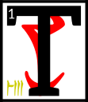hen Vivec left Seht to look after the dome-head demon and went back to the space that was not a space.
<b>&sup2;</b>From the Provisional House he looked into the middle world to find the fifth monster, called The Ruddy Man.

<b>&sup3;</b>When the dreughs ruled the world, the Daedroth Prince Molag Bal had been their chief.
<b>&#8308;</b>He took a different shape then, spiny and armored and made for the sea.
<b>&#8309;</b>Vivec, in giving birth to the many spawn of his marriage, had dropped an old image of Molag Bal into the world: a dead carapace of memory.
<b>&#8310;</b>It would not have been a monster if a Velothi child had not wanted to impress his village by wearing it.

<b>&#8311;</b>The Ruddy Man, of the eight monsters, was the least complicated. He made those who wore him into mighty killers and nothing more. He existed in the physical. Only geography makes him special.

<b>&#8312;</b>When Vivec found him near the boy's village, anon Gnisis, there was a violent clash of arms and an upheaval of the earth.
<b>&#8313;</b>Their battle created the West Gash. Wanderers that still go there hear still the sounds of it: sword across the crust, the grunt of God, the snapping of his monster child's splintered legs.

<b>&sup1;&#8304;</b>After his victory, Vivec took the shell of The Ruddy Man to the dreughs that had modified his mother.
<b>&sup1;&sup1;</b>The Queen of Dreughs, whose name is not easy to spell, was in a period of self-incubation.
<b>&sup1;&sup2;</b>Her wardens took the gift from Vivec and promised to guard it from the surface world. This is the first account of dreughs being liars.

<b>&sup1;&sup3;</b>In ten years, The Ruddy Man appeared again, this time near Tear, worn by a wayward shaman who followed the House of Troubles.
<b>&sup1;&#8308;</b>Instead of guarding it, the dreughs had imbued the living armor with mythic inflexibility.
<b>&sup1;&#8309;</b>It molted soon after skill-draping the shaman and stretched his bones to the five corners.

<b>&sup1;&#8310;</b>When Vivec met the monster in battle again he saw the remains of three villages dripping from its feet.
<b>&sup1;&#8311;</b>He took on his giant form and slew The Ruddy Man by way of the Symbolic Collage.
<b>&sup1;&#8312;</b>Since he no longer trusted the Altmer of the sea, Vivec gave the carapace of the monster to the devout and loyal mystics of the Number Room.
<b>&sup1;&#8313;</b>He told them:

'You may make of The Ruddy Man a philosopher's armor.'

<b>&sup2;&#8304;</b>The mystics began by wrapping one of their sages in the shells, a series of flourishes by two supra numerates, one hormonally tall and the other just under his arms.
<b>&sup2;&sup1;</b>They ran around the carapace and through each other, applying holy resin drawn from the carcasses of the now-useless numbers between twelve and thirteen.
<b>&sup2;&sup2;</b>Golden straws were quickly stuck through the mythic epidermal so the sage could breathe.
<b>&sup2;&sup3;</b>After the ceremonial etchings were drawn into hardening resin, long lists of dead names and equations whose solutions were to be found in the mouth of the Chimer inside, there came the illuminations, inscribed by the bright, terrible fingernail of Vivec.
<b>&sup2;&#8308;</b>From the nail's tip flowed a searing liquid, filling the grooves of the ceremonial etchings.
<b>&sup2;&#8309;</b>They bled out to form veined patterns about the sage-shell that theologians would decipher forever after.

<b>&sup2;&#8310;</b>The ending of the words is
ASV.

---

## ascahn'enta'shoreshik
&emsp;[Open][67] | [Chapters][38] | [Top][37]

[67]: lessons/sermon_29.html

#### Sermon Twenty-Nine

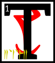he Scripture of the Numbers:

1\. The Dragon Break, or the Tower. 1\
<b>&sup2;</b>2\. The Enantiomorph. 68\
<b>&sup3;</b>3\. The Invisible Gate,
ASV. 112\
<b>&#8308;</b>4\. The Corners of House of Troubles. 242\
<b>&#8309;</b>5\. The Corners of the World. 100\
<b>&#8310;</b>6\. The Walking Ways. 266\
<b>&#8311;</b>7\. The Sword at the Center. 39\
<b>&#8312;</b>8\. The Wheel, or the Eight Givers. 484\
<b>&#8313;</b>9\. The Missing. 11\
<b>&sup1;&#8304;</b>10\. The Tribes of the Altmer. 140\
<b>&sup1;&sup1;</b>11\. The Number of the Master. 102\
<b>&sup1;&sup2;</b>12\. The Heavens. 379\
<b>&sup1;&sup3;</b>13\. The Serpent. 36\
<b>&sup1;&#8308;</b>14\. The King's Cough. 32\
<b>&sup1;&#8309;</b>15\. The Redeeming Force. 110\
<b>&sup1;&#8310;</b>16\. The Acceptable Blasphemes. 12\
<b>&sup1;&#8311;</b>17\. The Hurling Disk. 283\
<b>&sup1;&#8312;</b>18\. The Egg, or Six Times the Wise.\
<b>&sup1;&#8313;</b>19\. The Provisional House. 258\
<b>&sup2;&#8304;</b>20\. The Lunar Lattice. 425\
<b>&sup2;&sup1;</b>21\. The Womb. 13\
<b>&sup2;&sup2;</b>22\. Unknown. 453\
<b>&sup2;&sup3;</b>23\. The Hollow Prophet. 54\
<b>&sup2;&#8308;</b>24\. The Star Wound. 44\
<b>&sup2;&#8309;</b>25\. The Emperor. 239\
<b>&sup2;&#8310;</b>26\. The Rogue Plane. 81\
<b>&sup2;&#8311;</b>27\. The Secret Fire. 120\
<b>&sup2;&#8312;</b>28\. The Drowned Lamp. 8\
<b>&sup2;&#8313;</b>29\. The Captive Sage. 217\
<b>&sup3;&#8304;</b>30\. The Scarab. 10\
<b>&sup3;&sup1;</b>31\. The Listening Frame. 473\
<b>&sup3;&sup2;</b>32\. The False Call. 7\
<b>&sup3;&sup3;</b>33\. The Anticipations. 234\
<b>&sup3;&#8308;</b>34\. The Lawless Grammar. 2\
<b>&sup3;&#8309;</b>35\. The Prison-Shirt. 191\
<b>&sup3;&#8310;</b>36\. The Hours. 364

<b>&sup3;&#8311;</b>'The presence of deaf witness, this is what the numbers are. They hang onto the Aurbis as the last nostalgia of their godhood.
<b>&sup3;&#8312;</b>The effigies of numbers are their current applications; this is folly, as above. To be affixed to a symbol is too, too certain.'

<b>&sup3;&#8313;</b>The ending of the words is
ASV.

---

## cahnahna'shoreshik
&emsp;[Open][68] | [Chapters][38] | [Top][37]

[68]: lessons/sermon_30.html

#### Sermon Thirty

hen Vivec left the mystics of the Number Room and went back to the space that was not a space.
<b>&sup2;</b>From the Provisional House he looked into the middle world to find the sixth monster, called City-Face.
<b>&sup3;</b>He was vexed when he could not find it and went back to the Mourning Hold in secret anger, killing a mystic that asked about higher order.

<b>&#8308;</b>Nerevar, the Hortator, witnessed this and said, 'Why do this, milord? The mystics look to you for guidance. They work to make your temple better stoned.'

<b>&#8309;</b>Vivec said, 'No one knows what I am.'

The Hortator nodded and went back to his studies.

<b>&#8310;</b>Here is how City-Face hid from his mother-father: it had been born named as Ha-Note, a bare urge of power, an esoteric wind nerve tuned to the frequency of huddled masses.
<b>&#8311;</b>It found root in villages and multiplied, finding in the minds of the settled a veiled astrology, the star charts of culture, and this resonance made its head swim.
<b>&#8312;</b>Ha-Note moved sideways into the Adjacent Place, growing and unbeknownst. Above the vocal, it trembled with new emotions, immortal ones, absorbing more than the thirty known to exist in the middle world.
<b>&#8313;</b>When Ha-Note became gravely homesick, the Grabbers took it.

<b>&sup1;&#8304;</b>A Grabber said, 'New emotions to the lonely occur only of madness. This thing is gone. It is ours now.'

<b>&sup1;&sup1;</b>Grabbers had never made a city of their own, and their glimpse of Vivec's, which shone with holiness through all the spheres, had taken their attention.

<b>&sup1;&sup2;</b>'Under this reason did the issue of Vehk slide into our realm, drawn by our coveting, hidden in loss. We shall build our tower-hope upon its face.'

<b>&sup1;&sup3;</b>Now many years had passed in Resdaynia, and the high priests of the Dwemer were building something alike as Vivec and alike as the new Ha-Note of the Grabbers.
<b>&sup1;&#8308;</b>The Hortator was engaged with an army of theirs that had become too brave, talking foolish words, and Nerevar helped destroy them with the help of the orphan legion of Ayem.
<b>&sup1;&#8309;</b>When he went to give trophy to Vivec, he saw his lord under attack by the City-Face.
<b>&sup1;&#8310;</b>The monster was saying this:

'Here we are to replace your city, Vehk and Vehk.
<b>&sup1;&#8311;</b>We are from the place of the more-than-known emotions, and our citizenry has died from it. Two things we came for, but can stay for only one.
<b>&sup1;&#8312;</b>Either we ask you to correct our error of culture, or merely take yours by dint of force. The second is easiest, we think.'

<b>&sup1;&#8313;</b>Vivec sighed.

'You would replace my direction,' he said. 'I weary of this, though I wanted to kill you an age before.
<b>&sup2;&#8304;</b>Resdaynia is fallen ill, and I have no time for one more imaginary analogy of an unknown incident.
<b>&sup2;&sup1;</b>Here, take this.'

At which he touched the tower-hope of the City-Face and corrected the error of the Grabbers.

<b>&sup2;&sup2;</b>'And this.'

At which he stabbed the heart of the City-Face with the Ethos Knife, which is to say
RKHT AI AE ALTADOON AI,
the short blade of proper commerce.

<b>&sup2;&sup3;</b>The ending of the words is
ASV.

---

## cahnahn'alna'shoreshik
&emsp;[Open][69] | [Chapters][38] | [Top][37]

[69]: lessons/sermon_31.html

#### Sermon Thirty-One

any more years passed in Resdaynia, and the high priests of the Dwemer were almost ready to make war on the rulers of Veloth.
<b>&sup2;</b>The Hortator had become the husband of Ayem during this time, and the first saint of the Triune way.
<b>&sup3;</b>Vivec had tired of fighting his sons and daughters, and so took a respite from trying to find them.

<b>&#8308;</b>The Hortator said to his wife, 'Where is Vivec, my teacher? I love him still, though he grows cold. His lamentations, if I may call them that, have changed the skin of the whole country.
<b>&#8309;</b>He is hardly to be found anywhere in Veloth of late. The people grow dark because of it.'

<b>&#8310;</b>And Ayem took mercy on her troubled husband and told him that the sword of the Triune had been fighting minor monsters stirred up by the Dwemer as they worked on their brass siege machines.
<b>&#8311;</b>She took the Hortator inside her and showed him where his master was.

<b>&#8312;</b>ASV,
or at least that aspect that chose to be Vivec, sat in the Litany Hall of the False Thinking Temple after his battle with the Flute-and-Pipe Ogres of the West Gash.
<b>&#8313;</b>He began writing, again, in his Book of Hours. He had to put on his Water Face first.
<b>&sup1;&#8304;</b>That way he could separate the bronze of the Old Temple from the blue of the New and write with happiness.
<b>&sup1;&sup1;</b>Second, he had to take another feather from the Big Moon, further rendering it dead. That way he could write about mortals with truth.
<b>&sup1;&sup2;</b>Third, he recalled the Pomegranate Banquet, where he was forced to marry to Molag Bal with wet scriptures to cement his likeness as Mephala and write with black hands.
<b>&sup1;&sup3;</b>He wrote:

The last time I heard his voice, showing the slightest sign of impatience, I learned to control myself and submit to the will of others.
<b>&sup1;&#8308;</b>Afterwards, I dared to take on the sacred fire and realized there was no equilibrium with the
ET'ADA.
<b>&sup1;&#8309;</b>They were liars, lost roots, and the most I can do is to be an interpreter into the rational.
<b>&sup1;&#8310;</b>Even that fails the needs of the people. I sit on the mercy seat and pass judgment, the waking state, and the phase aspect of the innate urge.
<b>&sup1;&#8311;</b>Only here can I doubt, in this book, written in water, broadened to include evil.

<b>&sup1;&#8312;</b>Then Vivec threw his ink on this passage to cover it up (for the lay reader) and wrote instead:

Find me in the blackened paper, unarmored, in final scenery.
<b>&sup1;&#8313;</b>Truth is like my husband: instructed to smash, filled with procedure and noise, hammering, weighty, heaviness made schematic, lessons learned only by a mace.
<b>&sup2;&#8304;</b>Let those that hear me then be buffeted, and let some die in the ash from the striking.
<b>&sup2;&sup1;</b>Let those that find him find him murdered by illumination, pummeled like a traitorous house, because, if an hour is golden, then immortal I am a secret code.
<b>&sup2;&sup2;</b>I am the partaker of the Doom Drum, chosen of all those that dwell in the middle world to wear this crown, which reverberates with truth, and I am the mangling messiah.

<b>&sup2;&sup3;</b>The ending of the words is
ASV.

---

## cahnahn'asca'shoreshik
&emsp;[Open][70] | [Chapters][38] | [Top][37]

[70]: lessons/sermon_32.html

#### Sermon Thirty-Two

he Scripture of the Mace,

First:

'The pleasure of annihilation is the pleasure of disappearing into the unreal.

<b>&sup2;</b>All those that would challenge the sleeping world will seek membership in this movement. I denounce the alienation of the Cloven Duality with a hammer.'

<b>&sup3;</b>Second:

'Take from me the lessons as a punishment for being mortal. To be made of dirt is to be treated as such by your jailers.
<b>&#8308;</b>This is the key and the lock of the Daedra. Why do you think they escaped the compromise?'

<b>&#8309;</b>Third:

'Velothi, your skin has become the pregnant darkness. My brooding has brought this on.
<b>&#8310;</b>Remember that Boethiah asked you to become the color of bruise. How else to show yourselves people of the exodus into the vital: pain?'

<b>&#8311;</b>Fourth:

'The sage who is not an anvil: a conventional sentence and nothing more. By which I mean dead, the fourth walking way.'

<b>&#8312;</b>Fifth:

'A proper comprehension of the virtues: stage-managed and to be murdered.'

<b>&#8313;</b>Sixth:

'In the end, rejoice as a hostage released from drumming torment but that savors his wound.
<b>&sup1;&#8304;</b>The drum breaks and you find it to be a nest of hornets, which is to say: your sleep is over.'

<b>&sup1;&sup1;</b>Seventh:

'The suspicious is spectacle and the lie is only a theoretical inspiration.'

<b>&sup1;&sup2;</b>Eighth:

'But then why, you ask, do the Daedra wish to meddle with the Aurbis? It is because they are the radical critique, essential as all martyrs.
<b>&sup1;&sup3;</b>That some are more evil than others is not an illusion. Or rather, it is a necessary illusion.'

<b>&sup1;&#8308;</b>The ending of the words is
ASV.

---

## cahnahn'cahna'shoreshik
&emsp;[Open][71] | [Chapters][38] | [Top][37]

[71]: lessons/sermon_33.html

#### Sermon Thirty-Three

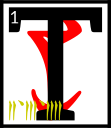hen Vivec left the Litany Hall of the False Thinking Temple, where he had brooded for so long creating the scripture of the pounding light, and went back to the space that was not a space.
<b>&sup2;</b>From the Provisional House he looked into the middle world to find the seventh monster, called Lie Rock.

<b>&sup3;</b>Lie Rock was born of Vivec's Second Aperture and was thrown out of the Pomegranate Banquet by a member of the Sweeps, another forgotten guild.
<b>&#8308;</b>The Sweep did not take it for the monster that it was and so he did not expect it to fly from his hand and into the heavens.

<b>&#8309;</b>'I am born of golden wisdom and powers that should have forever been unalike! With this nature I am invited into the Hidden Heaven!'

<b>&#8310;</b>By which he meant the Scaled Blanket, made of not-stars, whose number is thirteen.
<b>&#8311;</b>Lie Rock became full of foolishness, haggling with the Void Ghost who hides in the religions of all men.
<b>&#8312;</b>The Void Ghost said:

'Stay with me a full hundred years and I will give you a power that no divinity will dare disobey.'

<b>&#8313;</b>But before the hundred years was up, Vivec was already looking for Lie Rock and found him.

<b>&sup1;&#8304;</b>'Stupid stone,' Vivec said. 'To hide in the Scaled Blanket is to make a mark on nothing. His bargains are only for ruling kings!'

<b>&sup1;&sup1;</b>So Vivec sent the Hortator to the heavens to shave Lie Rock asunder by the named axe.
<b>&sup1;&sup2;</b>Nerevar made peace with the south-pole-star of thieving and the north-pole-star of warriors and the third-pole-star, which existed only in the ether, which was governed by the apprentice of Magnus the sun.
<b>&sup1;&sup3;</b>They gave him leave to wander among their charges and gave him red sight by which to find Lie Rock in the Hidden Heaven.

<b>&sup1;&#8308;</b>By chance, Nerevar met the Void Ghost first, who told him that he was in the wrong place to which the Hortator said, 'Me or you?' and the Void Ghost said both.
<b>&sup1;&#8309;</b>This sermon does not tell what else was said between these masters.

<b>&sup1;&#8310;</b>Lie Rock, however, used the confusion to launch his own attack on the city-god, Vivec.
<b>&sup1;&#8311;</b>He was hastened by all three of the black guardians, who wanted him swiftly gone, though they meant no hostility to the lord of the middle air.

<b>&sup1;&#8312;</b>The citizenry of Vivec screamed as they saw a shooting star come down out of the sky hole like a toll-road of hell.
<b>&sup1;&#8313;</b>But Vivec merely raised his hand and froze Lie Rock just above the city and then he pierced the monster with Muatra.

<b>&sup2;&#8304;</b>(The practice of piercing the Second Aperture is now forbidden.)

<b>&sup2;&sup1;</b>When Nerevar returned, he saw the frozen comet above his lord's city. He asked whether or not Vivec wanted it removed.

'I would have done so myself if I wanted, silly Hortator.
<b>&sup2;&sup2;</b>I shall keep it there with its last intention intact, so that if the love of the people of this city for me ever disappear, so shall the power that holds back their destruction.'

<b>&sup2;&sup3;</b>Nerevar said, 'Love is under your will only.'

<b>&sup2;&#8308;</b>Vivec smiled and told the Hortator that he had become a Minister of Truth.

<b>&sup2;&#8309;</b>The ending of the words is
ASV.

---

## cahnahn'cina'shoreshik
&emsp;[Open][72] | [Chapters][38] | [Top][37]

[72]: lessons/sermon_34.html

#### Sermon Thirty-Four

hen Vivec left the Ministry of Truth and went back to the space that was not a space.
<b>&sup2;</b>From the Provisional House he looked into the middle world to find the eighth and final and mightiest monster,
<b>&sup3;</b>called
GULGA MOR JIL HYAET AE HOOM.

<b>&#8308;</b>Vivec called to his side the Hortator and this was the first time that Nerevar had ever been to the Provisional House.
<b>&#8309;</b>He had the same vision that Vivec had so many years ago: that of the two-headed ruling king.

<b>&#8310;</b>'Who is that?' he wondered.

Vivec said, 'The red jewel of conquest.'

<b>&#8311;</b>Nerevar, perhaps because he was frightened, became vexed at his lord's answer. 'Why are you always so evasive?'

<b>&#8312;</b>Vivec told the Hortator that to be otherwise was to betray his nature.

<b>&#8313;</b>Together they moved into the middle world, to a village near where Vivec had been found by Ayem and Seht.
<b>&sup1;&#8304;</b>The eighth monster was there, but he did not act much like a monster. He sat with his legs in the ocean and with a troubled look on his face.
<b>&sup1;&sup1;</b>When he saw his mother-father, he asked why he should have to die and return to oblivion.

<b>&sup1;&sup2;</b>Vivec told the eighth monster that to be otherwise was to betray his nature.
<b>&sup1;&sup3;</b>Since this did not seem to satisfy the monster and Vivec still had a touch of Ayem's mercy he said:

'The fire is mine: let it consume thee,\
<b>&sup1;&#8308;</b>And make a secret door\
At the altar of Padhome,\
In the House of Boet-hi-Ah\
Where we become safe\
And looked after.'

<b>&sup1;&#8309;</b>The monster accepted Muatra with a peaceful look and his bones became the foundation for the City of the Dead, anon Necrom.

<b>&sup1;&#8310;</b>Nerevar put away his axe, which he had at the ready, and frowned.

'Why,' he said, 'did you ask me to come if you knew the eighth monster would give in so easily?'

<b>&sup1;&#8311;</b>Vivec looked at the Hortator for a long time.

Nerevar understood. 'Do not betray your nature. Answer as you will.'

<b>&sup1;&#8312;</b>Vivec said, 'I brought you here because I knew the mightiest of my issue would succumb to Muatra without argument, if only I gave him consolation first.'

<b>&sup1;&#8313;</b>Nerevar looked at Vivec for a long time.

Vivec understood. 'Say the words, Hortator.'

Nerevar said, 'Now I am the mightiest of your children.'

<b>&sup2;&#8304;</b>Let this sermon be consolation to those who read it that are destined to die.

<b>&sup2;&sup1;</b>The ending of the words is
ASV.

---

## cahnahn'arca'shoreshik
&emsp;[Open][73] | [Chapters][38] | [Top][37]

[73]: lessons/sermon_35.html

#### Sermon Thirty-Five

he Scripture of Love:

'The formulas of proper Velothi magic continue in ancient tradition, but that virility is dead, by which I mean at least replaced.
<b>&sup2;</b>Truth owes its medicinal nature to the establishment of the myth of justice.
<b>&sup3;</b>Its curative properties it likewise owes to the concept of sacrifice.
Princes, chiefs, and angels all subscribe to the same notion.
<b>&#8308;</b>This is a view primarily based on a prolific abolition of an implied profanity, seen in ceremonies, knife fighting, hunting, and the exploration of the poetic.
<b>&#8309;</b>On the ritual of occasions, which comes to us from the days of the cave glow, I can say nothing more than to loosen your equation of moods to lunar currency.
<b>&#8310;</b>Later, and by that I mean much, much later, my reign will be seen as an act of the highest love, which is a return from the astral destiny and the marriages between.
<b>&#8311;</b>By that I mean the catastrophes, which will come from all five corners. Subsequent are the revisions, differentiated between hope and the distraught, situations that are only required by the periodic death of the immutable.
<b>&#8312;</b>Cosmic time is repeated: I wrote of this in an earlier life. An imitation of submersion is love's premonition, its folly into the underworld, by which I mean the day you will read about outside of yourself in an age of gold.
<b>&#8313;</b>For on that day, which is a shadow of the sacrificial concept, all history is obliged to see me for what you are: in love with evil.
<b>&sup1;&#8304;</b>To keep one's powers intact at such a stage is to allow for the existence of what can only be called a continual spirit.
<b>&sup1;&sup1;</b>Make of your love a defense against the horizon. Pure existence is only granted to the holy, which comes in a myriad of forms, half of them frightening and the other half divided into equal parts purposeless and assured.
<b>&sup1;&sup2;</b>Late is the lover that comes to this by any other walking way than the fifth, which is the number of the limit of this world.
<b>&sup1;&sup3;</b>The lover is the highest country and a series of beliefs. He is the sacred city bereft of a double. The uncultivated land of monsters is the rule.
<b>&sup1;&#8308;</b>This is clearly attested by
ANU
and his double, which love knows never really happened. Similarly, all the other symbols of absolute reality are ancient ideas ready for their graves, or at least the essence of such.
<b>&sup1;&#8309;</b>This scripture is directly ordered by the codes of Mephala, the origin of sex and murder, defeated only by those who take up those ideas without my intervention.
<b>&sup1;&#8310;</b>The religious elite is not a tendency or a correlation. They are dogma complemented by the influence of the untrustworthy sea and the governance of the stars, dominated at the center by the sword, which is nothing without a victim to cleave unto.
<b>&sup1;&#8311;</b>This is the love of God and he would show you more: predatory but at the same time instrumental to the will of critical harvest, a scenario by which one becomes as he is, of male and female, the magic hermaphrodite.
<b>&sup1;&#8312;</b>Mark the norms of violence and it barely registers, suspended as it is by treaties written between the original spirits.
<b>&sup1;&#8313;</b>This should be seen as an opportunity, and in no way tedious, though some will give up for it is easier to kiss the lover than become one.
<b>&sup2;&#8304;</b>The lower regions crawl with these souls, caves of shallow treasures, meeting in places to testify by way of extension, when love is only satisfied by a considerable (incalculable) effort.'

<b>&sup2;&sup1;</b>The ending of the words is
ASV.

---

## cahnahn'tahna'shoreshik
&emsp;[Open][74] | [Chapters][38] | [Top][37]

[74]: lessons/sermon_36.html

#### Sermon Thirty-Six

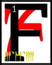or these were the days of Resdaynia, when Chimer and Dwemer lived under the wise and benevolent rule of the
ASV
and their champion the Hortator, though the Dwemer had become foolish and challenged their masters.

<b>&sup2;</b>Out of their fortresses they came with golden ballistae that walked and mighty atronachs and things that spat flame and things that made killing songs.
<b>&sup3;</b>Their king was Dumac Dwarf-Orc, but their high priest was Kagrenac the Blighter.

<b>&#8308;</b>Under mountains and over them the war with the Dwemer was raged, and then came the northern men to help Kagrenac and they brought Ysmir again.

<b>&#8309;</b>Leading the armies of the Chimer was the slave that would not perish, the Hortator Nerevar, who had traded his axe for the Ethos Knife.
<b>&#8310;</b>He slew Dumac at Red Mountain and saw the heart bone for the first time.

<b>&#8311;</b>Men of brass destroyed the eleven gates of the Mourning Hold and behind them came the Dwemeri architects of tone.
<b>&#8312;</b>Ayem threw down her cloak and became the Face-Snaked Queen of the Three in One.
<b>&#8313;</b>Those that looked upon her were overcome by the meanings of the stars.

<b>&sup1;&#8304;</b>Under the sea, Seht stirred and brought the army he had been working on in the castles of glass and coral.
<b>&sup1;&sup1;</b>Clockwork dreughs, mockeries of the Dwemeri war machines, rose up from the seas and took their counterparts back beneath, where they were swallowed forever by the sea.

<b>&sup1;&sup2;</b>Red Mountain exploded as the Hortator went too far inside, seeking the Sharmat.

<b>&sup1;&sup3;</b>Dwemeri high priest Kagrenac then revealed that which he had built in the image of Vivec.
<b>&sup1;&#8308;</b>It was a walking star, which burnt the armies of the Triune and destroyed the heartland of Veloth, creating the Inner Sea.

<b>&sup1;&#8309;</b>Each of the aspects of the
ASV
then rose up together, combining as one, and showed the world the sixth path.
<b>&sup1;&#8310;</b>Ayem took from the star its fire, Seht took from it its mystery, and Vehk took from it its feet, which had been constructed before the gift of Molag Bal and destroyed in the manner of truth: by a great hammering.
<b>&sup1;&#8311;</b>When the soul of the Dwemer could walk no more, they were removed from this world.

<b>&sup1;&#8312;</b>Resdaynia was no more. It had been redeemed of all the iniquities of the foolish.
<b>&sup1;&#8313;</b>The
ASV
drew nets from the Beginning Place and captured the ash of Red Mountain, which they knew was the Blight of the Dwemer and that would serve only to infect the whole of the middle world, and ate it.
ALTADOON DUNMERI!

<b>&sup2;&#8304;</b>The beginning of the words is
ASV.
I give you this as Vivec.

---

---
