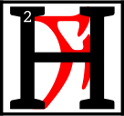
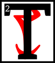
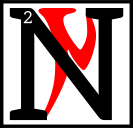
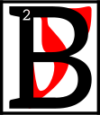
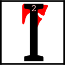

---

<!--- Local CSS Font Loading -->

<!--- Jekyll Page Links -->

<a href="../../../../index.html">Home</a>
&emsp;&nabla;&emsp;
<a href="../../../archive/about.html">About</a>
&emsp;&nabla;&emsp;
<a href="../../../archive/index.html">Archive</a>
&emsp;&nabla;&emsp;
<a href="../../index.html">Quintessence</a>

<!--- Markdown Body Below: -->

---

&#8203;

<h1>neihn gher leyrihn</h1>
<h1>THE TRUTH IN SEQUENCE</h1>

<h4>SO'T'HA SIL</h4>
<h6>The Light of Knowledge</h6>

&#8203;\
&#8203;

---

## Chapters

| &#8203; | Index               |
|--------:|:--------------------|
|  __1:__ | [Volume One][1]     |
|  __2:__ | [Volume Two][2]     |
|  __3:__ | [Volume Three][3]   |
|  __4:__ | [Volume Four][4]    |
|  __5:__ | [Volume Five][5]    |
|  __6:__ | [Volume Six][6]     |
|  __7:__ | [Volume Seven][7]   |
|  __8:__ | [Volume Eight][8]   |
|  __9:__ | [Volume Nine][9]    |
| __10:__ | [Volume Ten][10]    |
| __11:__ | [Volume Eleven][11] |
| __12:__ | [Volume Twelve][12] |

[1]: #alnaamurokam
[2]: #ascaamurokam
[3]: #cahnaamurokam
[4]: #cinaamurokam
[5]: #arcaamurokam
[6]: #tahnaamurokam
[7]: #sahnaamurokam
[8]: #daskhoraamurokam
[9]: #entaamurokam
[10]: #alnahnaamurokam
[11]: #alnahnalnaamurokam
[12]: #alnahnascaamurokam
[13]: #
[14]: #chapters

---

## alna'amurokam
&emsp;[Open][15] | [Chapters][14] | [Top][13]

[15]: sequence/volume_01.html

#### Volume One

<b>&sup1;</b>By the word, I wind the gears.

ow does one come to know the Clockwork God and Father of Mysteries?
<b>&sup3;</b>Our Lord Vivec and the Lady of Mercy, Almalexia, are known to us.
<b>&#8308;</b>Their faces are known to us. Their words are known to us. But what of Sotha Sil?
<b>&#8309;</b>He who is distant in both position and intent. Ever watchful, but seldom seen. Ever worshiped, but seldom heard.
<b>&#8310;</b>He is the Mainspring Ever-Wound&mdash;the unmoved mover, hidden within His Clockwork City, whose voice is the Divine Metronome.
<b>&#8311;</b>As Tourbillon, I speak His truth as I know it. I say the words in sequence so they can be known by the people.
<b>&#8312;</b>The sequence is but a shadow of the truth, but minds such as ours cannot bear the ordered unsequence.
<b>&#8313;</b>Minds such as ours cannot truly know themselves. Not yet.

<b>&sup1;&#8304;</b>The First Truth of the Mainspring Ever-Wound is the truth of Nirn.
<b>&sup1;&sup1;</b>The soul of Nirn has two faces. The first is known to us&mdash;the Nirn-Prior, or the Nirn of Many Parts.
<b>&sup1;&sup2;</b>It is a Nirn in pieces, assembled by the unsteady hand that has yet to find itself.
<b>&sup1;&sup3;</b>Its oscillations irregular, its going train disrupted by fear and delusion. Its faults are not in its parts, but in its assembly.
<b>&sup1;&#8308;</b>Each gear is a god. Each spring is a thought. But a mechanism built by many hands cannot know the precision of the master craftsman.
<b>&sup1;&#8309;</b>The et'Ada Gears cannot bring forth a true Nirn, because they know only its parts. They cannot see the whole.
<b>&sup1;&#8310;</b>The Eye of Sotha Sil ignores such division.
<b>&sup1;&#8311;</b>Where the broken gods see only pieces, our Father Sotha Sil sees the whole. He sees the Second Nirn.

<b>&sup1;&#8312;</b>The Second Nirn. The inchoate Nirn-Ensuing. The thought-form that anticipates the world to come: Tamriel Final. Anuvanna'si.
<b>&sup1;&#8313;</b>Only Sotha Sil knows its shape. Its nature lies forgotten in the before-time when Anu broke itself for wisdom's sake.
<b>&sup2;&#8304;</b>Our lessers know the Source as two forms: Anu and Padomay, but this binary is without merit.
<b>&sup2;&sup1;</b>One of Lorkhan's Great Lies, meant to sunder us from the truth of Anuic unity.
<b>&sup2;&sup2;</b>Our father, Sotha Sil, would have us know the truth: there is no Padomay.
<b>&sup2;&sup3;</b>Padomay is the absence of value. The lack. A ghost that vanishes at first light. A Nothing.
<b>&sup2;&#8308;</b>There is only Anu, sundered and known by many names, possessing many faces. The one.

<b>&sup2;&#8309;</b>When Anu broke itself, it did so to understand its nature.
<b>&sup2;&#8310;</b>In its sundering, the values that swam in its vastness thought to know themselves.
<b>&sup2;&#8311;</b>The et'Ada Gears gave themselves many names and set their will to building.
<b>&sup2;&#8312;</b>Alas, they heeded the counsel of Lorkhan and forgot the face of Anu.
<b>&sup2;&#8313;</b>They thought themselves distinct and whole. And so, many hands assembled the world, each with separate intention and selfish purpose.
<b>&sup3;&#8304;</b>The Nirn of Many Parts was the result. A broken and leaking steam-ship that lists ever wind-ward.

<b>&sup3;&sup1;</b>But rejoice, children of the Tribunal! In His wisdom, the Mainspring Ever-Wound seeks to reclaim our lost heritage.
<b>&sup3;&sup2;</b>His heart is oiled and calibrated, pumping dark truth as blood.
<b>&sup3;&sup3;</b>His mind is the God-Mortar where the fractured values of Anuic nature are ground and weighed&mdash;unified through His will alone.
<b>&sup3;&#8308;</b>From this great labor, a new Nirn will be born. Tamriel Final. Anuvanna'si.
<b>&sup3;&#8309;</b>I pray that we see the fruit of His labor&mdash;a perfect world, without et'Ada Gears. Without the illusion of change. Water-tight and everlasting.

<b>&sup3;&#8310;</b>By the word, I wind the gears.

---

## asca'amurokam
&emsp;[Open][16] | [Chapters][14] | [Top][13]

[16]: sequence/volume_02.html

#### Volume Two

<b>&sup1;</b>By the word, I wind the gears.

he will of Sotha Sil is the chrononymic will. The Nameless Will. For what is "Name?"
<b>&sup3;</b>The Divine Metronome tells us that "Name" is the wedge that pries gear from pinion.
<b>&#8308;</b>The residue of Lorkhan's Great Lie that loosens the wheel chain and corrodes the frame.
<b>&#8309;</b>The et'Ada Gears named each and each, in their way.
<b>&#8310;</b>Our lessers see this as a kindness, but the Mainspring Ever-Wound calls it a curse, rooted in selfish pride.
<b>&#8311;</b>To name is to cleave one from another.
<b>&#8312;</b>It is the death of Anuic convergence and the Nirn-Ensuing&mdash;the misassembled dragon that breathes dry falsehood and whose name is "Multitude."

<b>&#8313;</b>There is only one name that is not Name. Seht, the convergent Clockwork God, whose will pumps like a piston into both "then" and "after."
<b>&sup1;&#8304;</b>Sotha Sil, Father of Mystery, whose heart drives the Wheels Eternal and whose blood oils the All-Axle.
<b>&sup1;&sup1;</b>SI,
the Divine Engine, whose mind merges "they" and "we" and births the Nirn-Ensuing.
<b>&sup1;&sup2;</b>Lesser wills are wisps of smoke, born and lost in a sea of endless sky. Lost children whose freedom is death.

<b>&sup1;&sup3;</b>For what is freedom, child of the Tribunal? The counter-lever to slavery? No.
<b>&sup1;&#8308;</b>Have you not heard the words in sequence? The chrononymic will is the pendulum that swings only once.
<b>&sup1;&#8309;</b>It cannot do otherwise. To swing twice would break one intention from another and prove the blasphemy of two.
<b>&sup1;&#8310;</b>As Padomay is illusion, so too is the named will.
<b>&sup1;&#8311;</b>For what is "choice" if not chaos? What is "free will" if not the lack of order, vulgar and triumphant?
<b>&sup1;&#8312;</b>The true wheels spin clockwise, ever clockwise. In the unity of Nirn-Ensuing, each belongs to all, and all belong to none&mdash;save Tamriel Final. Anuvanna'si.
<b>&sup1;&#8313;</b>So lay down your cheap burdens, child. "Shall I do thus?" Such "choice" is delusion.
<b>&sup2;&#8304;</b>Give yourself to the pursuit of unity, for in the end, you cannot do otherwise.

<b>&sup2;&sup1;</b>By the word, I wind the gears.

---

## cahna'amurokam
&emsp;[Open][17] | [Chapters][14] | [Top][13]

[17]: sequence/volume_03.html

#### Volume Three

<b>&sup1;</b>By the word, I wind the gears.

he Third Truth of the Mainspring Ever-Wound is the truth of the Daedra.
<b>&sup3;</b>In the days before the First Ignition, the Chimer people bent their knees to the False Princes:
<b>&#8308;</b>The Webspinner, the Prince of Plots, and the Queen of Dawn and Dusk. I do not use their names, as Name cleaves one from another.
<b>&#8309;</b>You know them well, child of the Tribunal, for every time you bear false witness, or make foolish boasts, you do so in their name.
<b>&#8310;</b>Their words corrode and weaken the heart. Their threats loosen the fasteners and break the seals.
<b>&#8311;</b>They are the Anti-Gears that turn counter to the Nameless Will. Servants of the Padomaic untruth whose nature is void.
<b>&#8312;</b>Of the Daedra, only the Gray Prince of Order knew his nature, and he went mad in the knowing.

<b>&#8313;</b>The Daedra fear wisdom and order, you see? And thus do they fear the Clockwork God above all others.
<b>&sup1;&#8304;</b>Where others see dark crowns numbered ten and six, Sotha Sil sees shadows and nothing more.
<b>&sup1;&sup1;</b>For the Daedra are the lie that creation tells itself. Like their father, Padomay, they are Nothing. And in the Tamriel Final, Nothing shall hold no sway. Anuvanna'si.
<b>&sup1;&sup2;</b>Their black mountain called "Oblivion" shall sink into the Furnace of Forgotten Numbers, where all lies burn and brittle multitudes turn to slag.

<b>&sup1;&sup3;</b>I hear you ask: If the Daedra are of the Nothing, how do they lurk on our threshold? How do they lurk at all?
<b>&sup1;&#8308;</b>Hear the words in sequence, child of the Tribunal!
<b>&sup1;&#8309;</b>In the clumsily built Nirn-Prior, the et'Ada Gears left gaps and crevices where Nothing could take root.
<b>&sup1;&#8310;</b>Imperfections born from Lorkhan's Great Lie and the selfishness of fractured creation.
<b>&sup1;&#8311;</b>In the glorious Anuic convergence of the Nirn-Ensuing, all gaps will be sealed. All crevices will be welded.
<b>&sup1;&#8312;</b>The creaking and rattling of the machine shall retreat to a whisper, and the reckless chaos born from the et'Ada Gears' folly shall shrivel and starve.

<b>&sup1;&#8313;</b>By the word, I wind the gears.

---

## cina'amurokam
&emsp;[Open][18] | [Chapters][14] | [Top][13]

[18]: sequence/volume_04.html

#### Volume Four

<b>&sup1;</b>By the word, I wind the gears.

ow I speak to you of Sotha Sil's silence.
<b>&sup3;</b>The children of ash sometimes ask, "Where is our Clockwork God? Why does only the Tourbillon speak His truth in mortal sequence?"
<b>&#8308;</b>They ask in hushed tones, with brows creased by fear.
<b>&#8309;</b>Do not flee from such questions, child of the Tribunal. These are the little blasphemies that lead to wisdom&mdash;the faultless flame that turns ignorance to steam.
<b>&#8310;</b>For the Mainspring Ever-Wound is the Father of Curiosity, and curiosity is the joyful destroyer.
<b>&#8311;</b>Only in sundering can things be made whole. Only the disassembled engine can be scrubbed and made clean.
<b>&#8312;</b>So, smash the old machines! Topple your mind's idols! And from the wreckage, assemble new truths&mdash;flawless and water-tight.

<b>&#8313;</b>Do you see now, child of the Tribunal? It is the silence of Sotha Sil that gives birth to the intrepid mind.
<b>&sup1;&#8304;</b>Knowledge must be found&mdash;and to find a thing, it must be hidden. It is not enough to be told.
<b>&sup1;&sup1;</b>The whirr of the machine is as silence to the one who lives within it.
<b>&sup1;&sup2;</b>A turbine ever-oiled does not know the lack of oil&mdash;does not know the purpose of oil. And so it is with truth.

<b>&sup1;&sup3;</b>Now, you must know that curiosity is not without cost.
<b>&sup1;&#8308;</b>ALM
forgive this heresy!
VI
forgive this heresy! I speak the words in sequence only.
<b>&sup1;&#8309;</b>Pay heed to the laws of golden masks, but know also their limits. Pay heed to the songs of dancing glass, but know also the boundaries of their scale.
<b>&sup1;&#8310;</b>Their truth is the truth of inertia. Of gravity. Their hearts are vessels filled with liquid brass&mdash;resistant to harm, but incapable of movement.
<b>&sup1;&#8311;</b>The Mainspring Ever-Wound spurns that which does not move.
<b>&sup1;&#8312;</b>In the Nirn-Ensuing, that which does not move shall be fed to the Kiln-Amaranthine where Seht's quiet wrath burns like the sun, and broken cogs are made whole.
<b>&sup1;&#8313;</b>The Wheels Eternal must spin. The Tamriel Final must tick and tock. Anuvanna'si.
<b>&sup2;&#8304;</b>Each and each must take its place in the whole. For if even one piece is missing, the whole is not whole.

<b>&sup2;&sup1;</b>By the word, I wind the gears.

---

## arca'amurokam
&emsp;[Open][19] | [Chapters][14] | [Top][13]

[19]: sequence/volume_05.html

#### Volume Five

<b>&sup1;</b>By the word, I wind the gears.

peak not of Dwarves, child of the Tribunal. The simple clockworks of the Dwemer pale before the sublime machinery of Sotha Sil.
<b>&sup3;</b>Let Dumac's lament be a silent one. Let his hissing tombs stay buried. Let his automata rust and crumble.
<b>&#8308;</b>For his was the greatest failure&mdash;driven by Lorkhan's Great Lie and churlish pride.
<b>&#8309;</b>His is a tale of woe and terror, and those that pursue his ugly maths shall pay a great price in blood.

<b>&#8310;</b>"But, was Dumac not a creator?" you ask? "Were the brass-child's hands not covered in oil? Did they not speak the words of Making, and set wheel to axle?"
<b>&#8311;</b>Hear the words in sequence, followers of Seht. Intention dictates the worth of a machine.
<b>&#8312;</b>Where the Mainspring Ever-Wound seeks the convergence of the Nirn-Ensuing, the ghosts of the Dwemer cry out: "Multitudes! Multitudes!"
<b>&#8313;</b>Mer and machine, parted. Wisdom and ambition, parted. Made and Unmade, parted.
<b>&sup1;&#8304;</b>And from those sunderings, a thousand thousand skittering machines are made&mdash;left to wander forgotten halls, aimless and profligate.
<b>&sup1;&sup1;</b>One may twist a knob left in preparation for another to twist the same knob right. One may loosen a pipe so that another may tighten it.
<b>&sup1;&sup2;</b>They exist only to maintain the brass-childrens' folly, and so they are redundant and profane in the Eye of Sotha Sil.

<b>&sup1;&sup3;</b>But most profane is this: the walking horror that bears the Name,
NM.
The Brass Tower of Vanity.
<b>&sup1;&#8308;</b>The mindless guardian of the Nirn-Prior. The Antipodal-God-Thing that reigns on the darkest pole of the sacred Nirn-Sphere.
<b>&sup1;&#8309;</b>Of all the threats to Tamriel Final,
NM
is the greatest. Anuvanna'si.
<b>&sup1;&#8310;</b>The Daedra can be banished in thought, but
NM
must be sundered on Nirn.
<b>&sup1;&#8311;</b>It is the welded knot at the center of Anu that must be untied. The God-Puzzle.
<b>&sup1;&#8312;</b>The Mainspring Ever-Wound remains silent on this point. And where there is silence, there is great wisdom.

<b>&sup1;&#8313;</b>By the word, I wind the gears.

---

## tahna'amurokam
&emsp;[Open][20] | [Chapters][14] | [Top][13]

[20]: sequence/volume_06.html

#### Volume Six

<b>&sup1;</b>By the word, I wind the gears.

ehold, the Clockwork City! The Throne Aligned! The Omni-Axle!
<b>&sup3;</b>The Brass-Throat Herald of Joyful Destruction! The Oil-Slick Tower of Seamless Assembly! Rejoice! Rejoice!

<b>&#8308;</b>Listen, child of the Tribunal! Do you not hear the whirr of the gears? The hiss of the pistons?
<b>&#8309;</b>It is the voice of Sotha Sil, calling you to the Nirn-Ensuing. To the Tamriel Final. Anuvanna'si.
<b>&#8310;</b>Cast down your worldly maths. Loosen the chains of your selfish pursuits.
<b>&#8311;</b>Shall I describe it to you? Shall I guide your eyes to the future of Nirn?
<b>&#8312;</b>Hear the words in sequence, dark child. Close your eyes and awaken!

<b>&#8313;</b>Gaze up to behold a crystal sky, girded and bound by Seht's bright bands.
<b>&sup1;&#8304;</b>Look down to behold the black stone of His will, and His imagination made clay.
<b>&sup1;&sup1;</b>Drink His truth, thick as blood, from the broad black rivers.
<b>&sup1;&sup2;</b>Feel His breath on your skin&mdash;let its dreamy redolence fill your nostrils and sting your eyes.
<b>&sup1;&sup3;</b>You stand at the center of the wheel. The home of the Mainspring Ever-Wound.

<b>&sup1;&#8308;</b>Obsidian towers stretch ever skyward, festooned with polished brass and godly filigrees.
<b>&sup1;&#8309;</b>Great turbines drive memory through a thousand thousand pipes that stretch out like tangled veins, or the golden roots of an ageless tree.
<b>&sup1;&#8310;</b>And wandering amidst the humming and hissing paradise are His second-children. The Fabri'siraynosim. The merged-ones.
<b>&sup1;&#8311;</b>Birthed of the unsequence, and bound to the Nirn-Ensuing. They cry out in one voice: "Death to Multitudes! Woe and terror!
<b>&sup1;&#8312;</b>Let the fragments melt in the Boiler of Unknown Angles! Let the falsehoods burn in the Furnace of Forgotten Numbers!
<b>&sup1;&#8313;</b>Disassemble and cleanse! Dismantle and make whole!"
<b>&sup2;&#8304;</b>They are the guardians&mdash;the ever-wound key-lords.
<b>&sup2;&sup1;</b>Only the Nameless heart avoids their wrath. Their hatred of discord knows no limits.
<b>&sup2;&sup2;</b>For the road to Tamriel Final is not a bloodless one, child of the Tribunal. Anuvanna'si.
<b>&sup2;&sup3;</b>Contemplate this with a pious heart. Seek a clean and well-oiled soul. It shall serve you well in His truth-to-come.

<b>&sup2;&#8308;</b>So you see the Clockwork City is like Sotha Sil Himself&mdash;rich in beauty for the faithful, and alight with sublime terror for the servants of chaos.
<b>&sup2;&#8309;</b>In which Clockwork City would you reside? Commit your small blasphemies and think on this.

<b>&sup2;&#8310;</b>By the word, I wind the gears.

---

## sahna'amurokam
&emsp;[Open][21] | [Chapters][14] | [Top][13]

[21]: sequence/volume_07.html

#### Volume Seven

<b>&sup1;</b>By the word, I wind the gears.

hink now on the wheel. To all things it appertains.

<b>&sup3;</b>Is there anything so sacred as the wheel? Like Tamriel Final, the wheel both moves and does not move. Anuvanna'si.
<b>&#8308;</b>The axle sleeps, while the spokes make haste&mdash;round and round in reflective circles.
<b>&#8309;</b>Now, here dwells a Nameless secret, child of the Tribunal: does a thing move when it moves in circles?

<b>&#8310;</b>Motion lies at the heart of the Nirn-Ensuing, but not all motion is Nameless. Not all movement earns His blessing.

<b>&#8311;</b>The Divine Metronome calls the first motion "The Motion of Lines."
<b>&#8312;</b>Line-motion is the motion of simple minds&mdash;the motion of weak wills and scholars' vanity.
<b>&#8313;</b>"Forward!" it cries! Forward to the fruits of cheap ambition. Forward to the promise of everlasting kingdoms. Forward to the mirage that the sages call "progress."
<b>&sup1;&#8304;</b>These misguided pioneers venture out into their wild tomorrows, and the tomorrows after that, certain of their worth&mdash;their virtue.
<b>&sup1;&sup1;</b>But what profits a man or mer to gaze deep into a single future?
<b>&sup1;&sup2;</b>The aims of mortals are narrow, far too narrow!
<b>&sup1;&sup3;</b>To move forward is to ignore infinite angles in favor of one. It is the act of a beast or a child.
<b>&sup1;&#8308;</b>The Clockwork God spurns vanity in the guise of courage. These explorers' travels only lead them farther from Tamriel Final. Anuvanna'si.

<b>&sup1;&#8309;</b>Seht speaks of the second motion only in whispers. "The Pendulum" or "Named Oscillation" is the tic-tock motion&mdash;the motion of entropy and false hope.
<b>&sup1;&#8310;</b>None but the Clockwork God may claim its dark power. With each wide swing it shouts Lorkhan's lie.
<b>&sup1;&#8311;</b>"Hail, intentions divided! Hail, cursed multitudes!"
<b>&sup1;&#8312;</b>Do not stand in the Pendulum's path, ash-child. Only the Mainspring Ever-Wound may bear its weight.

<b>&sup1;&#8313;</b>Do not stand in the Pendulum's path, ash-child. Only the Mainspring Ever-Wound may bear its weight.
<b>&sup2;&#8304;</b>Like the Father of Mystery, it gives and takes in equal measure.
<b>&sup2;&sup1;</b>As the bow upon the strings, it calls forth the sublime. As the carpenter's saw, it wrenches back and forth, sundering the Named pursuits of lesser mer.
<b>&sup2;&sup2;</b>Only a Nameless heart may harness its strength.
<b>&sup2;&sup3;</b>The artist, the star-counter, and the engineer call it "muse." The truth-blind multitudes call it "destroyer."

<b>&sup2;&#8308;</b>Do you see now, child of the Tribunal? Every movement hides intent. To stray from the wheel is to abandon the Clockwork God.
<b>&sup2;&#8309;</b>In the Tamriel Final, all shall spin, and only spin. Anuvanna'si.

<b>&sup2;&#8310;</b>By the word, I wind the gears.

---

## daskhora'amurokam
&emsp;[Open][22] | [Chapters][14] | [Top][13]

[22]: sequence/volume_08.html

#### Volume Eight

<b>&sup1;</b>By the word, I wind the gears.

lessed Father of Mystery, place your oil upon my tongue that I might tell the true tale of Mournhold.
<b>&sup3;</b>Behold the strength of untold calculation! Behold the power of the Mainspring Ever-Wound!

<b>&#8308;</b>Every Nameless soul must confess the truth of Mournhold, for many lessons hide in its ashes.
<b>&#8309;</b>Sing now the hymn of anguish and horror, child of Seht!
<b>&#8310;</b>Behold, Mehrunes Dagon, Sovereign of Destruction! Mehrunes Dagon, the Flame Tyrant! Mehrunes Dagon, Father of Cataclysm!
<b>&#8311;</b>Recall how he marched upon Almalexia's jewel! Do you remember how his Will burned like kiln-fire, and hot pitch fell from his lips?
<b>&#8312;</b>Aloft, he held four great razors. Each sang a screeching paean to glorify him.
<b>&#8313;</b>Torrents of flame fell upon the innocent and wicked alike, shearing flesh from bone; belching forth widows and orphans in gouts of frothing screams.

<b>&sup1;&#8304;</b>"Who dares to face me, draped as I am in fire and blood?" roared Dagon.
<b>&sup1;&sup1;</b>The dark Prince beat his breast and howled long-forgotten curses. The dead burst forth from their tombs, shrieking for mercy.
<b>&sup1;&sup2;</b>The dark Prince beat his breast and howled long-forgotten curses. The dead burst forth from their tombs, shrieking for mercy.
<b>&sup1;&sup3;</b>And everywhere, flames&mdash;an inferno that turned all souls to ash.

<b>&sup1;&#8308;</b>Almalexia, Mother of Mercy, cast her eyes upon the ruins of her gemmed city and wept.
<b>&sup1;&#8309;</b>To see such love burned and squandered turned her heart to molten brass.
<b>&sup1;&#8310;</b>Our Clockwork God took note of her fury, sealing the memory away in his great mnemonic planisphere&mdash;a reminder of her love's high price.

<b>&sup1;&#8311;</b>Rising from the ground like foundry-smoke, the Tribunes confronted the Prince of Disasters.
<b>&sup1;&#8312;</b>Ayem's voice like a screeching steam-whistle, and Sotha Sil's like a lurching engine.

<b>&sup1;&#8313;</b>"ERAM VAR AE ALTADOON!"

they cried, rending their garments and donning their killing masks.
<b>&sup2;&#8304;</b>Ayem drew her bright Hopesfire and skipped over the flames like a river-stone.
<b>&sup2;&sup1;</b>With a mighty scream, she plunged the blade deep into Dagon's breast and turned it like a jailer's key.
<b>&sup2;&sup2;</b>Scorching blood spewed out of the wound, scalding her hands and face.
<b>&sup2;&sup3;</b>As she fell, the Divine Metronome chiseled a thought-rune of infinite angles.
<b>&sup2;&#8308;</b>Do you remember how the veins of tin, copper, and orichalc erupted from the depths to break our mother's Fall?
<b>&sup2;&#8309;</b>Through His will alone, Mighty Seht wound the veins into god-bronze whips, and lashed the Prince pitilessly.
<b>&sup2;&#8310;</b>Dagon hissed and tumbled backward. His otherworldly flesh fell like chaff before the scythe.
<b>&sup2;&#8311;</b>Alas, a Sarmissonays'um ghoul-thing emerged from every chunk.

<b>&sup2;&#8312;</b>A multitude of the creatures gathered around Ayem, fiery tar oozing from their mouths and open sores.
<b>&sup2;&#8313;</b>They groaned and retched, speaking only Dagon's name as they fell upon her.
<b>&sup3;&#8304;</b>The Warden hissed thrice, took up her blessed sword, and smote the beasts by the score.
<b>&sup3;&sup1;</b>She severed head from neck and arm from shoulder, cleaving sin from virtue and shouting old-oaths of banishing.
<b>&sup3;&sup2;</b>Do you remember how the beasts fell to her on that red day?
<b>&sup3;&sup3;</b>You must recall the howls of Madness! How Dagon foamed and snarled beneath the lash of Sotha Sil!
<b>&sup3;&#8308;</b>"Behold!" cried the Divine Metronome as He smashed the Prince to splinters.
<b>&sup3;&#8309;</b>"Behold the wrath of lost Ald Sotha! Know death at my hands, false-son of a false-father!

<b>&sup3;&#8310;</b>KAER PADHOME VIE ALTADOON!"

<b>&sup3;&#8311;</b>Even then, at the end, the Prince of Destruction did not relent.
<b>&sup3;&#8312;</b>With the last of his four great arms, Dagon dragged the last of his four great razors across the Watchmaker's jaw.
<b>&sup3;&#8313;</b>Tasting the blood on His tongue, our Father of Mysteries whispered a final chrononymic death-word, and Dagon exploded throughout all time.
<b>&#8308;&#8304;</b>The earthbones quaked and the All-Axle shook. From this word of sundering, Truth took root.

<b>&#8308;&sup1;</b>Mehrunes's ruin slithered between the cracks of Nirn and Oblivion, shrieking curses like a petulant child. The Mainspring Ever-Wound tightened His brass-wrought fist and slammed the gap shut&mdash;
<b>&#8308;&sup2;</b>another small step toward Tamriel Final. Anuvanna'si.
<b>&#8308;&sup3;</b>So ends the true account of Mournhold's fall. Remember this tale always.

<b>&#8308;&#8308;</b>By the word, I wind the gears.

---

## enta'amurokam
&emsp;[Open][23] | [Chapters][14] | [Top][13]

[23]: sequence/volume_09.html

#### Volume Nine

<b>&sup1;</b>By the word, I wind the gears.

he Mainspring Ever-Wound values craft above all things.
<b>&sup3;</b>She who shapes and assembles, he who conceives and creates&mdash;these are the true children of the Clockwork God.

<b>&#8308;</b>Your labors need not whirr and hiss like the sublime clockworks of Sotha Sil.
<b>&#8309;</b>The brush, the auger, the tongs, the needle&mdash;each and each may honor the Father of Mysteries, so long as they speak His truth.
<b>&#8310;</b>And what is His truth, child of Seht? Perfection only? No.
<b>&#8311;</b>Hear the words in sequence! Simple precision is naught but the shadow of virtue.
<b>&#8312;</b>Even a faithless smith may fashion the blade with the keenest edge.
<b>&#8313;</b>The perfect sphere, the clearest glass, the truest angle&mdash;all fall short of His favor.
<b>&sup1;&#8304;</b>Only through the purest incongruities and greatest doubts do we earn His blessing.
<b>&sup1;&sup1;</b>You must think with the thrice-folded mind. You must gaze upon the unsequence.

<b>&sup1;&sup2;</b>No mortal may grasp the unsequence fully. We see the edges only&mdash;the liminal truths.
<b>&sup1;&sup3;</b>For some, the unsequence brings despair. Others look upon it with a child's bewilderment.
<b>&sup1;&#8308;</b>But for the precious few, the Nameless explorers, this thin ray of understanding may serve as the Bridge of Infinite Curve. The Walking Wheel.

<b>&sup1;&#8309;</b>Know this, ash-child: only the intrepid mind may walk this path.
<b>&sup1;&#8310;</b>For you see, the Nameless soul is the tightrope walker that strides in circles only.
<b>&sup1;&#8311;</b>Below and aside, waits the gaping maw of Sheogorath's lie. Ahead and above, waits Tamriel Final. Anuvanna'si.

<b>&sup1;&#8312;</b>I hear your cries, child of Seht! "How does one walk the wheel?" you ask.
<b>&sup1;&#8313;</b>Here lies a Nameless truth. Just as no wrench fits all bolts, no walk fits all souls.
<b>&sup2;&#8304;</b>For the sculptor, it may mean an angle inverted, or a form transposed&mdash;an abandonment of the Named resemblance and an embrace of the abstract.
<b>&sup2;&sup1;</b>For the scholar of maths, it could require half-mad theorems&mdash;rooms of cubic numbers and functions only imagined.
<b>&sup2;&sup2;</b>For the inventor, it may demand a tool without any known use, or an answer-machine that prints only questions.

<b>&sup2;&sup3;</b>Craft perfected, and use obscure: this is the surest path to Tamriel Final. Anuvanna'si.

<b>&sup2;&#8308;</b>By the word, I wind the gears.

---

## alnahna'amurokam
&emsp;[Open][24] | [Chapters][14] | [Top][13]

[24]: sequence/volume_10.html

#### Volume Ten

<b>&sup1;</b>By the word, I wind the gears.

eware blind
reverence for The Old, child of Seht. The oil of antiquity often fuels the future.
<b>&sup3;</b>Those who ignore the counsel of our blessed ancestors do so at their peril.
<b>&#8308;</b>But not all ruins hide wisdom within their shattered halls. Some ruins are dark and barren places&mdash;
<b>&#8309;</b>unsteady graves for lies and curses. Resting places for bent axles, stripped bolts, and the bitter silence of inertia.

<b>&#8310;</b>In the time before our Father's rise, old and feeble knowledge ruled the hearts of mer.
<b>&#8311;</b>The children of ash entered their ancestral tombs not in search of truth, but in search of truth's corpse.
<b>&#8312;</b>They saw their forebears not as proud and vigorous guides, but as wheezing, toothless ghosts&mdash;
<b>&#8313;</b>guardians of the musty and derelict engines that fools call deep wisdom. You must smash these old machines, child of Seht!
<b>&sup1;&#8304;</b>The past does not rust upon the scrap pile. It hurtles toward the Mainspring Ever-Wound's glorious and multi-angled future, whipped by the scorching tongues of our honored forebears!
<b>&sup1;&sup1;</b>Ever do their words and deeds grease the wheels of the Nirn-Ensuing!
<b>&sup1;&sup2;</b>Ever do they weld the seams of Tamriel Final! Anuvanna'si.

<b>&sup1;&sup3;</b>But alas! Even now, stewards of The Old feed aged truth to those who would listen.
<b>&sup1;&#8308;</b>They are the daughters and sons of
PSJJJJ
who crouch like gargoyles over musty tomes, faces hidden beneath frayed and graying robes.
<b>&sup1;&#8309;</b>They counsel caution, temperance, and equanimity&mdash;ancient virtues of the fading Nirn-Prior.
<b>&sup1;&#8310;</b>Even so, the Father of Curiosity calls them friends.
<b>&sup1;&#8311;</b>With a god's patience, He teaches them. With a father's love, He guides them; all in the hopes that one day they may see the deepest truth of The Old:
<b>&sup1;&#8312;</b>that we must banish our feeble ghosts and give their memory new life through the thrice-folded mind.
<b>&sup1;&#8313;</b>Toothless gears cannot be repaired&mdash;they must be melted and reforged. So it is with our people's truth.

<b>&sup2;&#8304;</b>None will deny that the daughters and sons of
PSJJJJ
wield great power.
<b>&sup2;&sup1;</b>Like our Clockwork City, their isle of Artaeum glides between what is and what may be.
<b>&sup2;&sup2;</b>Like our Clockwork Apostles, they study, strive, and create. But power without an infinite future's courage is like an empty boiler&mdash;
<b>&sup2;&sup3;</b>infused with fierce heat but producing no steam. Woe upon those who recoil from Tamriel Final! Anuvanna'si.
<b>&sup2;&#8308;</b>The will of the Clockwork God turns such cowardice to slag.
<b>&sup2;&#8309;</b>But rejoice! The Father of Mysteries' affection proves the worth of
PSJJJJ.
<b>&sup2;&#8310;</b>One day these lost spellweavers will heed the words of the Divine Metronome and seek the true and noble change&mdash;the aratagnithir.
<b>&sup2;&#8311;</b>On that day we shall embrace them not as friends, but as brothers and sisters.

<b>&sup2;&#8312;</b>By the word, I wind the gears.

---

## alnahn'alna'amurokam
&emsp;[Open][25] | [Chapters][14] | [Top][13]

[25]: sequence/volume_11.html

#### Volume Eleven

<b>&sup1;</b>By the word, I wind the gears.

 hear your whispers&mdash;your puerile laments.
<b>&sup3;</b>Even here in the Clockwork City, bathed in the oil of His divine wisdom, you cry out, "Where are the soft grasses and babbling creeks?
<b>&#8308;</b>Where are the heady wines and rich fruits? Where are the gentle rains, and sighing boughs, and swaying mushrooms?"
<b>&#8309;</b>Like hungry babes you weep, "Where is the Real?"
<b>&#8310;</b>Ease your bellows and steady your gears. You must gaze now upon the brass-wrought truth.
<b>&#8311;</b>See the Real of Tamriel Final. Anuvanna'si.

<b>&#8312;</b>What makes a thing real? Is it the blood, or the sap, or the beating heart?
<b>&#8313;</b>Is it the shrieking trauma of an infant's birth? The low roar of the tides?
<b>&sup1;&#8304;</b>The root's thirst for water or the lazy drift of distant clouds?
<b>&sup1;&sup1;</b>No, child of Seht! Hear the words in sequence! Can you not see that your fears spring from Lorkhan's lie?
<b>&sup1;&sup2;</b>Those soft forms and gentle comforts you covet are naught but corroded lies&mdash;fractured creation's panacea that deadens the soul's forgotten pain.

<b>&sup1;&sup3;</b>"But is Sotha Sil's sacred city not a replication?" you ask, "A Nirn in miniature?"
<b>&sup1;&#8308;</b>Hear this, ash-child: the Clockwork City is no mere simulacrum.
<b>&sup1;&#8309;</b>The copper leaves and sculpted hills are not Nirn's resemblance, but Nirn's refinement&mdash;
<b>&sup1;&#8310;</b>worldly forms made whole by the steady hand of the Mainspring Ever-Wound. The glorious unity of Tamriel Final demands convergence. Anuvanna'si.
<b>&sup1;&#8311;</b>Mer and machine made whole. Nature and engineering made whole. The past and the future made whole.
<b>&sup1;&#8312;</b>In time, all of Nirn shall be pressed and fired in this forge of Seht's blessed imaginings&mdash;weighed and measured upon the Nameless Scales!
<b>&sup1;&#8313;</b>Is this not the Real? Is this not the redemption of the et'Ada's sins?
<b>&sup2;&#8304;</b>Do you see now the impoverished forms of the Nirn-Prior? The cheap and hollow falsehoods that masquerade as nature's splendor?

<b>&sup2;&sup1;</b>Seek out the dry, hard places, child of Seht. Anoint your tongue with His oil. Fill your stomach with His nourishing grain.
<b>&sup2;&sup2;</b>Cast out what was and fix your eyes upon the Nirn-to-come&mdash;upon Tamriel Final. Anuvanna'si.

<b>&sup2;&sup3;</b>By the word, I wind the gears.

---

## alnahn'asca'amurokam
&emsp;[Open][26] | [Chapters][14] | [Top][13]

[26]: sequence/volume_12.html

#### Volume Twelve

<b>&sup1;</b>By the word, I wind the gears.

 have spoken the words in sequence, child of Seht. I have guided your eyes to the glorious Nirn-Ensuing&mdash;
<b>&sup3;</b>to the inevitable grandeur of Tamriel Final. Anuvanna'si.
<b>&#8308;</b>I have shouted my grave admonitions and whispered the secrets of the infinite curve. Now, as my engine fails, I bestow upon you my final blessing.
<b>&#8309;</b>You who sing the song of making and set your wheels to axles&mdash;you intrepid star-counters who shatter the old machines and smelt new truths from the crude and forgotten ores of the Aurbis&mdash;you must hear this ultimate lesson.

<b>&#8310;</b>Tamriel Final shall change you in ways both grand and terrifying. Anuvanna'si.
<b>&#8311;</b>Just as molten brass cools in its mold, so too will your body take on a new and hardened shape.
<b>&#8312;</b>Just as water changes from liquid to steam, so too will the cheap preoccupations of your mind disperse and fade.
<b>&#8313;</b>Just as oil ignites and powers the engine, so too will your soul glow bright and drive the Wheels Eternal.
<b>&sup1;&#8304;</b>The unity of Tamriel Final must wash away our selfish pursuits and jealous will, ash-child. Anuvanna'si.
<b>&sup1;&sup1;</b>In the glorious Nirn-Ensuing, we must exorcise that grinning apparition we call "I." Only then can we know the sublime truth of the Mainspring Ever-Wound.
<b>&sup1;&sup2;</b>We must walk change's road if we seek the end of disorder&mdash;and like all roads worth walking, it fills our hearts with joy and terror.

<b>&sup1;&sup3;</b>How like the et'Ada gears we are&mdash;content to live our lives in vain and sequestered sorrow, all the while oblivious to the anguished cries of our fractured souls!
<b>&sup1;&#8308;</b>Look upon the lonely shore of Nirn. What do you see, with your broken eyes?
<b>&sup1;&#8309;</b>One beach? One sea? Deceit and vanity! The Named illusion!
<b>&sup1;&#8310;</b>For what is a "beach" if not a desperate agglomeration of isolated grains?
<b>&sup1;&#8311;</b>What is a "sea" if not a churning mass of solitary tears? Separate! Broken! Arrogant and futile!

<b>&sup1;&#8312;</b>Even after meditating upon these sermons, there are some among you who cling to the Nirn-Prior.
<b>&sup1;&#8313;</b>You fear the loss of your thin and impoverished "self." You must cast aside these childish fears!
<b>&sup2;&#8304;</b>What good is a "self" if it burns away at the threshold of what waits beyond time?
<b>&sup2;&sup1;</b>Do you not see that the Father of Mysteries seeks to usher our world through the End? To protect us from the lies-made-flesh who seek to destroy us?
<b>&sup2;&sup2;</b>If you remember only one thing, let it be this: our blessed Clockwork God loves you with a fierce and awesome heart.
<b>&sup2;&sup3;</b>What he does, he does for you and for all who would follow his divine example.

<b>&sup2;&#8308;</b>Lasting joy. The peace of unity. The sublime satisfaction of perfect rhythm; these are the product of our honest labors&mdash;the spokes of our blessed wheel that spins eternal.
<b>&sup2;&#8309;</b>The Mainspring Ever-Wound offers perfection, child of Seht. You have but to gaze within.
<b>&sup2;&#8310;</b>Stoke your coals. Add fresh water to your boilers. Tighten your bolts, and believe. Tamriel Final awaits. Anuvanna'si.

<b>&sup2;&#8311;</b>By the word, I wind the gears.

---

---
