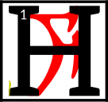

---

<!--- Local CSS Font Loading -->

<!--- Jekyll Page Links -->

<a href="../../../../../index.html">Home</a>
&emsp;&nabla;&emsp;
<a href="../../../../archive/about.html">About</a>
&emsp;&nabla;&emsp;
<a href="../../../../archive/index.html">Archive</a>
&emsp;&nabla;&emsp;
<a href="../../../index.html">Quintessence</a>

<!--- Markdown Body Below: -->

---

## alna'shoreshik

#### Sermon One

e was born in the ash among the Velothi, anon Chimer, before the war with the northern men.
<b>&sup2;</b>Ayem came first to the village of the netchimen, and her shadow was that of Boethiah, who was the Prince of Plots,
<b>&sup3;</b>and things unknown and known would fold themselves around her until they were like stars or the messages of stars.
<b>&#8308;</b>Ayem took a netchiman's wife and said:

'I am the Face-Snaked Queen of the Three in One.
<b>&#8309;</b>In you is an image and a seven-syllable spell,
AYEM AE SEHTI AE VEHK,
which you will repeat to it until mystery comes.'

<b>&#8310;</b>Then Ayem threw the netchiman's wife into the ocean water where dreughs took her into castles of glass and coral.
<b>&#8311;</b>They gifted the netchiman's wife with gills and milk fingers, changing her sex so that she might give birth to the image as an egg.
<b>&#8312;</b>There she stayed for seven or eight months.

<b>&#8313;</b>Then Seht came to the netchiman's wife and said:

'I am the Clockwork King of the Three in One.
<b>&sup1;&#8304;</b>In you is an egg of my brother-sister, who possesses invisible knowledge of words and swords, which you shall nurture until the Hortator comes.'

<b>&sup1;&sup1;</b>And Seht then extended his hands and multitudes of homunculi came forth, each like a glimmering rope through the water,
<b>&sup1;&sup2;</b>and they raised the netchiman's wife back to the surface world and set her down on the shoals of Azura's coast.
<b>&sup1;&sup3;</b>There she lay for seven or eight more months, caring for the egg-knowledge by whispering to it the Codes of Mephala and the prophecies of Veloth and even the forbidden teachings of Trinimac.

<b>&sup1;&#8308;</b>Seven Daedra came to her one night and each one gave to the egg new motions that could be achieved by certain movements of the bones.
<b>&sup1;&#8309;</b>These are called the Barons of Move Like This.
<b>&sup1;&#8310;</b>Then an eighth Daedroth came, and he was a Demiprince, called Fa-Nuit-Hen, or the Multiplier of Motions Known.
<b>&sup1;&#8311;</b>And Fa-Nuit-Hen said:

'Whom do you wait for?'

To which the netchiman's wife said the Hortator.

<b>&sup1;&#8312;</b>'Go to the land of the Indoril in three months' time, for that is when war comes.
<b>&sup1;&#8313;</b>I return now to haunt the warriors who fell and still wonder why. But first I show you this.'

<b>&sup2;&#8304;</b>Then the Barons and the Demiprince joined together into a pillar of fighting styles terrible to behold and they danced before the egg and its learning image.

<b>&sup2;&sup1;</b>'Look, little Vehk, and find the face behind the splendor of my bladed carriage, for in it is delivered the unmixed conflict path, perfect in every way. What is its number?'

<b>&sup2;&sup2;</b>It is said the number is the number of birds that can nest in an ancient tibrol tree, less three grams of honest work,
<b>&sup2;&sup3;</b>but Vivec in his later years found a better one and so gave this secret to his people.

<b>&sup2;&#8308;</b>'For I have crushed a world with my left hand,' he will say, 'but in my right hand is how it could have won against me. Love is under my will only.'

<b>&sup2;&#8309;</b>The ending of the words is
ASV.

---

#### References

1. [UESP: The 36 Lessons of Vivec][1]

[1]: https://en.uesp.net/wiki/Morrowind:36_Lessons_of_Vivec,_Sermon_1

---
