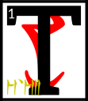

---

<!--- Local CSS Font Loading -->

<!--- Jekyll Page Links -->

<a href="../../../../../index.html">Home</a>
&emsp;&nabla;&emsp;
<a href="../../../../archive/about.html">About</a>
&emsp;&nabla;&emsp;
<a href="../../../../archive/index.html">Archive</a>
&emsp;&nabla;&emsp;
<a href="../../../index.html">Quintessence</a>

<!--- Markdown Body Below: -->

---

## asca'shoreshik

#### Sermon Two

he netchiman's wife who carried the egg of Vivec within her went looking for the lands of the Indoril.
<b>&sup2;</b>Along the journey many spirits came to see her and offer instructions to her son-daughter, the future glorious invisible warrior-poet of Vvardenfell, Vivec.
<b>&sup3;</b>The first spirit threw his arms about her and hugged his knowledge in tight.
<b>&#8308;</b>The netchiman's wife became soaked in the Incalculable Effort.
<b>&#8309;</b>The egg was delighted and did somersaults inside her, bowing to the five corners of the world and saying:

'Thus whoever performs this holy act shall be proud and mighty among the rest!'

<b>&#8310;</b>The second spirit was too aloof and acted above his station so much that he was driven off by a headache spell.
<b>&#8311;</b>The third spirit, At-Hatoor, came down to the netchiman's wife while she relaxed for a while under an Emperor Parasol.
<b>&#8312;</b>His garments were made from implications of meaning, and the egg looked at them three times.
<b>&#8313;</b>The first time Vivec said:

'Ha, it means nothing!'

After looking a second time he said:

'Hmm, there might be something there after all.'

<b>&sup1;&#8304;</b>Finally, giving At-Hatoor's garments a sidelong glance, he said:

'Amazing, the ability to infer significance in something devoid of detail!'

'There is a proverb,' At-Hatoor said, and then he left.

<b>&sup1;&sup1;</b>The fourth spirit came with the fifth, for they were cousins.
<b>&sup1;&sup2;</b>They could ghost touch and probed inside the egg to find its core.
<b>&sup1;&sup3;</b>Some say Vivec at this point was shaped like a star with its penumbra broken off; others, that it looked like a revival of vanished forms.

<b>&sup1;&#8308;</b>'From my side of the family,' the first cousin said, 'I bring you a series of calamities that will bring about the end of the universe.'

<b>&sup1;&#8309;</b>'And from my side,' the second cousin said, 'I bring you all the primordial marriages that must happen within them, each one.'

<b>&sup1;&#8310;</b>At this the egg laughed. 'I am given too much to bear so young. I must have been born before.'

<b>&sup1;&#8311;</b>And then the sixth spirit appeared, the Black Hands Mephala, who taught the Velothi at the beginning of days all the arts of sex and murder.
<b>&sup1;&#8312;</b>Its burning heart melted the eyes of the netchiman's wife and took the egg from her belly with six cutting strokes.
<b>&sup1;&#8313;</b>The egg-image, however, could see into what it had been before in ancient times, when the earth still cooled, and was not blinded.

<b>&sup2;&#8304;</b>It joined with the Daedroth and took its former secrets, leaving a few behind to keep the web of the world from disentangling.
<b>&sup2;&sup1;</b>Then the Black Hands Mephala put the egg back into the netchiman's wife and blew on her with magic breath until the hole closed up.
<b>&sup2;&sup2;</b>But the Daedroth did not give her back her eyes, saying:

'God hath three keys; of birth, of machines, and of the words between.'

<b>&sup2;&sup3;</b>Within this Sermon the wise may find one half of these keys.

<b>&sup2;&#8308;</b>The ending of the words is
ASV.

---

#### References

1. [UESP: The 36 Lessons of Vivec][1]

[1]: https://en.uesp.net/wiki/Morrowind:36_Lessons_of_Vivec,_Sermon_2

---
