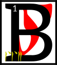

---

<!--- Local CSS Font Loading -->

<!--- Jekyll Page Links -->

<a href="../../../../../index.html">Home</a>
&emsp;&nabla;&emsp;
<a href="../../../../archive/about.html">About</a>
&emsp;&nabla;&emsp;
<a href="../../../../archive/index.html">Archive</a>
&emsp;&nabla;&emsp;
<a href="../../../index.html">Quintessence</a>

<!--- Markdown Body Below: -->

---

## cahna'shoreshik

#### Sermon Three

eing blind the netchiman's wife wandered into a cave on her way to the domains of House Indoril.
<b>&sup2;</b>It so happened that this cave was a Dwemeri stronghold.
<b>&sup3;</b>The Dwemer spied the egg and captured the netchiman's wife.
<b>&#8308;</b>They bound her head to foot and brought her deep within the earth.

<b>&#8309;</b>She heard one say, 'Go and make a simulacrum of her and place it back on the surface,
<b>&#8310;</b>for she has something akin to what we have and so the Velothi will covet it and notice if she is too long away.'

<b>&#8311;</b>In the darkness, the netchiman's wife felt great knives try to cut her open.
<b>&#8312;</b>When the knives did not work, the Dwemer used solid sounds.
<b>&#8313;</b>When those did not work, great heat was brought to bear.
<b>&sup1;&#8304;</b>Nothing was of any use, and the egg of Vivec remained safe within her.

<b>&sup1;&sup1;</b>A Dwemer said, 'Nothing is of any use. We must go and misinterpret this.'

<b>&sup1;&sup2;</b>Vivec felt that his mother was afraid, and so consoled her.

<b>&sup1;&sup3;</b>'The fire is mine: let it consume thee,\
And make a secret door\
At the altar of Padhome,\
In the House of Boet-hi-Ah\
Where we become safe\
And looked after.'

<b>&sup1;&#8308;</b>This old prayer made the netchiman's wife smile and begin such a deep sleep that when Dwemeri atronachs returned with cornered spheres and cut her apart she did not awake and died peacefully.
<b>&sup1;&#8309;</b>Vivec was removed from her womb and placed within a magical glass for further study.
<b>&sup1;&#8310;</b>To confound his captors, he channeled his essence into love, an emotion the Dwemer knew nothing about.

<b>&sup1;&#8311;</b>The egg said:

'Love is used not only as a constituent in moods and affairs,
<b>&sup1;&#8312;</b>but also as the raw material from which relationships produce hour-later exasperations, regrettably fashioned restrictions, riddles laced with affections known only to the loving couple, and looks that linger too long.
<b>&sup1;&#8313;</b>Love is also an often-used ingredient in some transparent verbal and nonverbal transactions where, eventually, it can sometimes be converted to a variety of true devotions, some of which yield tough, insoluble, and infusible unions.
<b>&sup2;&#8304;</b>In its basic form, love supplies approximately thirteen draughts of all energy that is derived from relationships. Its role and value in society at large are controversial.'

<b>&sup2;&sup1;</b>The Dwemer were vexed at these words and tried to hide behind their power symbols.
<b>&sup2;&sup2;</b>They sent their atronachs to remove the egg-image from their cave and place it within the simulacrum they had made of Vivec's mother.

<b>&sup2;&sup3;</b>A Dwemer said, 'We Dwemer are only aspirants to this that the Velothi have.
<b>&sup2;&#8308;</b>They shall be our doom in this and the eight known worlds,
NIRN,
LHKAN,
RKHET,
THENDR,
KYNRT,
AKHAT,
MHARA,
and JHUNAL.'

<b>&sup2;&#8309;</b>The secret to doom is within this Sermon.

<b>&sup2;&#8310;</b>The ending of the words is
ASV.

---

#### References

1. [UESP: The 36 Lessons of Vivec][1]

[1]: https://en.uesp.net/wiki/Morrowind:36_Lessons_of_Vivec,_Sermon_3

---
