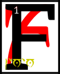

---

<!--- Local CSS Font Loading -->

<!--- Jekyll Page Links -->

<a href="../../../../../index.html">Home</a>
&emsp;&nabla;&emsp;
<a href="../../../../about/index.html">About</a>
&emsp;&nabla;&emsp;
<a href="../../../../archive/index.html">Archive</a>
&emsp;&nabla;&emsp;
<a href="../../../index.html">Quintessence</a>

<!--- Markdown Body Below: -->

---

## arca'shoreshik

#### Sermon Five

inally the simulacrum of the netchiman's wife became unstable.
<b>&sup2;</b>The Dwemer in their haste had built it shoddily and the ashes of Red Mountain slowed its golden tendons.
<b>&sup3;</b>Before long it fell on its knees beside the road to the lands of the Indoril and pitched over, to be discovered eighty days later by a merchant caravan on its way to the capital of Veloth, anon Almalexia.

<b>&#8308;</b>Vivec had not been among his people all the days of his pre-life so he stayed silent and let the Chimer in the caravan think that the simulacrum was broken and empty.

<b>&#8309;</b>A Chimeri warrior, who was protecting the caravan, said, 'Look here how the Dwemer try to fool us as ever, crafting our likenesses out of their flesh-metals.
<b>&#8310;</b>We should take this to the capital and show our mother Ayem. She will want to see this new strategy of our enemies.'

<b>&#8311;</b>But the merchant captain said, 'I doubt that we shall be paid well for the effort.
<b>&#8312;</b>We can make more money if we stop at Noormoc and sell it to the Red Wives of Dagon, who pay well for the wonders made by the Deep Folk.'

<b>&#8313;</b>But another Chimer, who was wise in the ways of prophecy, looked on the simulacrum with disquietude.
<b>&sup1;&#8304;</b>'Was I not hired on to help you seek the best of fortunes? I say you should listen to your warrior, then, and take this thing to Ayem,
<b>&sup1;&sup1;</b>for though manufactured by our enemies there is something in it that will become sacred, or has been already.'

<b>&sup1;&sup2;</b>The merchant captain took pause then and looked on the simulacrum of the netchiman's wife
<b>&sup1;&sup3;</b>and, though he heeded always the advice of his seers, could do no more than think of the profits to be made at Noormoc.
<b>&sup1;&#8308;</b>He thought mainly of the Red Wives' form of recompense, which was four-cornered and good wounded, a belly-magic known nowhere else under the moons.
<b>&sup1;&#8309;</b>His lust made him deny Ayem his mother.
<b>&sup1;&#8310;</b>He gave order to change course for Noormoc.

<b>&sup1;&#8311;</b>Before the caravan could get underway again, the Chimeri warrior who had counseled a passage to the capital threw his money to the merchant captain
<b>&sup1;&#8312;</b>and said, 'I will pay you thus for the simulacrum and warn you: war is coming with the shaggy men of the north
<b>&sup1;&#8313;</b>and I will not have my mother Ayem at uneven odds with one enemy while tending to another.'

<b>&sup2;&#8304;</b>'Nerevar,' the merchant captain said, 'this is not enough. I am Triune in my own way, but I follow the road of my body and demand more.'

<b>&sup2;&sup1;</b>Then Vivec could not remain silent anymore and said into Nerevar's head these words:

'You can hear the words, so run away\
<b>&sup2;&sup2;</b>Come, Hortator, unfold into a clear unknown,\
Stay quiet until you've slept in the yesterday,\
And say no elegies for the melting stone'

<b>&sup2;&sup3;</b>So Nerevar slew the merchant captain and took the caravan for his own.

<b>&sup2;&#8308;</b>The ending of the words is
ASV.

---

#### References

1. [UESP: The 36 Lessons of Vivec][1]

[1]: https://en.uesp.net/wiki/Morrowind:36_Lessons_of_Vivec,_Sermon_5

---
