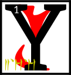

---

<!--- Local CSS Font Loading -->

<!--- Jekyll Page Links -->

<a href="../../../../../index.html">Home</a>
&emsp;&nabla;&emsp;
<a href="../../../../archive/about.html">About</a>
&emsp;&nabla;&emsp;
<a href="../../../../archive/index.html">Archive</a>
&emsp;&nabla;&emsp;
<a href="../../../index.html">Quintessence</a>

<!--- Markdown Body Below: -->

---

## tahna'shoreshik

#### Sermon Six

ou have discovered the sixth Sermon of Vivec, which was hidden in the words that came next to the Hortator.

<b>&sup2;</b>There is an eon within itself that when unraveled becomes the first sentence of the world.\
&#8203;

<b>&sup3;</b>Mephala and Azura are the twin gates of tradition and Boethiah is the secret flame.

<b>&#8308;</b>The Sun shall be eaten by lions, which cannot be found yet in Veloth.

<b>&#8309;</b>Six are the vests and garments worn by the suppositions of men.

<b>&#8310;</b>Proceed only with the simplest terms, for all others are enemies and will confuse you.

<b>&#8311;</b>Six are the formulas to heaven by violence, one that you have learned by studying these words.

<b>&#8312;</b>The Father is a machine and the mouth of a machine. His only mystery is an invitation to elaborate further.

<b>&#8313;</b>The Mother is active and clawed like a nix-hound, yet she is the holiest of those that reclaim their days.

<b>&sup1;&#8304;</b>The Son is myself, Vehk, and I am unto three, six, nine, and the rest that come after, glorious and sympathetic, without borders, utmost in the perfections of this world and the others, sword and symbol, pale like gold.

<b>&sup1;&sup1;</b>There is a fourth kind of philosophy that uses nothing but disbelief.

<b>&sup1;&sup2;</b>For by the sword I mean the sensible.\
\
For by the word I mean the dead.

<b>&sup1;&sup3;</b>I am Vehk, your protector and the protector of Red Mountain until the end of days, which are numbered
3'3'3'3.

<b>&sup1;&#8308;</b>Below me is the savage, which we needed to remove ourselves from the Altmer.

<b>&sup1;&#8309;</b>Above me is a challenge, which bathes itself in fire and the essence of a god.

<b>&sup1;&#8310;</b>Through me you are desired, unlike the prophets that have borne your name before.

<b>&sup1;&#8311;</b>Six are the walking ways, from enigma to enemy to teacher.

<b>&sup1;&#8312;</b>Boethiah and Azura are the principles of the universal plot, which is begetting, which is creation, and Mephala makes of it an art form.

<b>&sup1;&#8313;</b>For by the sword I mean the first night.\
\
For by the word I mean the dead.

<b>&sup2;&#8304;</b>There will be a splendor in your name when it is said to be true.

<b>&sup2;&sup1;</b>Six are the guardians of Veloth, three before and they are born again, and they will test you until you have the proper tendencies of the hero.

<b>&sup2;&sup2;</b>There is a world that is sleeping and you must guard against it.

<b>&sup2;&sup3;</b>For by the sword I mean the dual nature.\
\
For by the word I mean animal life.

<b>&sup2;&#8308;</b>For by the sword I mean preceded by a sigh.\
\
For by the word I mean preceded by a wolf.

<b>&sup2;&#8309;</b>The ending of the words is
ASV.

---

#### References

1. [UESP: The 36 Lessons of Vivec][1]

[1]: https://en.uesp.net/wiki/Morrowind:36_Lessons_of_Vivec,_Sermon_6

---
