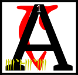

---

<!--- Local CSS Font Loading -->

<!--- Jekyll Page Links -->

<a href="../../../../../index.html">Home</a>
&emsp;&nabla;&emsp;
<a href="../../../../archive/about.html">About</a>
&emsp;&nabla;&emsp;
<a href="../../../../archive/index.html">Archive</a>
&emsp;&nabla;&emsp;
<a href="../../../index.html">Quintessence</a>

<!--- Markdown Body Below: -->

---

## daskhora'shoreshik

#### Sermon Eight

nd presently Nerevar and Vivec were within sight of the capital and the Four Corners of the House of Troubles knew that it was not time to contest them.
<b>&sup2;</b>The caravan musicians made a great song of entrance and the eleven gates of the Mourning Hold were thrown wide.

<b>&sup3;</b>Ayem was accompanied by her husband-state, a flickering image that was channeled to her ever-changing female need.
<b>&#8308;</b>Around her were the Shouts, a guild now forgotten, who carried with them the whims of the people, for the Velothi then were still mostly good at heart.
<b>&#8309;</b>The Shouts were the counselors of Ayem and the country, though they sometimes quarreled and needed Seht to wring them into usefulness.
<b>&#8310;</b>Ayem approached Nerevar, who was by now adorned in the flags of House Indoril.
<b>&#8311;</b>He gifted her with the simulacrum of the netchiman's wife and the egg of Vivec inside.

<b>&#8312;</b>Ayem said to Nerevar, 'Seht who is Azura has revealed that war is come and that the Hortator that shall deliver us will approach with a solution walking at his side.'

<b>&#8313;</b>Nerevar said, 'I have traveled out of my way to warn you of the deceit of our enemies, the Dwemer, but I have learned much on the journey and have changed my mind.
<b>&sup1;&#8304;</b>This netchiman's wife you see at my side is a sword and a symbol and there is prophecy inside.
<b>&sup1;&sup1;</b>It tells me that, like it, we must for a while be like he is and, as a people, cloaked in our former enemies, and to use their machines without shame.'

<b>&sup1;&sup2;</b>At which Vivec spoke aloud, 'Boethiah-who-is-you wore the skin of Trinimac to cleanse the faults of Veloth, my Queen, and so it should be again. This is the walking way of the glorious.'
<b>&sup1;&sup3;</b>Seht appeared out of a cloud of iron vapor and his minions made of their blood a chair.
<b>&sup1;&#8308;</b>He sat beside Ayem and looked on the rebirth of mastery.
<b>&sup1;&#8309;</b>Vivec said to them, his Triune:

'My rituals and ordeals and all the rhymes within,\
Use no other motive than the revelation of my skin.'

<b>&sup1;&#8310;</b>Ayem said,
'AYEM AE SEHTI AE VEHK.
We are delivered and made whole, the diamond of the Black Hands is uncovered.'

<b>&sup1;&#8311;</b>Seht said, 'Wherever so he treads, there is invisible scripture.'

To which the Shouts were silent in sudden reading.

<b>&sup1;&#8312;</b>Vivec then reached out from the egg all his limbs and features, merging with the simulacrum of his mother, gilled and blended in all the arts of the star-wounded East, under water and in fire and in metal and in ash, six times the wise,
<b>&sup1;&#8313;</b>and he became the union of male and female, the magic hermaphrodite, the martial axiom, the sex-death of language and unique in all the middle world.

<b>&sup2;&#8304;</b>He said, 'Let us now guide the hands of the Hortator in war and its aftermath. For we go different, and in thunder. This is our destiny.'

<b>&sup2;&sup1;</b>The ending of the words is
ASV.

---

#### References

1. [UESP: The 36 Lessons of Vivec][1]

[1]: https://en.uesp.net/wiki/Morrowind:36_Lessons_of_Vivec,_Sermon_8

---
