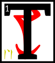

---

<!--- Local CSS Font Loading -->

<!--- Jekyll Page Links -->

<a href="../../../../../index.html">Home</a>
&emsp;&nabla;&emsp;
<a href="../../../../archive/about.html">About</a>
&emsp;&nabla;&emsp;
<a href="../../../../archive/index.html">Archive</a>
&emsp;&nabla;&emsp;
<a href="../../../index.html">Quintessence</a>

<!--- Markdown Body Below: -->

---

## enta'shoreshik

#### Sermon Nine

hen came the war with the northern men, where Vivec did guide the Hortator into swift and tricky union with the Dwemer.
<b>&sup2;</b>The greatest demon chieftains of the frigid west were those listed below, five in unholy number.

<b>&sup3;</b>HOAGA,
the Mouth of Mud, who appeared as a great bearded king, had the powers of Marshalling and breathing the earth.
<b>&#8308;</b>On the battlefields, this demon would often be seen on the sidelines, eating the soil voraciously.
<b>&#8309;</b>When his men fell, Hoaga would fill their bodies back with it, whereupon they would rise again and fight, albeit slower.
<b>&#8310;</b>He had a Secret Name, Fenja, and destroyed seventeen Chimeri villages and two Dwemeri strongholds before being turned away.

<b>&#8311;</b>CHEMUA,
the Running Hunger, who appeared as a mounted soldier with full helm, had the powers of Heart Roaring and of sky sickening.
<b>&#8312;</b>He ate the Chimeri hero, Dres Khizumet-e, sending the spirit back to the Hortator as an assassin.
<b>&#8313;</b>Sometimes called First Blighter, Chemua could give clouds stomach aches and turn the rain of Veloth into bile.
<b>&sup1;&#8304;</b>He destroyed six Chimeri villages before he was slain by Vivec and the Hortator.

<b>&sup1;&sup1;</b>BHAG,
the Two-Tongued, who appeared as a great bearded king, had the powers of Surety and Form Change.
<b>&sup1;&sup2;</b>His raiders were small in number, but ran amok in the west hinterlands, killing many Velothi trappers and scouts.
<b>&sup1;&sup3;</b>He fell in a great debate with Vivec, for the warrior-poet alone could understand the northern man's two-layered speech, though
ASV
had to remain invisible during the argument.

<b>&sup1;&#8308;</b>BARFOK,
Maid of Planes, who appeared as a winged human with lick-encrusted spear, had the powers of Event Denouement.
<b>&sup1;&#8309;</b>Battles fought against her would always end in victory for Barfok, because she could shape outcomes by singing.
<b>&sup1;&#8310;</b>Four Chimeri villages and two more Dwemeri strongholds were destroyed by her decision enforcement.
<b>&sup1;&#8311;</b>Vivec had to stuff her mouth with his milk finger to keep her from singing Veloth into ruin.

<b>&sup1;&#8312;</b>YSMIR,
the Dragon of the North, who always appears as a great bearded king, had powers innumerable and echoing.
<b>&sup1;&#8313;</b>He was grim and dark and the most silent of the invading chieftains, though when he spoke villages were uplifted and thrown into the sea.
<b>&sup2;&#8304;</b>The Hortator fought him unarmed, grabbing the Dragon's roars by hand until Ysmir's power throat bled.
<b>&sup2;&sup1;</b>These roars were given to Vivec to bind into an ebony listening frame, which the warrior-poet placed on Ysmir's face and ears to drive him mad and drive him away.

<b>&sup2;&sup2;</b>'The coming forth and the driving away brings all things around. What I shall say next is unpleasant to record:
HERMA-MORA-ALTADOON!
AE ALTADOON!'

<b>&sup2;&sup3;</b>The ending of the words is
ASV.

---

#### References

1. [UESP: The 36 Lessons of Vivec][1]

[1]: https://en.uesp.net/wiki/Morrowind:36_Lessons_of_Vivec,_Sermon_9

---
