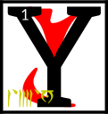

---

<!--- Local CSS Font Loading -->

<!--- Jekyll Page Links -->

<a href="../../../../../index.html">Home</a>
&emsp;&nabla;&emsp;
<a href="../../../../archive/about.html">About</a>
&emsp;&nabla;&emsp;
<a href="../../../../archive/index.html">Archive</a>
&emsp;&nabla;&emsp;
<a href="../../../index.html">Quintessence</a>

<!--- Markdown Body Below: -->

---

## alnahna'shoreshik

#### Sermon Ten

ou have discovered the tenth Sermon of Vivec, which was hidden in the words that came in the aftermath to the Hortator.

<b>&sup2;</b>The evoker shall raise his left hand empty and open, to indicate he needs no weapons of his own.
<b>&sup3;</b>The coming forth is always hidden, so the evoker is always invisible or, better, in the skin of his enemies.

<b>&#8308;</b>'The eyelid of the kingdom shall fill thirty and six folios, but the eye shall read the world.'
<b>&#8309;</b>By this the Hortator needs me to understand.

The sword is an impatient signature. Write no contracts on the dead.

<b>&#8310;</b>Vivec says unto the Hortator remember the words of Boet-hi-ah:

We pledge ourselves to you, the Frame-maker, the Scarab: a world for us to love you in, a cloak of dirt to cherish.
<b>&#8311;</b>Betrayed by your ancestors when you were not even looking. Hoary Magnus and his ventured opinions cannot sway the understated, a trick worthy of the always satisfied.
<b>&#8312;</b>A short season of towers, a rundown absolution, and what is this, what is this but fire under your eyelid?

<b>&#8313;</b>Shift ye in your skin, I say to the Trinimac-eaters. Pitch your voices into the color of bruise.
<b>&sup1;&#8304;</b>Divide ye like your enemies, in Houses, and lay your laws in set sequence from the center, again like the enemy Corners of the House of Troubles, and see yourself thence as timber, or mud-slats, or sheets of resin.
<b>&sup1;&sup1;</b>Then do not divide, for yet is the stride of
SITHISIT
quicker than the rush of enemies, and He will sunder the whole for the sake of a shingle.

<b>&sup1;&sup2;</b>For we go different, and in thunder.
SITHISIT
is the start of all true Houses, built against stasis and lazy slaves.
<b>&sup1;&sup3;</b>Turn from your predilections, broken like false maps. Move and move like this.
<b>&sup1;&#8308;</b>Quicken against false fathers, mothers left in corners weeping for glass and rain.
<b>&sup1;&#8309;</b>Stasis asks merely for nothing, for itself, which is nothing, as you were in the eight everlasting imperfections.

<b>&sup1;&#8310;</b>Vivec says unto the Hortator remember the words of Vivec.\
UNDERSTAND THAT
SITHISIT
STILL TRAVELS

<b>&sup1;&#8311;</b>Vivec says unto the Hortator remember the words of Vivec.\
IN A PHOSPHORESCENT MIRROR OF THE SKY

<b>&sup1;&#8312;</b>Vivec says unto the Hortator remember the words of Vivec.\
DROWNED AND SMILING

<b>&sup1;&#8313;</b>Vivec says unto the Hortator remember the words of Vivec.\
INTERMITTENT HOPES ENOUGH

<b>&sup2;&#8304;</b>Vivec says unto the Hortator remember the words of Vivec.\
TO ANSWER ALL THE THINGS

<b>&sup2;&sup1;</b>Vivec says unto the Hortator remember the words of Vivec.\
NOT YET QUERIED

<b>&sup2;&sup2;</b>The ending of the words is
ASV.

---

#### References

1. [UESP: The 36 Lessons of Vivec][1]

[1]: https://en.uesp.net/wiki/Morrowind:36_Lessons_of_Vivec,_Sermon_10

---
