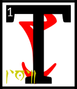

---

<!--- Local CSS Font Loading -->

<!--- Jekyll Page Links -->

<a href="../../../../../index.html">Home</a>
&emsp;&nabla;&emsp;
<a href="../../../../archive/about.html">About</a>
&emsp;&nabla;&emsp;
<a href="../../../../archive/index.html">Archive</a>
&emsp;&nabla;&emsp;
<a href="../../../index.html">Quintessence</a>

<!--- Markdown Body Below: -->

---

## alnahn'alna'shoreshik

#### Sermon Eleven

hese were the days of Resdaynia, when Chimer and Dwemer lived under the wise and benevolent rule of the
ASV
and their champion the Hortator.
<b>&sup2;</b>When the gods of Veloth would retreat unto their own, to mold the cosmos and other matters, the Hortator would at times become confused.
<b>&sup3;</b>Vivec would always be there to advise him, and this is the first of the three lessons of ruling kings:

<b>&#8308;</b>'The waking world is the amnesia of dream. All motifs can be mortally wounded. Once slain, themes turn into the structure of future nostalgia.
<b>&#8309;</b>Do not abuse your powers or they will lead you astray. They will leave you like rebellious daughters.
<b>&#8310;</b>They will lose their virtue. They will become lost and resentful and finally become pregnant with the seed of folly.
<b>&#8311;</b>Soon you will be the grandparent of a broken state. You will be mocked. It will fall apart like a stone that recalls that it is really water.

<b>&#8312;</b>'Keep nothing in your house that is neither needed or beautiful.

'Ordeals you should face unimpeded by the world of restriction.
<b>&#8313;</b>The splendor of stars is Ayem's domain. The selfishness of the sea is Seht's. I rule the middle air. All else is earth and under your temporal command.
<b>&sup1;&#8304;</b>There is no bone that cannot be broken, except for the heart bone. You will see it twice in your lifetimes. Take what you can the first time and let us do the rest.

<b>&sup1;&sup1;</b>'There is no true symbolism of the center. The Sharmat will believe there is.
<b>&sup1;&sup2;</b>He will feel that he can cause years of exuberance from sitting in the sacred, when really no one can leave that state and cause anything more but strife.

<b>&sup1;&sup3;</b>'There is once more the case of the symbolic and barren. The true prince that is cursed and demonized will be adored at last with full hearts.
<b>&sup1;&#8308;</b>According to the Codes of Mephala there can be no official art, only fixation points of complexity that will erase from the awe of the people given enough time.
<b>&sup1;&#8309;</b>This is a secret that hides another.
<b>&sup1;&#8310;</b>An impersonal survival is not the way of the ruling king.
Embrace the art of the people and marry it and by that I mean secretly have it murdered.

<b>&sup1;&#8311;</b>'The ruling king that sees in another his equivalent rules nothing.

<b>&sup1;&#8312;</b>'The secret of weapons is this: they are the mercy seat.

<b>&sup1;&#8313;</b>'The secret of language is this: it is immobile.

<b>&sup2;&#8304;</b>'The ruling king is armored head to toe in brilliant flame. He is redeemed by each act he undertakes. His death is only a diagram back to the waking world.
<b>&sup2;&sup1;</b>He sleeps the second way. The Sharmat is his double, and therefore you wonder if you rule nothing.

<b>&sup2;&sup2;</b>'Hortator and Sharmat, one and one, eleven, an inelegant number.
<b>&sup2;&sup3;</b>Which of the ones is the more important? Could you ever tell if they switched places? I can and that is why you will need me.

<b>&sup2;&#8308;</b>'According to the Codes of Mephala, there is no difference between the theorist and the terrorist.
<b>&sup2;&#8309;</b>Even the most cherished desire disappears in their hands. This is why Mephala has black hands. Bring both of yours to every argument.
<b>&sup2;&#8310;</b>The one-handed king finds no remedy. When you approach God, however, cut both of them off.
<b>&sup2;&#8311;</b>God has no need of theory and he is armored head to toe in terror.'

<b>&sup2;&#8312;</b>The ending of the words is
ASV.

---

#### References

1. [UESP: The 36 Lessons of Vivec][1]

[1]: https://en.uesp.net/wiki/Morrowind:36_Lessons_of_Vivec,_Sermon_11

---
