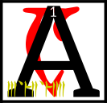

---

<!--- Local CSS Font Loading -->

<!--- Jekyll Page Links -->

<a href="../../../../../index.html">Home</a>
&emsp;&nabla;&emsp;
<a href="../../../../archive/about.html">About</a>
&emsp;&nabla;&emsp;
<a href="../../../../archive/index.html">Archive</a>
&emsp;&nabla;&emsp;
<a href="../../../index.html">Quintessence</a>

<!--- Markdown Body Below: -->

---

## alnahn'asca'shoreshik

#### Sermon Twelve

s the Hortator pondered the first lesson of ruling kings, Vivec wandered into the Mourning Hold and found that Ayem was with a pair of lovers.
<b>&sup2;</b>Seht had divided himself again. Vivec then leapt through into their likenesses to observe, but he gained no secrets that he did not already know.
<b>&sup3;</b>He left a few of his own behind to make the journey worthwhile.

<b>&#8308;</b>Then Vivec left the capital of Veloth and wandered far into the ash.
<b>&#8309;</b>He found a span of badlands to practice his giant-form.
<b>&#8310;</b>He made of his feet a less dense material than the divine to keep from falling waist-deep into the earth.
<b>&#8311;</b>At this point the First Corner of the House of Troubles, the Prince Molag Bal, made his presence known.

<b>&#8312;</b>Vivec looked on the King of Rape and said:

'How very beautiful you are, that you do not join us.'

<b>&#8313;</b>And Molag Bal crushed the warrior-poet's feet, which were not invulnerable, and had legions cleave them off.
<b>&sup1;&#8304;</b>Mighty fires from the Beginning Place were brought like nets to hold Vivec and he let them.

<b>&sup1;&sup1;</b>'I would prefer,' he said, 'some kind of ceremony if we are to be married.'

<b>&sup1;&sup2;</b>And the legions that took the feet were summoned again and ordered to begin a banquet.
<b>&sup1;&sup3;</b>Pomegranates sprang from the badlands and tents were raised.
<b>&sup1;&#8308;</b>A throng of Velothi mystics came, reading the passages of the severed feet on the ground and weeping until the scriptures were wet.

<b>&sup1;&#8309;</b>'We must love each other briefly,' Vivec said, 'if at all.
<b>&sup1;&#8310;</b>I am needed to counsel the Hortator in more important matters because the Dwemeri high priests stir up trouble. You may have my head for an hour.'

<b>&sup1;&#8311;</b>Molag Bal rose up and extended six arms to show his worth.
<b>&sup1;&#8312;</b>They were decorated in runes of seduction and its reverse. They were decorated in the annotated calendars of longer worlds.
<b>&sup1;&#8313;</b>When he spoke, mating monsters fell out. 'Where must it go?' he said.

<b>&sup2;&#8304;</b>'I told you,' Vivec said, 'I am meant to be the teacher of the king of the earth.
AE ALTADOON GHARTOK PADHOME.'

<b>&sup2;&sup1;</b>With these magic words, the King of Rape added another:
[CHIM],
which is the secret syllable of royalty.

<b>&sup2;&sup2;</b>Vivec had what he needed from the Daedroth and so married him that day.
<b>&sup2;&sup3;</b>In the hour that Bal had his head, the King of Rape asked for proof of love.

<b>&sup2;&#8308;</b>Vivec spoke two poems to show him such, but only the first is known.

I'm not sure just how much glass it took to make your hair\
Twice as much, I am sure, as the oceans have to share\
<b>&sup2;&#8309;</b>Hell, my sweet, is a fiction written by those who tell the truth\
My mouth is skilled at lying and its alibi a tooth

<b>&sup2;&#8310;</b>The sons and daughters of Vivec and Molag Bal number in the thousands. The name of the mightiest is a string of power:

GULGA MOR JIL HYAET AE HOOM.

<b>&sup2;&#8311;</b>The ending of the words is
ASV.

---

#### References

1. [UESP: The 36 Lessons of Vivec][1]

[1]: https://en.uesp.net/wiki/Morrowind:36_Lessons_of_Vivec,_Sermon_12

---
