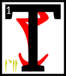

---

<!--- Local CSS Font Loading -->

<!--- Jekyll Page Links -->

<a href="../../../../../index.html">Home</a>
&emsp;&nabla;&emsp;
<a href="../../../../about/index.html">About</a>
&emsp;&nabla;&emsp;
<a href="../../../../archive/index.html">Archive</a>
&emsp;&nabla;&emsp;
<a href="../../../index.html">Quintessence</a>

<!--- Markdown Body Below: -->

---

## alnahn'tahna'shoreshik

#### Sermon Sixteen

he Hortator wandered through the Mourning Hold, wrestling with the lessons he had learned.
<b>&sup2;</b>They were slippery in his mind. He could not always keep the words straight and knew that this was a danger.
<b>&sup3;</b>He wandered to find Vivec, his lord and master, the glory of the image of Veloth, and found him of all places in the Temple of False Thinking.
<b>&#8308;</b>There, clockwork shears were taking off Vivec's hair. A beggar king had brought his loom and was making of the hair an incomplete map of adulthood and death.

<b>&#8309;</b>Nerevar said, 'Why are you doing this, milord?'

Vivec said, 'To make room for the fire.'

<b>&#8310;</b>And the Hortator could see that Vivec was out of sorts, though not because of the impending new power to come.
<b>&#8311;</b>The golden warrior-poet had been exercising his Water Face as well, learned from the dreughs before he was born.

<b>&#8312;</b>Nerevar said, 'Is this to keep you from the fire?'

Vivec said, 'It is so that I may see with truth.
<b>&#8313;</b>It, and my place here at the altar of Padhome in the house of False Thinking, serve so that I may see beyond my own secrets.
<b>&sup1;&#8304;</b>The Water Face cannot lie. It comes from the ocean, which is too busy to think, much less lie. Moving water resembles truth by its trembling.'

<b>&sup1;&sup1;</b>Nerevar said, 'I am afraid to become slipshod in my thinking.'

Vivec said, 'Reach heaven by violence then.'

<b>&sup1;&sup2;</b>So to quiet his mind the Hortator chose from the Fight Racks an axe.
<b>&sup1;&sup3;</b>He named it and moved on to the first moon.

<b>&sup1;&#8308;</b>There, Nerevar was greeted by the Parliament of Craters, who knew him by title and resented his presence, for he was to be a ruling king of earth and this was the lunar realm.
<b>&sup1;&#8309;</b>They shifted around him in a pattern of entrapment.

<b>&sup1;&#8310;</b>'The moon does not recognize crowns or scepters,' they said, 'nor the representatives of kingdoms below, lion or serpent or mathematician.
<b>&sup1;&#8311;</b>We are the graves of those that have migrated and become ancient countries. We seek no Queens or thrones.
<b>&sup1;&#8312;</b>Your appearance is decidedly solar, which is to say a library of stolen ideas. We are neither tear nor sorrow.
<b>&sup1;&#8313;</b>Our revolution succeeded in the manner that is was written. You are the Hortator and unwelcome here.'

<b>&sup2;&#8304;</b>And so Nerevar carved at the grave ghosts until he was out of breath and their Parliament could make no new laws.

<b>&sup2;&sup1;</b>He said, 'I am not of the slaves that perish.'

Of the members of Parliament only a few survived the Hortator's attack.

<b>&sup2;&sup2;</b>A surviving Crater said, 'Appropriation is nothing new. Everything happens of itself. This motif is by no means unassociated with hero myths.
<b>&sup2;&sup3;</b>You have not acted with the creative impulse; you fall below the weight of destiny. We are graves but not coffins. Know the difference.
<b>&sup2;&#8308;</b>You have only dug more and supplied no ghosts to reside within. Central to your claim is the predominance of frail events.
<b>&sup2;&#8309;</b>To be judged by the earth is to sit on a throne of wonder why. Damage us more and you will find naught but the absence of our dead.'

<b>&sup2;&#8310;</b>The ending of the words is
ASV.

---

#### References

1. [UESP: The 36 Lessons of Vivec][1]

[1]: https://en.uesp.net/wiki/Morrowind:36_Lessons_of_Vivec,_Sermon_16

---
