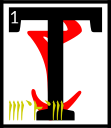

---

<!--- Local CSS Font Loading -->

<!--- Jekyll Page Links -->

<a href="../../../../../index.html">Home</a>
&emsp;&nabla;&emsp;
<a href="../../../../about/index.html">About</a>
&emsp;&nabla;&emsp;
<a href="../../../../archive/index.html">Archive</a>
&emsp;&nabla;&emsp;
<a href="../../../index.html">Quintessence</a>

<!--- Markdown Body Below: -->

---

## ascahn'asca'shoreshik

#### Sermon Twenty-Two

hen Vivec left the first Whirling School and went back to the space that was not a space.
<b>&sup2;</b>From the Provisional House he looked into the middle world to find the second monster, which was called the Treasure Wood Sword.
<b>&sup3;</b>Within years of the Pomegranate Banquet, it had become a lessoning tune to the lower Velothi houses.
<b>&#8308;</b>They preached of its power:

'The Treasure Wood Sword, splinter scintilla of the high and glorious! He who wields it becomes self-known!'

<b>&#8309;</b>The warrior-poet appeared as a visitation in the ancestor alcove of House Mora, whose rose-worn prince of garlands was a hero against the northern demons.
<b>&#8310;</b>Vivec congregated with the bones. He said:

'A scavenger cannot acquire a silk sash and expect to discover the greater systems of its predecessor: perfect happiness is embraced only by the weeping.
<b>&#8311;</b>Give me back (and do so freely) what is barren of my marriage and I will not erase you from the thought realm of God.
<b>&#8312;</b>Your line has a notable enchantress that my sister Ayem is fond of and from her murky wisdom alone do I condescend to ask.'

<b>&#8313;</b>A bone-walker emerged from a wall. It had three precious stones set in its lower jaw, a magical practice of old. One was opal, the color of opal.
<b>&sup1;&#8304;</b>The bone-walker bowed to the prince of the middle air and said:

'The Treasure Wood Sword will not leave our house. Bargains were made with the Black Hands Mephala, the greater shade.'

<b>&sup1;&sup1;</b>Vivec kissed the first precious stone and said:

'Animal picture, rude-walker, go back to the lamp that stays lit in water and store no more messages of useless noise. Down.'

<b>&sup1;&sup2;</b>He kissed the second precious stone and said:

'Proud residue, soon dispersed, serve no guarantees made in my fore-image and demand nothing of its under-skin. I am master evermore. Down.'

<b>&sup1;&sup3;</b>He kissed the opal and said:

'Down I take thee.'

<b>&sup1;&#8308;</b>And then Vivec withdrew into the hidden places and found the darkest mothers of the Morag Tong, taking them all to wife and filling them with undusted loyalty that tasted of summer salt.
<b>&sup1;&#8309;</b>They became as black queens, screaming live with a hundred murderous sons, a thousand murderous arms, and a hundred thousand murderous hands,
<b>&sup1;&#8310;</b>one vast moving event of thrusting-kill-laughter in alleys, palaces, workshops, cities and secret halls.
<b>&sup1;&#8311;</b>Their movements among the holdings of the Ra'athim were as rippled endings, heaving between times, with all fates leading to swallowed knives, murder as moaning, God's holy rape-erasure of wet death.

<b>&sup1;&#8312;</b>The King of Assassins presented to Vivec the Treasure Wood Sword.

<b>&sup1;&#8313;</b>'Milord,' the King of Assassins said. 'The prince of House Mora is now fond of you, as well.
<b>&sup2;&#8304;</b>I placed him in the Corner of Dagon. His eyes I set into a fire prayer for the wicked. His mouth I stuffed with birds.'

<b>&sup2;&sup1;</b>The ending of the words is
ASV.

---

#### References

1. [UESP: The 36 Lessons of Vivec][1]

[1]: https://en.uesp.net/wiki/Morrowind:36_Lessons_of_Vivec,_Sermon_22

---
