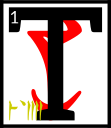

---

<!--- Local CSS Font Loading -->

<!--- Jekyll Page Links -->

<a href="../../../../../index.html">Home</a>
&emsp;&nabla;&emsp;
<a href="../../../../archive/about.html">About</a>
&emsp;&nabla;&emsp;
<a href="../../../../archive/index.html">Archive</a>
&emsp;&nabla;&emsp;
<a href="../../../index.html">Quintessence</a>

<!--- Markdown Body Below: -->

---

## ascahn'cahna'shoreshik

#### Sermon Twenty-Three

he Scripture of the Sword,

First:

'The sword, treated as a delicate meal, is the Symbolic Collage. It serves you well in the first half of life. Name one dynasty that knows this not.'

<b>&sup2;</b>Second:

'The unity of my approach is understood by the immobile warrior. True eyes are acquired.
<b>&sup3;</b>Rejoice as my own subjects and realms. I build for you a city of swords, by which I mean laws that cut the people who live there into better shapes.'

<b>&#8308;</b>Third:

'Girls burn their dresses on my arrival if I am armored. They crawl to me as bled pilgrims.
<b>&#8309;</b>Minor spirits die without trace. Follow me of all the
ASV
if you are to mark your days with killing.
<b>&#8310;</b>AE ALTADOON,
the third law of weaponry.'

<b>&#8311;</b>Fourth:

'The immobile warrior is never fatigued. He cuts sleep holes in the middle of a battle to regain his strength.'

<b>&#8312;</b>Fifth:

'Instinct is not reflex action, but mini-miracles held in reserve.
<b>&#8313;</b>I am the welfare that decides which warrior will emerge. Beg not for luck. Serve me to win.'

<b>&sup1;&#8304;</b>Sixth:

'The span of the apparently inactivated is your love of the absolute. The birth of God from the netchiman's wife is the abortion of kindness from love.'

<b>&sup1;&sup1;</b>Seventh:

'The true sword is able to cut chains of generations, which is to say, the creation myths of your enemies. Look on me as the exiled garden. All else is uncut weed.'

<b>&sup1;&sup2;</b>Eighth:

'I give you an ancient road tempered by the second walking way.
<b>&sup1;&sup3;</b>Your hands must be huge to wield any sword the size of an ancient road, and yet he who is of right stature may irritate the sun with only a stick.'

<b>&sup1;&#8308;</b>The ending of the words is
ASV.

---

#### References

1. [UESP: The 36 Lessons of Vivec][1]

[1]: https://en.uesp.net/wiki/Morrowind:36_Lessons_of_Vivec,_Sermon_23

---
