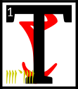

---

<!--- Local CSS Font Loading -->

<!--- Jekyll Page Links -->

<a href="../../../../../index.html">Home</a>
&emsp;&nabla;&emsp;
<a href="../../../../about/index.html">About</a>
&emsp;&nabla;&emsp;
<a href="../../../../archive/index.html">Archive</a>
&emsp;&nabla;&emsp;
<a href="../../../index.html">Quintessence</a>

<!--- Markdown Body Below: -->

---

## ascahn'cina'shoreshik

#### Sermon Twenty-Four

hen Vivec left the house of assassins and went back to the space that was not a space.
<b>&sup2;</b>From the Provisional House he looked into the middle world to find the third monster, called Horde Mountain.
<b>&sup3;</b>It was made of modular warriors running free but spaced according to pattern,
<b>&#8308;</b>and from the highest warrior who could cut clouds they spread out beneath him like a tree, a skirt whose bottom circle was an army that ran through the ash.

<b>&#8309;</b>Vivec admired the cone-shape of his child and remembered with joy the whirlwind of fighting styles that instructed him during the days before life.

<b>&#8310;</b>Vivec moved into Veloth, saying, 'Onus.'

But before he could even get within sword-span of the monster, a trio of lower houses had trapped Horde Mountain in a net of doubtful doctrine.
<b>&#8311;</b>When they saw their lord, the Velothi cheered.

'We are happy to serve you and win!' they said.

<b>&#8312;</b>Vivec smiled at those brave souls around him and summoned celebration demons to cleave unto the victors.
<b>&#8313;</b>There was a great display of love and duty around the netted monster, and Vivec was at the center with a headdress made of mating bones.
<b>&sup1;&#8304;</b>He laughed and told mystical jokes and made the heads of the three houses marry and become a new order.

'You shall forever be now my Buoyant Armigers,' he said.

<b>&sup1;&sup1;</b>Then Vivec pierced Horde Mountain with Muatra and made of it all a big bag of bones.
<b>&sup1;&sup2;</b>At the touch of his right hand the net became right scripture and he threw it all northeasterly.
<b>&sup1;&sup3;</b>The contents spread out like sugar-glows and Vivec and the Buoyant Armigers ran under it laughing.

<b>&sup1;&#8308;</b>Finally the bones of Horde Mountain landed and became the foundation stones for the City of Swords, which Vivec named after his own sigil,
<b>&sup1;&#8309;</b>and the net fell across it all and between, or became as bridges between bones, and since its segments had been touched by his holy wisdom they became the most perfect of all city streets in the known worlds.

<b>&sup1;&#8310;</b>Throngs of Velothi came to the new city and Ayem and Seht gave it their blessing.
<b>&sup1;&#8311;</b>The streets were filled with laughter and love and the strength of tree-shaped enemy children.

<b>&sup1;&#8312;</b>Ayem said:

'To my sister-brother's city I give the holy protection of House Indoril, whose powers and thrones know no equal under heaven, wherefrom came the Hortator.'

<b>&sup1;&#8313;</b>Seht said:

'To my sister-brother's city I give safe passage through the dark corners still left of Molag Bal, and I give it this spell as well:
SO'T'HA SIL,
which is my name to the mighty.
<b>&sup2;&#8304;</b>It will protect the lost unless their flight is on purpose and fill all the roads and alleys with the mystery paths of civilization, and give the city a mind and make of it a conduit to the full concentrate of the
ASV.'

<b>&sup2;&sup1;</b>Thus was founded the city of Vivec in the days of Resdaynia.

<b>&sup2;&sup2;</b>The ending of the words is
ASV.

---

#### References

1. [UESP: The 36 Lessons of Vivec][1]

[1]: https://en.uesp.net/wiki/Morrowind:36_Lessons_of_Vivec,_Sermon_24

---
