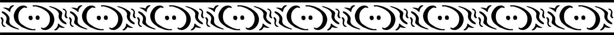
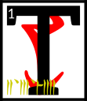

---

<!--- Local CSS Font Loading -->

<!--- Jekyll Page Links -->

<a href="../../../../../index.html">Home</a>
&emsp;&nabla;&emsp;
<a href="../../../../archive/about.html">About</a>
&emsp;&nabla;&emsp;
<a href="../../../../archive/index.html">Archive</a>
&emsp;&nabla;&emsp;
<a href="../../../index.html">Quintessence</a>

<!--- Markdown Body Below: -->

---

## ascahn'arca'shoreshik

#### Sermon Twenty-Five

he Scripture of the City:

'All cities are born of solid light. Such is my city, his city.

<b>&sup2;</b>'But then the light subsides, revealing the bright and terrible angel of Veloth.
<b>&sup3;</b>He is in his pre-chimerical form, demonic
VEHK,
gaunt and pale and beautiful, skin stretched painfully thin on bird's bones, feathered serpents encircling his arms.
<b>&#8308;</b>His wings are spread out behind him, their red and yellow ends like razors in the sun.
<b>&#8309;</b>The wispy mass of his fire hair floats as if underwater, milky in the nimbus of light that crowns his head.
<b>&#8310;</b>His presence is undeniable, the awe too much to bear.

<b>&#8311;</b>'This is God's city, different from others. Cities from foreign countries put their denizens to sleep and walk to the star-wounded East to pay homage to me.
<b>&#8312;</b>The capital of the northern men, crusty with eon's ice, bows before Vivec the city, me it together.

<b>&#8313;</b>'Self-thought streets rush through tunnel blood. I have rebuilt myself. Hyper eyed signposts along my traffic arm, soon to be an inner sea.
<b>&sup1;&#8304;</b>My body is crawling with all gathered to see me rising up like a monolithic instrument of pleasure. My spine is the main road to the city that I am.
<b>&sup1;&sup1;</b>Countless transactions are taking place in veins and catwalks and the roaming, roaming, roaming, as they roam over and through and add to me.
<b>&sup1;&sup2;</b>There are temples erected along the hollow of my skull and I will ever wear them as a crown. Walk across the lips of God.

<b>&sup1;&sup3;</b>'They add new doors to me and I become effortlessly trans-immortal with the comings and goings and the stride-heat of the market where I am traded for,
<b>&sup1;&#8308;</b>yell of the children hear them play, scoffed at, amused, desired, paid for in native coin, new minted with my face on one side and my city-body on the other.
<b>&sup1;&#8309;</b>I stare with each new window. Soon I am a million-eyed insect dreaming.

<b>&sup1;&#8310;</b>'Red-sparking war trumpets sound like cattle in the ribcage of shuffling transit. The heretics are destroyed on the plaza knees.
<b>&sup1;&#8311;</b>I flood over into the hills, houses rising like a rash, and I never scratch. Cities are the antidotes to hunting.

<b>&sup1;&#8312;</b>'I raise lanterns to light my hollows, lend wax to the thousands of candlesticks that bear my name again and again,
<b>&sup1;&#8313;</b>the name innumerable, shutting in, mantra and priest, god-city, filling every corner with the naming name,
<b>&sup2;&#8304;</b>wheeled, circling, running river language giggling with footfalls mating, selling, stealing, searching, and worry not ye who walk with me.
<b>&sup2;&sup1;</b>This is the flowering scheme of the Aurbis. This is the promise of the
PSJJJJ:
egg, image, man, god, city, state.
<b>&sup2;&sup2;</b>I serve and am served. I am made of wire and string and mortar and I accede my own precedent, world without am.'

<b>&sup2;&sup3;</b>The ending of the words is
ASV.

---

#### References

1. [UESP: The 36 Lessons of Vivec][1]

[1]: https://en.uesp.net/wiki/Morrowind:36_Lessons_of_Vivec,_Sermon_25

---
