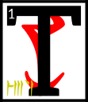

---

<!--- Local CSS Font Loading -->

<!--- Jekyll Page Links -->

<a href="../../../../../index.html">Home</a>
&emsp;&nabla;&emsp;
<a href="../../../../about/index.html">About</a>
&emsp;&nabla;&emsp;
<a href="../../../../archive/index.html">Archive</a>
&emsp;&nabla;&emsp;
<a href="../../../index.html">Quintessence</a>

<!--- Markdown Body Below: -->

---

## ascahn'tahna'shoreshik

#### Sermon Twenty-Six

hen Vivec left his architectural rapture and went back to the space that was not a space.
<b>&sup2;</b>From the Provisional House he looked into the middle world to find the fourth monster, called The Pocket Cabal.

<b>&sup3;</b>The monster hid itself in the spell-lists of the great Chimeri wizards of the extreme east, where the Emperor Parasols grow wild.
<b>&#8308;</b>Vivec disguised himself as a simple traveler, but radiated a tenuous sense-fabric so that the wizards would seek him out. Of Muatra he made a simple walking dwarf.

<b>&#8309;</b>Before long the invisible one was among the libraries of the east, feeding the essential words of The Pocket Cabal to his walking dwarf and then running when the magic would fail.
<b>&#8310;</b>After a year or two of this thievery, Muatra was sick to its stomach, and the walking dwarf exploded near the slave pens of a wizard's tower.
<b>&#8311;</b>The Pocket Cabal then slipped itself into the mouths of the slaves and hid again.

<b>&#8312;</b>Vivec then watched as the slaves erupted into babble and breaking magic.
<b>&#8313;</b>They rattled their cages and sung out half-hymns that formed into forbidden and arcane knowledge.
<b>&sup1;&#8304;</b>Litany fiends appeared and drank from the excess. Grabbers from the Adjacent Place came into the world sideways, the slave talking having disrupted the normal non-cardinal points.

<b>&sup1;&sup1;</b>So of course a giant bug appeared, with the greatest eastern wizard inside it.
<b>&sup1;&sup2;</b>He could see past Vivec's disguise and knew of the warrior-poet's divinity but he thought himself so powerful that he talked harshly:

<b>&sup1;&sup3;</b>'See what you have wrought, silly Triune! Columns of nonsense and litany fiends!
<b>&sup1;&#8308;</b>I cannot believe how reason or temperance can be made whole again due to your eating, eating, eating! Consort with more demons, why don't you?'

Vivec stabbed the wizard through his soul.

<b>&sup1;&#8309;</b>The giant bug harness fell on the slave cages and the slaves ran about free and reckless, too reckless more with pregnant words. Colors bent into the earth.

<b>&sup1;&#8310;</b>Vivec created a dome-head demon to contain it all.

'The Pocket Cabal is therefore interred here forever. Let this be a cursed land where sorcery is broken and maligned.'

<b>&sup1;&#8311;</b>Then he picked up Muatra by the beard and left the ghostly hemisphere of the dome-head demon.
<b>&sup1;&#8312;</b>On its boundaries, Vivec placed a warning and a song of entrance that contained errors in it.
<b>&sup1;&#8313;</b>With mock bones of half-dead Muatra he created the tent poles of a fortress-theory and fatal languages were imprisoned for all time.

<b>&sup2;&#8304;</b>Seht appeared and looked on what his brother-sister had created.
<b>&sup2;&sup1;</b>The Clockwork King said:

'Of the eight monsters, this is the most confusing. May I treasure it?'

<b>&sup2;&sup2;</b>Vivec gave Seht leave to do so, but told him never to release The Pocket Cabal into the middle world.
<b>&sup2;&sup3;</b>He said:

'I have hidden secrets in my travels here and made a likeness of Muatra to ward against the unwise. Under this dome, the temporal myth is no longer man.'

<b>&sup2;&#8308;</b>The ending of the words is
ASV.

---

#### References

1. [UESP: The 36 Lessons of Vivec][1]

[1]: https://en.uesp.net/wiki/Morrowind:36_Lessons_of_Vivec,_Sermon_26

---
