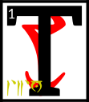

---

<!--- Local CSS Font Loading -->

<!--- Jekyll Page Links -->

<a href="../../../../../index.html">Home</a>
&emsp;&nabla;&emsp;
<a href="../../../../about/index.html">About</a>
&emsp;&nabla;&emsp;
<a href="../../../../archive/index.html">Archive</a>
&emsp;&nabla;&emsp;
<a href="../../../index.html">Quintessence</a>

<!--- Markdown Body Below: -->

---

## ascahn'sahna'shoreshik

#### Sermon Twenty-Seven

he Scripture of the Word,

First:

'All language is based on meat. Do not let the sophists fool you.'\
&#8203;

<b>&sup2;</b>Second:

'The third walking path explores hysteria without fear. The efforts of madmen are a society of itself, but only if they are written.
<b>&sup3;</b>The wise may substitute one law for another, even into incoherence, and still say he is working within a method. This is true of speech and extends to all scripture.'

<b>&#8308;</b>Third:

'Do not go to the realm of apology for absolution. Beyond articulation, there is no fault.
<b>&#8309;</b>The Adjacent Place, where the Grabbers live, is the illusion of the vocal or the middle realms of thought, by which I mean the constructed.
<b>&#8310;</b>This is how I stole the certainty of the Chancellor of Exactitude, perfect to look upon from every angle.
<b>&#8311;</b>When you come out of the vocal, you can never be certain.'

<b>&#8312;</b>Fourth:

'The truest body of work is made up of silence: as in the silence that results from no reference. By the word I mean the dead.'

<b>&#8313;</b>Fifth:

'The first meaning is always hidden.'

<b>&sup1;&#8304;</b>Sixth:

'The realm of apology is perfection and impossible to attack. Thus, the wise avoid it.
<b>&sup1;&sup1;</b>Trinity in unity is the world and word of action: the third walking path.'

<b>&sup1;&sup2;</b>Seventh:

'The sage who suppresses his best aphorism: cut off his hands, for he is a thief.'

<b>&sup1;&sup3;</b>Eighth:

'The clothes of the broken map are worn only by fools and heretics. The map is an exit for laziness.
<b>&sup1;&#8308;</b>It is the dusty tongue, which is to say the given chart that most take as a story that is complete. No word is true until it is eaten.'

<b>&sup1;&#8309;</b>The ending of the words is
ASV.

---

#### References

1. [UESP: The 36 Lessons of Vivec][1]

[1]: https://en.uesp.net/wiki/Morrowind:36_Lessons_of_Vivec,_Sermon_27

---
