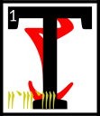

---

<!--- Local CSS Font Loading -->

<!--- Jekyll Page Links -->

<a href="../../../../../index.html">Home</a>
&emsp;&nabla;&emsp;
<a href="../../../../archive/about.html">About</a>
&emsp;&nabla;&emsp;
<a href="../../../../archive/index.html">Archive</a>
&emsp;&nabla;&emsp;
<a href="../../../index.html">Quintessence</a>

<!--- Markdown Body Below: -->

---

## cahnahn'cahna'shoreshik

#### Sermon Thirty-Three

hen Vivec left the Litany Hall of the False Thinking Temple, where he had brooded for so long creating the scripture of the pounding light, and went back to the space that was not a space.
<b>&sup2;</b>From the Provisional House he looked into the middle world to find the seventh monster, called Lie Rock.

<b>&sup3;</b>Lie Rock was born of Vivec's Second Aperture and was thrown out of the Pomegranate Banquet by a member of the Sweeps, another forgotten guild.
<b>&#8308;</b>The Sweep did not take it for the monster that it was and so he did not expect it to fly from his hand and into the heavens.

<b>&#8309;</b>'I am born of golden wisdom and powers that should have forever been unalike! With this nature I am invited into the Hidden Heaven!'

<b>&#8310;</b>By which he meant the Scaled Blanket, made of not-stars, whose number is thirteen.
<b>&#8311;</b>Lie Rock became full of foolishness, haggling with the Void Ghost who hides in the religions of all men.
<b>&#8312;</b>The Void Ghost said:

'Stay with me a full hundred years and I will give you a power that no divinity will dare disobey.'

<b>&#8313;</b>But before the hundred years was up, Vivec was already looking for Lie Rock and found him.

<b>&sup1;&#8304;</b>'Stupid stone,' Vivec said. 'To hide in the Scaled Blanket is to make a mark on nothing. His bargains are only for ruling kings!'

<b>&sup1;&sup1;</b>So Vivec sent the Hortator to the heavens to shave Lie Rock asunder by the named axe.
<b>&sup1;&sup2;</b>Nerevar made peace with the south-pole-star of thieving and the north-pole-star of warriors and the third-pole-star, which existed only in the ether, which was governed by the apprentice of Magnus the sun.
<b>&sup1;&sup3;</b>They gave him leave to wander among their charges and gave him red sight by which to find Lie Rock in the Hidden Heaven.

<b>&sup1;&#8308;</b>By chance, Nerevar met the Void Ghost first, who told him that he was in the wrong place to which the Hortator said, 'Me or you?' and the Void Ghost said both.
<b>&sup1;&#8309;</b>This sermon does not tell what else was said between these masters.

<b>&sup1;&#8310;</b>Lie Rock, however, used the confusion to launch his own attack on the city-god, Vivec.
<b>&sup1;&#8311;</b>He was hastened by all three of the black guardians, who wanted him swiftly gone, though they meant no hostility to the lord of the middle air.

<b>&sup1;&#8312;</b>The citizenry of Vivec screamed as they saw a shooting star come down out of the sky hole like a toll-road of hell.
<b>&sup1;&#8313;</b>But Vivec merely raised his hand and froze Lie Rock just above the city and then he pierced the monster with Muatra.

<b>&sup2;&#8304;</b>(The practice of piercing the Second Aperture is now forbidden.)

<b>&sup2;&sup1;</b>When Nerevar returned, he saw the frozen comet above his lord's city. He asked whether or not Vivec wanted it removed.

'I would have done so myself if I wanted, silly Hortator.
<b>&sup2;&sup2;</b>I shall keep it there with its last intention intact, so that if the love of the people of this city for me ever disappear, so shall the power that holds back their destruction.'

<b>&sup2;&sup3;</b>Nerevar said, 'Love is under your will only.'

<b>&sup2;&#8308;</b>Vivec smiled and told the Hortator that he had become a Minister of Truth.

<b>&sup2;&#8309;</b>The ending of the words is
ASV.

---

#### References

1. [UESP: The 36 Lessons of Vivec][1]

[1]: https://en.uesp.net/wiki/Morrowind:36_Lessons_of_Vivec,_Sermon_33

---
