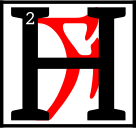

---

<!--- Local CSS Font Loading -->

<!--- Jekyll Page Links -->

<a href="../../../../../index.html">Home</a>
&emsp;&nabla;&emsp;
<a href="../../../../archive/about.html">About</a>
&emsp;&nabla;&emsp;
<a href="../../../../archive/index.html">Archive</a>
&emsp;&nabla;&emsp;
<a href="../../../index.html">Quintessence</a>

<!--- Markdown Body Below: -->

---

## alna'amurokam

#### Volume One

<b>&sup1;</b>By the word, I wind the gears.

ow does one come to know the Clockwork God and Father of Mysteries?
<b>&sup3;</b>Our Lord Vivec and the Lady of Mercy, Almalexia, are known to us.
<b>&#8308;</b>Their faces are known to us. Their words are known to us. But what of Sotha Sil?
<b>&#8309;</b>He who is distant in both position and intent. Ever watchful, but seldom seen. Ever worshiped, but seldom heard.
<b>&#8310;</b>He is the Mainspring Ever-Wound&mdash;the unmoved mover, hidden within His Clockwork City, whose voice is the Divine Metronome.
<b>&#8311;</b>As Tourbillon, I speak His truth as I know it. I say the words in sequence so they can be known by the people.
<b>&#8312;</b>The sequence is but a shadow of the truth, but minds such as ours cannot bear the ordered unsequence.
<b>&#8313;</b>Minds such as ours cannot truly know themselves. Not yet.

<b>&sup1;&#8304;</b>The First Truth of the Mainspring Ever-Wound is the truth of Nirn.
<b>&sup1;&sup1;</b>The soul of Nirn has two faces. The first is known to us&mdash;the Nirn-Prior, or the Nirn of Many Parts.
<b>&sup1;&sup2;</b>It is a Nirn in pieces, assembled by the unsteady hand that has yet to find itself.
<b>&sup1;&sup3;</b>Its oscillations irregular, its going train disrupted by fear and delusion. Its faults are not in its parts, but in its assembly.
<b>&sup1;&#8308;</b>Each gear is a god. Each spring is a thought. But a mechanism built by many hands cannot know the precision of the master craftsman.
<b>&sup1;&#8309;</b>The et'Ada Gears cannot bring forth a true Nirn, because they know only its parts. They cannot see the whole.
<b>&sup1;&#8310;</b>The Eye of Sotha Sil ignores such division.
<b>&sup1;&#8311;</b>Where the broken gods see only pieces, our Father Sotha Sil sees the whole. He sees the Second Nirn.

<b>&sup1;&#8312;</b>The Second Nirn. The inchoate Nirn-Ensuing. The thought-form that anticipates the world to come: Tamriel Final. Anuvanna'si.
<b>&sup1;&#8313;</b>Only Sotha Sil knows its shape. Its nature lies forgotten in the before-time when Anu broke itself for wisdom's sake.
<b>&sup2;&#8304;</b>Our lessers know the Source as two forms: Anu and Padomay, but this binary is without merit.
<b>&sup2;&sup1;</b>One of Lorkhan's Great Lies, meant to sunder us from the truth of Anuic unity.
<b>&sup2;&sup2;</b>Our father, Sotha Sil, would have us know the truth: there is no Padomay.
<b>&sup2;&sup3;</b>Padomay is the absence of value. The lack. A ghost that vanishes at first light. A Nothing.
<b>&sup2;&#8308;</b>There is only Anu, sundered and known by many names, possessing many faces. The one.

<b>&sup2;&#8309;</b>When Anu broke itself, it did so to understand its nature.
<b>&sup2;&#8310;</b>In its sundering, the values that swam in its vastness thought to know themselves.
<b>&sup2;&#8311;</b>The et'Ada Gears gave themselves many names and set their will to building.
<b>&sup2;&#8312;</b>Alas, they heeded the counsel of Lorkhan and forgot the face of Anu.
<b>&sup2;&#8313;</b>They thought themselves distinct and whole. And so, many hands assembled the world, each with separate intention and selfish purpose.
<b>&sup3;&#8304;</b>The Nirn of Many Parts was the result. A broken and leaking steam-ship that lists ever wind-ward.

<b>&sup3;&sup1;</b>But rejoice, children of the Tribunal! In His wisdom, the Mainspring Ever-Wound seeks to reclaim our lost heritage.
<b>&sup3;&sup2;</b>His heart is oiled and calibrated, pumping dark truth as blood.
<b>&sup3;&sup3;</b>His mind is the God-Mortar where the fractured values of Anuic nature are ground and weighed&mdash;unified through His will alone.
<b>&sup3;&#8308;</b>From this great labor, a new Nirn will be born. Tamriel Final. Anuvanna'si.
<b>&sup3;&#8309;</b>I pray that we see the fruit of His labor&mdash;a perfect world, without et'Ada Gears. Without the illusion of change. Water-tight and everlasting.

<b>&sup3;&#8310;</b>By the word, I wind the gears.

---

#### References

1. [UESP: The Truth in Sequence][1]

[1]: https://en.uesp.net/wiki/Online:The_Truth_in_Sequence:_Volume_1

---
