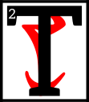

---

<!--- Local CSS Font Loading -->

<!--- Jekyll Page Links -->

<a href="../../../../../index.html">Home</a>
&emsp;&nabla;&emsp;
<a href="../../../../about/index.html">About</a>
&emsp;&nabla;&emsp;
<a href="../../../../archive/index.html">Archive</a>
&emsp;&nabla;&emsp;
<a href="../../../index.html">Quintessence</a>

<!--- Markdown Body Below: -->

---

## cahna'amurokam

#### Volume Three

<b>&sup1;</b>By the word, I wind the gears.

he Third Truth of the Mainspring Ever-Wound is the truth of the Daedra.
<b>&sup3;</b>In the days before the First Ignition, the Chimer people bent their knees to the False Princes:
<b>&#8308;</b>The Webspinner, the Prince of Plots, and the Queen of Dawn and Dusk. I do not use their names, as Name cleaves one from another.
<b>&#8309;</b>You know them well, child of the Tribunal, for every time you bear false witness, or make foolish boasts, you do so in their name.
<b>&#8310;</b>Their words corrode and weaken the heart. Their threats loosen the fasteners and break the seals.
<b>&#8311;</b>They are the Anti-Gears that turn counter to the Nameless Will. Servants of the Padomaic untruth whose nature is void.
<b>&#8312;</b>Of the Daedra, only the Gray Prince of Order knew his nature, and he went mad in the knowing.

<b>&#8313;</b>The Daedra fear wisdom and order, you see? And thus do they fear the Clockwork God above all others.
<b>&sup1;&#8304;</b>Where others see dark crowns numbered ten and six, Sotha Sil sees shadows and nothing more.
<b>&sup1;&sup1;</b>For the Daedra are the lie that creation tells itself. Like their father, Padomay, they are Nothing. And in the Tamriel Final, Nothing shall hold no sway. Anuvanna'si.
<b>&sup1;&sup2;</b>Their black mountain called "Oblivion" shall sink into the Furnace of Forgotten Numbers, where all lies burn and brittle multitudes turn to slag.

<b>&sup1;&sup3;</b>I hear you ask: If the Daedra are of the Nothing, how do they lurk on our threshold? How do they lurk at all?
<b>&sup1;&#8308;</b>Hear the words in sequence, child of the Tribunal!
<b>&sup1;&#8309;</b>In the clumsily built Nirn-Prior, the et'Ada Gears left gaps and crevices where Nothing could take root.
<b>&sup1;&#8310;</b>Imperfections born from Lorkhan's Great Lie and the selfishness of fractured creation.
<b>&sup1;&#8311;</b>In the glorious Anuic convergence of the Nirn-Ensuing, all gaps will be sealed. All crevices will be welded.
<b>&sup1;&#8312;</b>The creaking and rattling of the machine shall retreat to a whisper, and the reckless chaos born from the et'Ada Gears' folly shall shrivel and starve.

<b>&sup1;&#8313;</b>By the word, I wind the gears.

---

#### References

1. [UESP: The Truth in Sequence][1]

[1]: https://en.uesp.net/wiki/Online:The_Truth_in_Sequence:_Volume_3

---
