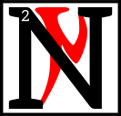

---

<!--- Local CSS Font Loading -->

<!--- Jekyll Page Links -->

<a href="../../../../../index.html">Home</a>
&emsp;&nabla;&emsp;
<a href="../../../../archive/about.html">About</a>
&emsp;&nabla;&emsp;
<a href="../../../../archive/index.html">Archive</a>
&emsp;&nabla;&emsp;
<a href="../../../index.html">Quintessence</a>

<!--- Markdown Body Below: -->

---

## cina'amurokam

#### Volume Four

<b>&sup1;</b>By the word, I wind the gears.

ow I speak to you of Sotha Sil's silence.
<b>&sup3;</b>The children of ash sometimes ask, "Where is our Clockwork God? Why does only the Tourbillon speak His truth in mortal sequence?"
<b>&#8308;</b>They ask in hushed tones, with brows creased by fear.
<b>&#8309;</b>Do not flee from such questions, child of the Tribunal. These are the little blasphemies that lead to wisdom&mdash;the faultless flame that turns ignorance to steam.
<b>&#8310;</b>For the Mainspring Ever-Wound is the Father of Curiosity, and curiosity is the joyful destroyer.
<b>&#8311;</b>Only in sundering can things be made whole. Only the disassembled engine can be scrubbed and made clean.
<b>&#8312;</b>So, smash the old machines! Topple your mind's idols! And from the wreckage, assemble new truths&mdash;flawless and water-tight.

<b>&#8313;</b>Do you see now, child of the Tribunal? It is the silence of Sotha Sil that gives birth to the intrepid mind.
<b>&sup1;&#8304;</b>Knowledge must be found&mdash;and to find a thing, it must be hidden. It is not enough to be told.
<b>&sup1;&sup1;</b>The whirr of the machine is as silence to the one who lives within it.
<b>&sup1;&sup2;</b>A turbine ever-oiled does not know the lack of oil&mdash;does not know the purpose of oil. And so it is with truth.

<b>&sup1;&sup3;</b>Now, you must know that curiosity is not without cost.
<b>&sup1;&#8308;</b>ALM
forgive this heresy!
VI
forgive this heresy! I speak the words in sequence only.
<b>&sup1;&#8309;</b>Pay heed to the laws of golden masks, but know also their limits. Pay heed to the songs of dancing glass, but know also the boundaries of their scale.
<b>&sup1;&#8310;</b>Their truth is the truth of inertia. Of gravity. Their hearts are vessels filled with liquid brass&mdash;resistant to harm, but incapable of movement.
<b>&sup1;&#8311;</b>The Mainspring Ever-Wound spurns that which does not move.
<b>&sup1;&#8312;</b>In the Nirn-Ensuing, that which does not move shall be fed to the Kiln-Amaranthine where Seht's quiet wrath burns like the sun, and broken cogs are made whole.
<b>&sup1;&#8313;</b>The Wheels Eternal must spin. The Tamriel Final must tick and tock. Anuvanna'si.
<b>&sup2;&#8304;</b>Each and each must take its place in the whole. For if even one piece is missing, the whole is not whole.

<b>&sup2;&sup1;</b>By the word, I wind the gears.

---

#### References

1. [UESP: The Truth in Sequence][1]

[1]: https://en.uesp.net/wiki/Online:The_Truth_in_Sequence:_Volume_4

---
