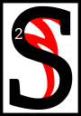

---

<!--- Local CSS Font Loading -->

<!--- Jekyll Page Links -->

<a href="../../../../../index.html">Home</a>
&emsp;&nabla;&emsp;
<a href="../../../../archive/about.html">About</a>
&emsp;&nabla;&emsp;
<a href="../../../../archive/index.html">Archive</a>
&emsp;&nabla;&emsp;
<a href="../../../index.html">Quintessence</a>

<!--- Markdown Body Below: -->

---

## arca'amurokam

#### Volume Five

<b>&sup1;</b>By the word, I wind the gears.

peak not of Dwarves, child of the Tribunal. The simple clockworks of the Dwemer pale before the sublime machinery of Sotha Sil.
<b>&sup3;</b>Let Dumac's lament be a silent one. Let his hissing tombs stay buried. Let his automata rust and crumble.
<b>&#8308;</b>For his was the greatest failure&mdash;driven by Lorkhan's Great Lie and churlish pride.
<b>&#8309;</b>His is a tale of woe and terror, and those that pursue his ugly maths shall pay a great price in blood.

<b>&#8310;</b>"But, was Dumac not a creator?" you ask? "Were the brass-child's hands not covered in oil? Did they not speak the words of Making, and set wheel to axle?"
<b>&#8311;</b>Hear the words in sequence, followers of Seht. Intention dictates the worth of a machine.
<b>&#8312;</b>Where the Mainspring Ever-Wound seeks the convergence of the Nirn-Ensuing, the ghosts of the Dwemer cry out: "Multitudes! Multitudes!"
<b>&#8313;</b>Mer and machine, parted. Wisdom and ambition, parted. Made and Unmade, parted.
<b>&sup1;&#8304;</b>And from those sunderings, a thousand thousand skittering machines are made&mdash;left to wander forgotten halls, aimless and profligate.
<b>&sup1;&sup1;</b>One may twist a knob left in preparation for another to twist the same knob right. One may loosen a pipe so that another may tighten it.
<b>&sup1;&sup2;</b>They exist only to maintain the brass-childrens' folly, and so they are redundant and profane in the Eye of Sotha Sil.

<b>&sup1;&sup3;</b>But most profane is this: the walking horror that bears the Name,
NM.
The Brass Tower of Vanity.
<b>&sup1;&#8308;</b>The mindless guardian of the Nirn-Prior. The Antipodal-God-Thing that reigns on the darkest pole of the sacred Nirn-Sphere.
<b>&sup1;&#8309;</b>Of all the threats to Tamriel Final,
NM
is the greatest. Anuvanna'si.
<b>&sup1;&#8310;</b>The Daedra can be banished in thought, but
NM
must be sundered on Nirn.
<b>&sup1;&#8311;</b>It is the welded knot at the center of Anu that must be untied. The God-Puzzle.
<b>&sup1;&#8312;</b>The Mainspring Ever-Wound remains silent on this point. And where there is silence, there is great wisdom.

<b>&sup1;&#8313;</b>By the word, I wind the gears.

---

#### References

1. [UESP: The Truth in Sequence][1]

[1]: https://en.uesp.net/wiki/Online:The_Truth_in_Sequence:_Volume_5

---
