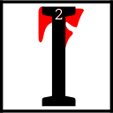

---

<!--- Local CSS Font Loading -->

<!--- Jekyll Page Links -->

<a href="../../../../../index.html">Home</a>
&emsp;&nabla;&emsp;
<a href="../../../../archive/about.html">About</a>
&emsp;&nabla;&emsp;
<a href="../../../../archive/index.html">Archive</a>
&emsp;&nabla;&emsp;
<a href="../../../index.html">Quintessence</a>

<!--- Markdown Body Below: -->

---

## alnahn'alna'amurokam

#### Volume Eleven

<b>&sup1;</b>By the word, I wind the gears.

 hear your whispers&mdash;your puerile laments.
<b>&sup3;</b>Even here in the Clockwork City, bathed in the oil of His divine wisdom, you cry out, "Where are the soft grasses and babbling creeks?
<b>&#8308;</b>Where are the heady wines and rich fruits? Where are the gentle rains, and sighing boughs, and swaying mushrooms?"
<b>&#8309;</b>Like hungry babes you weep, "Where is the Real?"
<b>&#8310;</b>Ease your bellows and steady your gears. You must gaze now upon the brass-wrought truth.
<b>&#8311;</b>See the Real of Tamriel Final. Anuvanna'si.

<b>&#8312;</b>What makes a thing real? Is it the blood, or the sap, or the beating heart?
<b>&#8313;</b>Is it the shrieking trauma of an infant's birth? The low roar of the tides?
<b>&sup1;&#8304;</b>The root's thirst for water or the lazy drift of distant clouds?
<b>&sup1;&sup1;</b>No, child of Seht! Hear the words in sequence! Can you not see that your fears spring from Lorkhan's lie?
<b>&sup1;&sup2;</b>Those soft forms and gentle comforts you covet are naught but corroded lies&mdash;fractured creation's panacea that deadens the soul's forgotten pain.

<b>&sup1;&sup3;</b>"But is Sotha Sil's sacred city not a replication?" you ask, "A Nirn in miniature?"
<b>&sup1;&#8308;</b>Hear this, ash-child: the Clockwork City is no mere simulacrum.
<b>&sup1;&#8309;</b>The copper leaves and sculpted hills are not Nirn's resemblance, but Nirn's refinement&mdash;
<b>&sup1;&#8310;</b>worldly forms made whole by the steady hand of the Mainspring Ever-Wound. The glorious unity of Tamriel Final demands convergence. Anuvanna'si.
<b>&sup1;&#8311;</b>Mer and machine made whole. Nature and engineering made whole. The past and the future made whole.
<b>&sup1;&#8312;</b>In time, all of Nirn shall be pressed and fired in this forge of Seht's blessed imaginings&mdash;weighed and measured upon the Nameless Scales!
<b>&sup1;&#8313;</b>Is this not the Real? Is this not the redemption of the et'Ada's sins?
<b>&sup2;&#8304;</b>Do you see now the impoverished forms of the Nirn-Prior? The cheap and hollow falsehoods that masquerade as nature's splendor?

<b>&sup2;&sup1;</b>Seek out the dry, hard places, child of Seht. Anoint your tongue with His oil. Fill your stomach with His nourishing grain.
<b>&sup2;&sup2;</b>Cast out what was and fix your eyes upon the Nirn-to-come&mdash;upon Tamriel Final. Anuvanna'si.

<b>&sup2;&sup3;</b>By the word, I wind the gears.

---

#### References

1. [UESP: The Truth in Sequence][1]

[1]: https://en.uesp.net/wiki/Online:The_Truth_in_Sequence:_Volume_11

---
