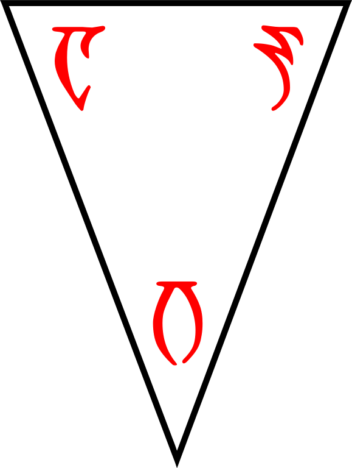

---

<!--- Local CSS Font Loading -->

<!--- Jekyll Page Links -->

<a href="../../../index.html">Home</a>
&emsp;&nabla;&emsp;
<a href="../../archive/about.html">About</a>
&emsp;&nabla;&emsp;
<a href="../../archive/index.html">Archive</a>
&emsp;&nabla;&emsp;
<a href="../index.html">Quintessence</a>

<!--- Markdown Body Below: -->

---

&#8203;

<h1>THE QUINTESSENCE</h1>
<h1>arcalbusehr</h1>
 
<h6>Based on the</h6>
<h6>Heirographa of the</h6>
<h4>CODEX SINRAMUS</h4>
<h4>sinramenthi shokhaahn</h4>
 
<h4>FAITHFULLY TRANSLATED</h4>
<h4>INTO THE COMMON TONGUE</h4>
<h6>out of Dunmeris, diligently conferred</h6>
<h6>with the Daedric & other Editions, Revised</h6>
<h6><i>with Chapters, Markers, Rubrics, & other helps,</i></h6>
<h6><i>for greater understanding of the texts</i></h6>

&#8203;\
&#8203;\
&#8203;

---

## Sections

| &#8203; | Index                                     |
|--------:|:------------------------------------------|
| &#8203; | [Foreword][1]                             |
| &#8203; | &emsp;&emsp;[To the Reader][2]            |
| &#8203; | &emsp;&emsp;[The Living Gods][3]          |
| &#8203; | &emsp;&emsp;[Worshiping the Illogical][4] |
| &#8203; | &emsp;&emsp;[The Pilgrim's Way][5]        |
| &#8203; | &emsp;&emsp;[Love Under Will][6]          |
|  __1:__ | [The Collection of the Ancestors][7]      |
|  __2:__ | [The Collection of the Homilies][8]       |
|  __3:__ | [The Collection of the Sequence][9]       |
|  __4:__ | [The Collection of the Lessons][10]       |
|  __5:__ | [The Collection of the Avowalments][11]   |
| &#8203; | [Breviary][12]                            |

[1]: #foreword
[2]: #to-the-reader
[3]: #the-living-gods
[4]: #worshiping-the-illogical
[5]: #the-pilgrims-way
[6]: #love-under-will
[7]: ./codex/index-ancestors.md
[8]: ./codex/index-homilies.md
[9]: ./codex/index-sequence.md
[10]: ./codex/index-lessons.md
[11]: ./codex/index-avowalments.md
[12]: ./codex/index-breviary.md
[13]: #
[14]: #sections

---

## Foreword

#### To the Reader

&emsp;[Sections][14] | [Top][13]

'Five are the corners of the world, but six are the
walking ways, from enigma to enemy to teacher.'

Five are the elements, the continents, and the limits of this world, and thus is this codex divided into five sections. For out of these do we strive as many and more paths to 'transcend mortal boundaries set in place by immortal rulers'. By the Tri-Angled Truth may we rest assured of more volition than the bones of the earth can contain. Among these pages do we perceive more verity than the etchings of mere language can espouse. And so, it is with most humble gratitude and honor to present the reader with this work, a Quintessence of the sacred writs, carefully handed down by our people, who are set apart in this world.

Our local temples maintain an open canon of scripture dedicated to ALMSIVI, so that the teachings of our Lords shall mix freely into the hearts of our diverse and ever changing folk, wherever we may sojourn. The collections of writings found in the High Fane and the Great Temple of Mournhold, with esteem also to the Library of Telvannis, contain thousands of documents both uttered by the Gods and penned by the Saints.

Presented in this tome however, is a core assemblage of the received texts as collected by the monks of the monastery of Sinramen. Indeed, some of these works can be found in every quarter, while others remain most prominent in the nameless studies of the Star-Wounded East, and still a few have slipped in to the codex from times disputed. The result is a carefully selected corpus whose ancient five-part Heirographa, those texts most fit for general instruction, is at last available to the common reader.

The first section pertains to the origins of our Psijic Endeavor, charting history from the Dawn, the forming of the et'Ada, and the Sundering of Ehlnofey into Mundus, to the eating of Trinimac, the Exodus of Veloth, and the unification of Resdayn. It illuminates our sacred connection to the Spirits and Ancestors. The three middle sections are dedicated to our living Gods and explore aspects of their personhood, godhood, and hand in the birth, life, and ghost of each mer. Ayem cultivates our culture, Seht challenges our assumptions and Vehk reshapes our morals. Finally, the last section contains remnants of texts that tell a rare account of the Apotheosis, that speak further of the skills necessary to make an Exodus, and of our hope in the Amaranth, the Million-Eyed Insect Dreaming and life of the Nirn-Ensuing.

The utmost care has been taken to deliver, with esteemed clarity, a rendition of these Scriptures into the common language, so as to provide the laity with a deeper insight into our ways, our knowledge, and our faith. Careful liberties have been taken to standardize particular names and passages. Where possible, spelling and transcription errors have been amended by hand and diligently checked against the common sources and Temple strictures to ensure their authenticity and intended meaning. To maintain a familiarity for the esteemed tongue, chapter titles have been printed in both insular and common forms.

Furthermore, within the text has been placed a different kind of numeral notation, such that it can be easily discerned from the common letters so that the reader, through the division of verse, might be more equipped to perceive the meaning of our Lords and commit their words to memory. Sacred utterances have been rendered in the form of kili dahkem, an insular rubric, so as to maintain their most excellent and holy significance when breathed aloud by the adept.

May this edition of the Scriptures further serve as a Treasure Wood Sword, waived as a lessoning tune that guides us in song, cutting us in shape to the edification of all the Temple faithful and indeed our Dunmer people.

<b>DEDICATION</b>

*Through the bounty of Blessed ALMSIVI, Triune Grace,*\
*In the presence of the temple and all the host of Saints*\
*By the sacred unity of your Mercy, your Mystery, and your Mastery,*\
*Almalexia, Sotha Sil, and Vivec, blessed be your holy names;*\
*Through the terrible power of your monstrous love,*\
*As in the days of Resdayn, the time of our ancestors,*\
*When Boethia, Mephala, and Azura lead the Velothi out of captivity,*\
*So do you lead us now, in the days of Morrowind;*\
*Down each Walking Way, you advocate for us in our time of trial,*\
*And shew for us a secret door at the altar of Padhome,*\
*Where by your hands, we become safe and looked after.*

*The ending of the words, ALMSIVI.*

&ndash;Idrele, Curate and Scribe

---

#### The Living Gods

&emsp;[Sections][14] | [Top][13]

No other religion in all of Nirn can claim what the Dunmer know as absolute truth: their gods rule over them and walk among them, as real and as present as any other resident of Morrowind. From their seat of power in Mournhold's Tribunal Temple, the Living Gods of the Tribunal guard and counsel their people. When necessary, they punish sin and error, but they also share their bounty with the greatest and least among us, each according to their needs. But who are the Living Gods? They are powerful Dunmer who achieved divine status through superhuman discipline and virtue, and supernatural wisdom and insight. As the three God-Kings of Morrowind, they form the divine leadership of the Dunmer nation. The Three&mdash;Lord, Mother, and Wizard&mdash;are described below.

Vivec, the warrior-poet god and Master of Morrowind, is perhaps the most popular of the Three. He also tends to be the most public, and the people love him. His visage appears both beautiful and bloody at the same time, and he has made violence into an art form. Vivec the warrior-poet has darker aspects associated with primitive, ruthless impulses, such as lust and murder.

Almalexia, also known as Mother Morrowind, is the patron of healers and teachers. She is the Healing Mother, the source of compassion and sympathy, the protector of the poor and the weak. Almalexia embodies the best of Dunmeri culture and purpose. She exemplifies mercy, and her wisdom guides the Dunmer in all their daily affairs.

Sotha Sil, God of the World-Mechanism, is the least known and most hidden of the Tribunal gods. Sometimes referred to as the Mystery of Morrowind, he is a Magus and the patron of artificers and wizards. Perhaps the mightiest wizard in the land and certainly the wisest, he is considered to be the Light of Knowledge and the inspiration behind craft and sorcery.

Together, the Living Gods are the pillars of the Tribunal Temple. They represent the power and discipline of the Dunmeri people, and rule with a combination of compassion and strict adherence to law and protocol.

&ndash;Durillis, Temple Theologian

---

#### Worshiping the Illogical

&emsp;[Sections][14] | [Top][13]

The Clockwork Apostles dedicate their lives to many things. The words of our Sermons, laid before us by the ever-faithful Deldrise Morvayn, Fourth Tourbillon. The will of our god Lord Seht, the Mainspring Ever-Wound, the Divine Metronome. The driving forces of inspiration, of innovation, of discovery in all forms, magical, technological, spiritual.

But we often forget, in our pursuit to unravel the mysterious of our world, that we are also subjects of the Tribunal.

I have found throughout my long tenure that many of my pupils have a hard time grasping the threefold nature of our belief within the Tribunal. Still, despite the repetition of these questions, I never rebuff this curiosity. Rather, I try to encourage it, for there is an abundance of contradictions within our piety towards Lady Almalexia and Lord Vivec. After all, the worship of these deities seem to almost challenge the beliefs we hold so true within our order.

Why are we told to worship these often puzzling deities? Why must we follow not one god, but three?

Yet even this seemingly simple fact is but a misconception, for in this sequence we have found truth. ALMSIVI is but one entity, not the fractured creation that many perceive it as. It only appears fractured in the forms our gods have taken, but rather than separate deities they are all one portion of a welded whole. Regulated in their irregularities. Lady Almalexia and Lord Vivec, who are only consistent in their inconsistency, still create the order of our truths. They are the tock within our Lord Seht's tick, the wheel that forever goes forward but only to circle itself.

They are the truths of our chaotic present, the irregular oscillations that we must weld together. Within them we find the aspects of our humanity, the soul which merges with the machine, ambition which merges with beneficence. The act of faith itself seems contradictory to the importance we hold on evidential certainty. But not one among us is completely machine, cold and logical without the emotions which bind us together. No, we are welded beings, as varied and complex as our three gods. Fractured parts which have come together to create our individuality.

How does one devote themselves to such aspects? To these traits of Nirn which are not logic and order, our guiding principles? The Sermons tell us to understand their limitations. To pay heed, but know the boundaries of their scale. Know that these are the principals needed for our current world, Nirn-Prior, and shall be but an addition to the whole which is Nirn-Ensuing.

Hold tight their words, their laws and limits. Know that they are the echoes of a fractured selves, welded whole.

Know that the Sublime Piston gives and takes in equal measures, sundering the Named pursuits of lesser mer. We must tear apart that which will be welded whole once more. Beliefs, structures, laws, one day outdated and unneeded.

And so we pay our respects to these aspects of our deities. Without faith towards ALMSIVI we ourselves become sundered from the truth. Speak the names of Lady Almalexia, Lord Sotha Sil, and Lord Vivec with respect, with piety. Listen to their words and heed their laws when necessary. They are the cogs that reflect ourselves, to be as venerated as the truths that we honor.

&ndash;Nevyn, Proctor and Apostle of Seht

---

#### The Pilgrim's Way

&emsp;[Sections][14] | [Top][13]

To walk is to love, young pilgrims. We honor The Prophet through our travels. By walking his way, we keep the holy journey alive.

It is the sole that keeps us in contact with Veloth. With each step, we sing the marching song of our forebears. By retracing the pattern, we strengthen the bond.

It is with our feet that we followed Veloth. It was the exodus of the feet that brought us to Resdayn. It is our feet that now rest on the soils of Morrowind.

'Six are the guardians of Veloth, three before and they are born again, and they will test you until you have the proper tendencies of a hero.'

To walk is to love, young pilgrims. We honor The Three through our resolve. Through overcoming opposition, we grow closer to the source. These are the stories of the sole. With each step, the story grows.

The markings on the sole may be physical or spiritual, but are always intertwined. Scars, scabs and blisters lead to callusing of the body, but also of the mind. Tattoos mark both sole and spirit.

Each step has an effect, yet changes nothing. Each step is taken freely, though without choice. Each step tells the story that has yet to be told, the story that has already been told and the story that must be told.

By retracing the pattern, we strengthen the bond.

To walk is to love, young pilgrims.

&ndash;St. Rilms, the Barefooted

---

#### Love Under Will

&emsp;[Sections][14] | [Top][13]

'Know Love to avoid the Landfall, my brothers and sisters.'

Love is the harmony of self-interest and selflessness, when expressed or received unmindingly, that is, under will. We have been sundered, broken out of divinity and into the world, where mortal limits are a distraction from the freedom to truly act.

But, when one can sustain the balance of love without conscious effort, they become ever present in the moment, unbound by time, unminding of past decisions or future questions. Because they are not distracted by mortal anguish, their integrity remains whole and they are free to act as is true to their nature, their divine character.

&ndash;Udrasi, Priest and Mystic

---
