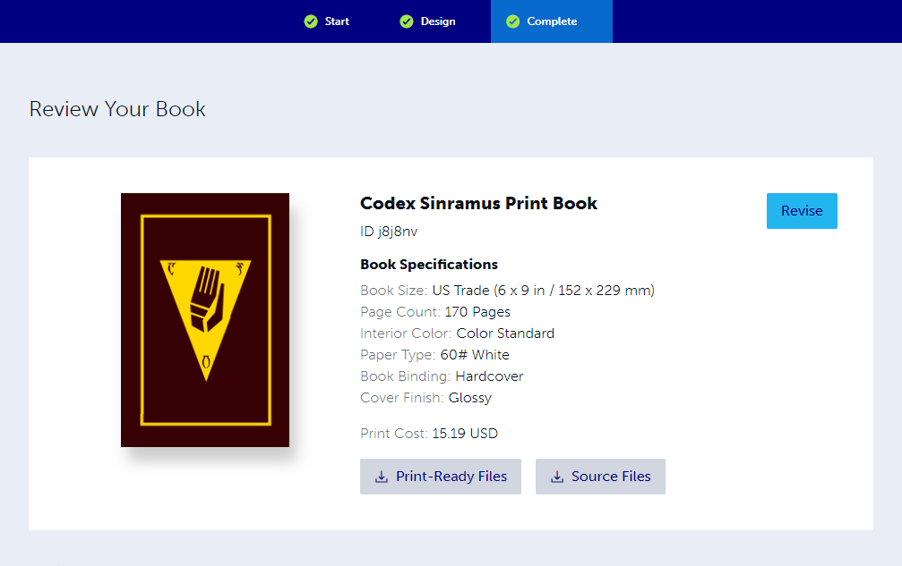

---

<!--- Local CSS Font Loading -->

<!--- Jekyll Page Links -->

<a href="../../../index.html">Home</a>
&emsp;&nabla;&emsp;
<a href="../../archive/about.html">About</a>
&emsp;&nabla;&emsp;
<a href="../../archive/index.html">Archive</a>
&emsp;&nabla;&emsp;
<a href="../index.html">Quintessence</a>

<!--- Markdown Body Below: -->

---

## QUINTESSENCE

__NOTE:__ Reddit has permanently suspended my account for posting this project. As such, I will no longer be able to answer questions related to it. I am very sorry.

#### Note: Print Sizes

I have made two different sizes available: a more standard US Trade size that is two-column, and a smaller "Pocket" size, similar to Mass Market Paperback dimensions, which is single column. The two editions are almost identical, except for a few small changes.

In the Pocket version:

* The introduction is rearranged to make the best use of available space
* The Temple Oath in Daedric has been removed due to legibility
* The breviary is rearranged to make the best use of available space
* The map of Tamriel has been removed due to legibility

---

#### How to Print

Printing something on Lulu is really easy but first you will need to download the interior and cover `.pdf`s.

Next, create an account at [lulu.com][1] and head to your [Projects Page][2] to create a new project.

On the Start page, be sure to set a category (it's a required field, I guess?). For fun, I chose "Religion & Spirituality" but there are other applicable categories as well, such as "Games" and "Fiction".

Below are the steps I used on the Design page to set up my book:

__Product Type:__ Print Book\
__Goal Option:__ Print Your Book\
__Interior File:__ [*us_trade_interior-codex_sinramus.pdf*][3]\
&emsp;&emsp;&emsp;or [*lulu_pocket_interior-codex_sinramus.pdf*][4]\
__Book Specifications:__\
&emsp;__Size:__ US Trade *or* Pocket Book\
&emsp;__Interior Color:__ Color Standard\
&emsp;__Paper Type:__ #60 White\
&emsp;__Book Binding:__ Hardcover\
&emsp;__Cover Finish:__ Glossy\
__Cover File:__ [*us_trade_hardcover-codex_sinramus.pdf*][5]\
&emsp;&emsp;&emsp;or [*lulu_pocket-hardcover-codex_sinramus.pdf*][6]

<table>
  <thead>
    <tr>
      <th>Preview</th>
      <th>Walkthrough</th>
    </tr>
  </thead>
  <tbody>
    <tr>
      <td>

</td>
      <td>First, select your product type which in this case is <b>Print Book</b>.</td>
    </tr>
    <tr>
      <td>

</td>
      <td>Since this is for personal use, choose <b>Print Your Book</b>.</td>
    </tr>
    <tr>
      <td>

</td>
      <td>Fill in some details about your book project. As previously mentioned, here is where you must choose a <b>Book Category</b> in order to proceed.</td>
    </tr>
    <tr>
      <td>

</td>
      <td>This is where you can upload an interior <code>.pdf</code> file. Be sure to choose either <a href="../pdf/us_trade_interior-codex_sinramus.pdf" title="US Trade Size"><i>us_trade_interior-codex_sinramus.pdf</i></a> or <a href="../pdf/lulu_pocket_interior-codex_sinramus.pdf" title="Lulu Pocket Size"><i>lulu_pocket_interior-codex_sinramus.pdf</i></a>.  
          You may receive two false-positive errors, as seen in the image to the left. One of them has to do with fine details in the images that might not show up on the printer. The other error is just a bug likely related to the exported <code>.pdf</code>, as there's no fonts in use below 5pt.</td>
    </tr>
    <tr>
      <td>

</td>
      <td>In most cases, the <b>Book Size</b> will be automatically chosen for you. However, be sure to check that this field matches the <code>.pdf</code> set that you intend to print.</td>
    </tr>
    <tr>
      <td>

</td>
      <td>Here is where you choose your <b>Interior Color</b>. If you want Daedric in color, choose <i>Color Standard</i>. To print in grayscale, choose <i>Black & White Standard</i>. I highly recommend color.</td>
    </tr>
    <tr>
      <td>

</td>
      <td>Next, you can select a <b>Paper Type</b>. The default and probably best choice is going to be <i>60# White</i>.</td>
    </tr>
    <tr>
      <td>

</td>
      <td>When selecting a <b>Book Binding</b>, be sure to choose <i>Hardcover</i>. You can do the <i>Linen Wrap</i> if you like, but my cover is not sized for the dust jacket, so you may need to make your own.</td>
    </tr>
    <tr>
      <td>

</td>
      <td>For the <b>Cover Finish</b>, I highly recommend <i>Glossy</i> for it's durability. <i>Matte</i> can sometimes ripple from the glue, and it smudges heavily which some may not like the appearance of.</td>
    </tr>
    <tr>
      <td>

</td>
      <td>This is where you can upload a cover <code>.pdf</code> file. Be sure to choose either <a href="../pdf/us_trade_hardcover-codex_sinramus.pdf" title="US Trade Size"><i>us_trade_hardcover-codex_sinramus.pdf</i></a> or <a href="../pdf/lulu_pocket-hardcover-codex_sinramus.pdf" title="US Trade Size"><i>lulu_pocket-hardcover-codex_sinramus.pdf</i></a>.  
          You will need to use the cover file that matches your uploaded interior file.</td>
    </tr>
    <tr>
      <td>
 <a href="../previews/publishing/setup-012.png" title="Internal Preview">
</td>
      <td>This page is meant to let you preview your cover file, however it appears that the alignment is off in this tool. If the the page contents appear to be spilling over into the shaded area, don't be alarmed, as that is how it appears for me too.  Lulu's template files and book creation guide are more accurate and correct. If you have made any changes and/or would like to verify measurements, these should be referenced instead of relying on the web preview applet.</td>
    </tr>
    <tr>
      <td>

</td>
      <td>If your cover is looking centered here, you can rest assured that it will print centered.</td>
    </tr>
  </tbody>
</table>

[1]: https://www.lulu.com/
[2]: https://www.lulu.com/account/projects
[3]: ../pdf/us_trade_interior-codex_sinramus.pdf
[4]: ../pdf/lulu_pocket_interior-codex_sinramus.pdf
[5]: ../pdf/us_trade_hardcover-codex_sinramus.pdf
[6]: ../pdf/lulu_pocket-hardcover-codex_sinramus.pdf

---

#### Making Modifications

The first thing you will want to grab is a copy of Lulu's book design reference guide.

[__Lulu Book Creation Guide__][7]

If you would like to make your own modifications to the Quintessence, my OpenDocument project file, as well as all of the image and font assets can be found in the [project folder on GitHub][8], or at the link on the [Quintessence Release Page][9]. Here's a direct link to the resource bundle in a `.zip`:

[__Source Document and Resource Bundle__][10]

When exporting to `.pdf`, I use the archive format PDF/A-1b to ensure there is no transparency in the raster images.

[7]: https://assets.lulu.com/media/guides/en/lulu-book-creation-guide.pdf
[8]: https://github.com/mmillar-bolis/MDunmeris/tree/gh-pages/documents/quintessence/project
[9]: https://github.com/mmillar-bolis/MDunmeris/releases/
[10]: https://github.com/mmillar-bolis/MDunmeris/releases/download/2.0/quintessence-project-source-bundle.zip

---
