---

<!--- Local CSS Font Loading -->

<!--- Jekyll Page Links -->

<a href="../../../index.html">Home</a>
&emsp;&nabla;&emsp;
<a href="../../archive/about.html">About</a>
&emsp;&nabla;&emsp;
<a href="../../archive/index.html">Archive</a>
&emsp;&nabla;&emsp;
<a href="../index.html">Quintessence</a>

<!--- Markdown Body Below: -->

---

## QUINTESSENCE

#### How to Print

Printing something on Lulu is really easy but first you will need to download the interior and cover `.pdf`s.

Next, create an account at [lulu.com][1] and head to your [Projects Page][2] to create a new project.

On the Start page, be sure to set a category (it's a required field, I guess?). For fun, I chose "Religion & Spirituality" but there are other applicable categories as well, such as "Games" and "Fiction".

Below are the steps I used on the Design page to set up my book:

__Product Type:__ Print Book\
__Goal Option:__ Print Your Book\
__Interior File:__ [*us_trade_interior-codex_sinramus.pdf*][3]\
&emsp;&emsp;&emsp;or [*lulu_pocket_interior-codex_sinramus.pdf*][4]\
__Book Specifications:__\
&emsp;__Size:__ US Trade *or* Pocket Book\
&emsp;__Interior Color:__ Color Standard\
&emsp;__Paper Type:__ #60 White\
&emsp;__Book Binding:__ Hardcover\
&emsp;__Cover Finish:__ Glossy\
__Cover File:__ [*us_trade_hardcover-codex_sinramus.pdf*][5]\
&emsp;&emsp;&emsp;or [*lulu_pocket-hardcover-codex_sinramus.pdf*][6]

| Preview | Walkthrough |
|--------:|:------------|
| <a href="../previews/publishing/setup-001.png" title="Print Book">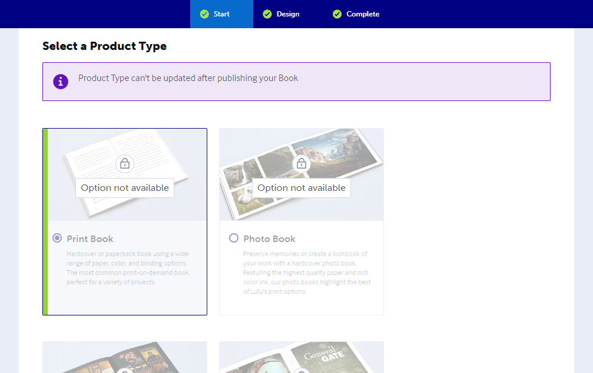</a> | First, select your product type which in this case is __Print Book__. |
| <a href="../previews/publishing/setup-002.png" title="Print Your Book">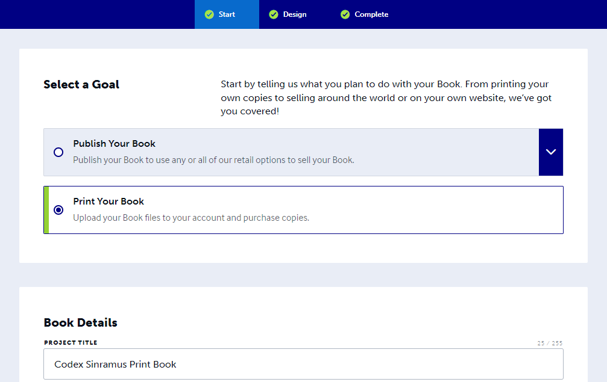</a> | Since this is for personal use, choose __Print Your Book__. |
| <a href="../previews/publishing/setup-003.png" title="Book Category">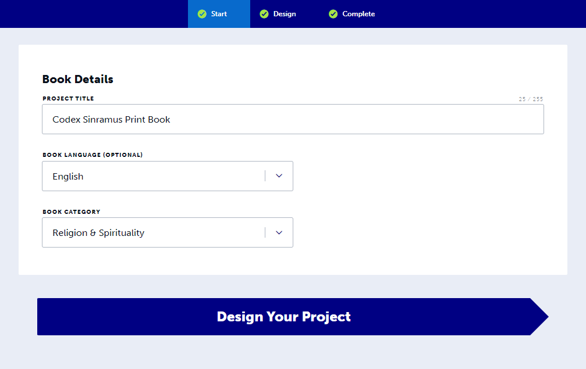</a> | Fill in some details about your book project. As previously mentioned, here is where you must choose a __Book Category__ in order to proceed. |
| <a href="../previews/publishing/setup-004.png" title="Interior File">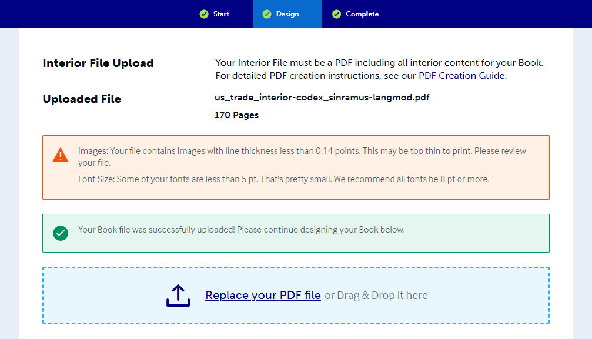</a> | This is where you can upload an interior `.pdf` file. Be sure to choose either [*us_trade_interior-codex_sinramus.pdf*][3] or [*lulu_pocket_interior-codex_sinramus.pdf*][4]. You will also need the matching cover file a few steps below. You will also get two false-positive errors, as seen in the image to the left. One of them has to do with fine details in the images that might not show up on the printer. The other error is just a bug as there's no size 3 fonts in use. |
| <a href="../previews/publishing/setup-005.png" title="Book Size">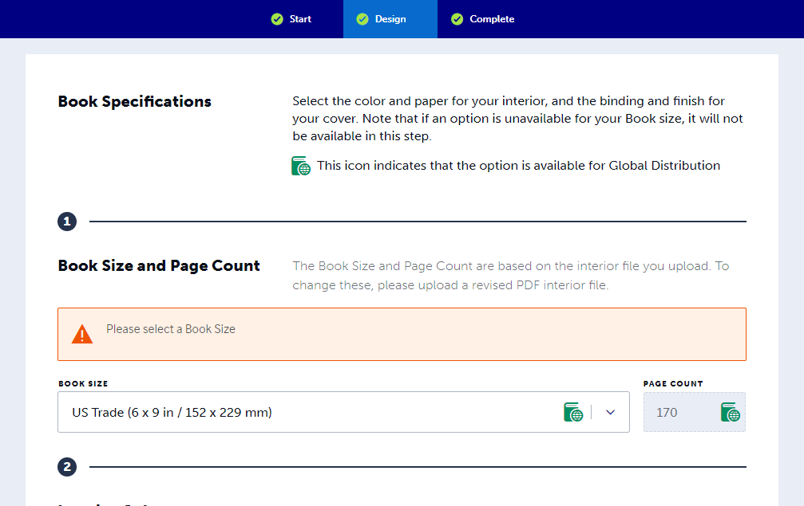</a> | In most cases, the __Book Size__ will be automatically chosen for you. However, be sure to check that this field matches the `.pdf` set that you intend to print. |
| <a href="../previews/publishing/setup-006.png" title="Interior Color">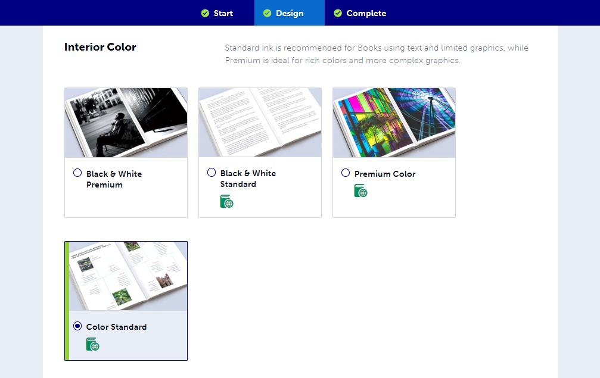</a> | Here is where you choose your __Interior Color__. If you want Daedric in color, choose *Color Standard*. To print in grayscale, choose *Black & White Standard*. I highly recommend color. |
| <a href="../previews/publishing/setup-007.png" title="Paper Type">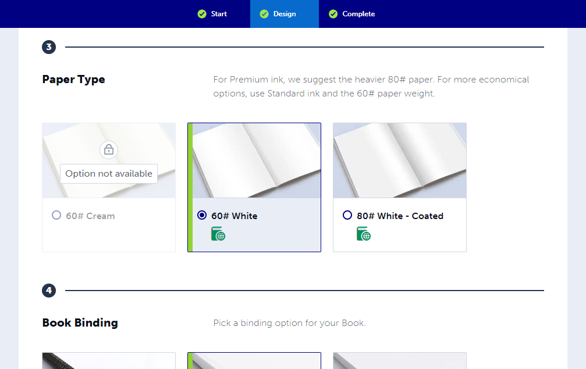</a> | Next, you can select a __Paper Type__. The default and probably best choice is going to be *60# White*. |
| <a href="../previews/publishing/setup-008.png" title="Book Binding">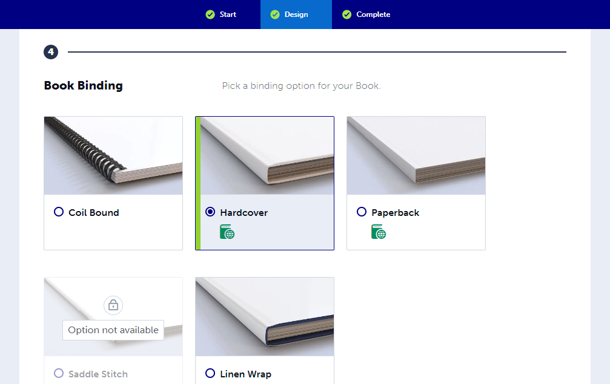</a> | When selecting a __Book Binding__, be sure to choose *Hardcover*. You can do the *Linen Wrap* if you like, but my cover is not sized for the dust jacket, so you may need to make your own. |
| <a href="../previews/publishing/setup-009.png" title="Cover Finish">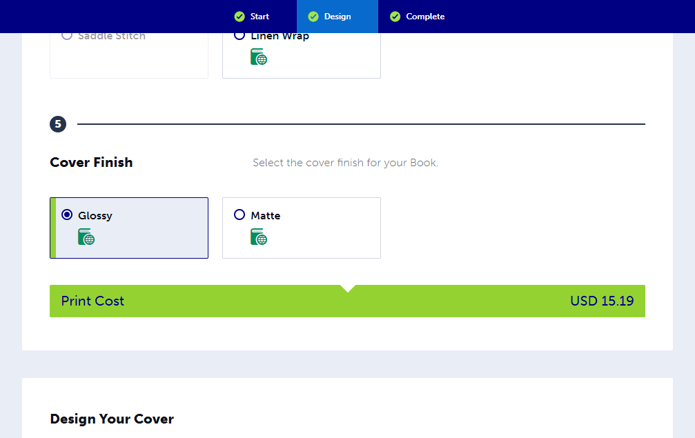</a> | For the __Cover Finish__, I highly recommend *Glossy* for it's durability. *Matte* can sometimes ripple from the glue, and it smudges heavily which some may not like the appearance of. |
| <a href="../previews/publishing/setup-010.png" title="Cover File">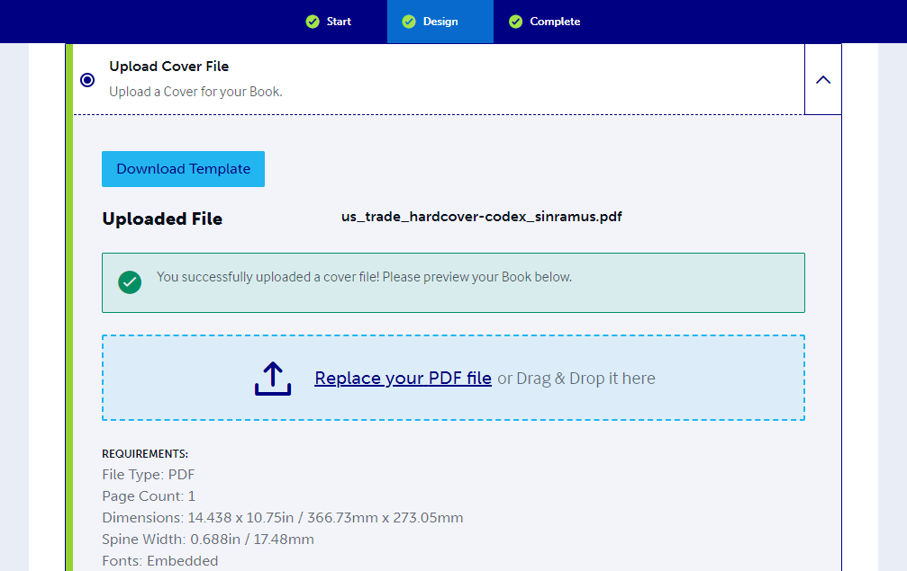</a> | This is where you can upload a cover `.pdf` file. Be sure to choose either [*us_trade_hardcover-codex_sinramus.pdf*][5] or [*lulu_pocket-hardcover-codex_sinramus.pdf*][6]. You will need to use the cover file that matches your uploaded interior file. |
| <a href="../previews/publishing/setup-011.png" title="Book Preview">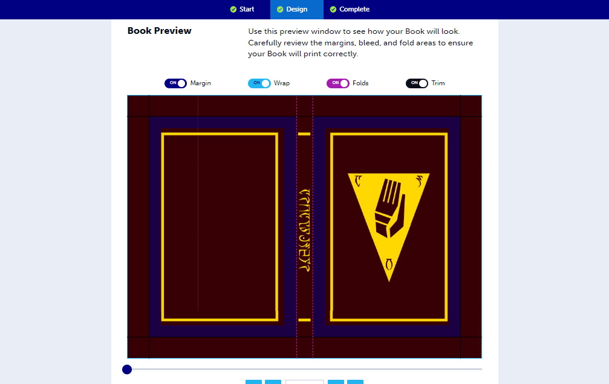</a> | This page is meant to let you preview your cover file, however it appears that the alignment is off in this tool. Lulu.com's template files are more correct and should be referenced instead of relying on this page. |
| <a href="../previews/publishing/setup-012.png" title="Review Your Book">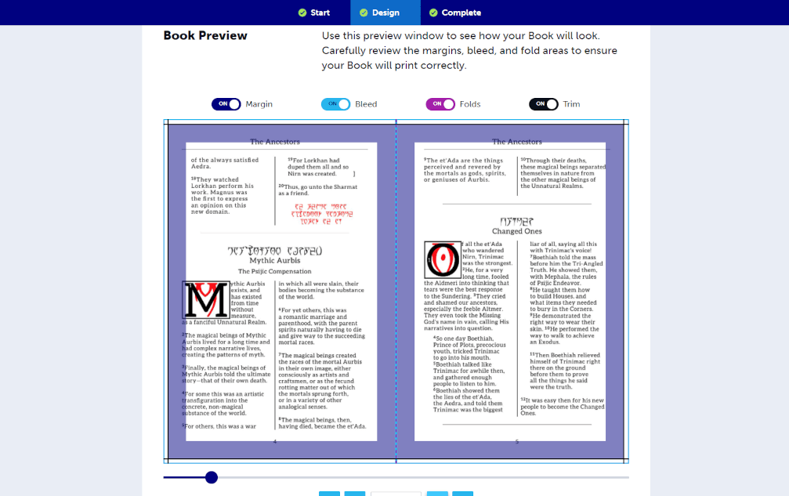</a> | If your cover is looking centered here, you can rest assured that it will print correctly. |

[1]: https://www.lulu.com/
[2]: https://www.lulu.com/account/projects
[3]: ../pdf/us_trade_interior-codex_sinramus.pdf
[4]: ../pdf/lulu_pocket_interior-codex_sinramus.pdf
[5]: ../pdf/us_trade_hardcover-codex_sinramus.pdf
[6]: ../pdf/lulu_pocket-hardcover-codex_sinramus.pdf

---

#### Making Modifications

The first thing you will want to grab is a copy of Lulu's book design reference guide.

[__Lulu Book Creation Guide__][7]

If you would like to make your own modifications to the Quintessence, my OpenDocument project file, as well as all of the image and font assets can be found in the [project folder on GitHub][8], or at the link for the [Quintessence Release Page][9] section above. Here's a direct link to the resource bundle in a `.zip`:

[__Source Document and Resource Bundle__][10]

When exporting to `.pdf`, I use the archive format PDF/A-1b to ensure there is no transparency in the raster images.

[7]: https://assets.lulu.com/media/guides/en/lulu-book-creation-guide.pdf
[8]: https://github.com/mmillar-bolis/MDunmeris/tree/gh-pages/documents/quintessence/project
[9]: https://github.com/mmillar-bolis/MDunmeris/releases/
[10]: https://github.com/mmillar-bolis/MDunmeris/releases/download/1.3/quintessence-project-source-bundle.zip

---
